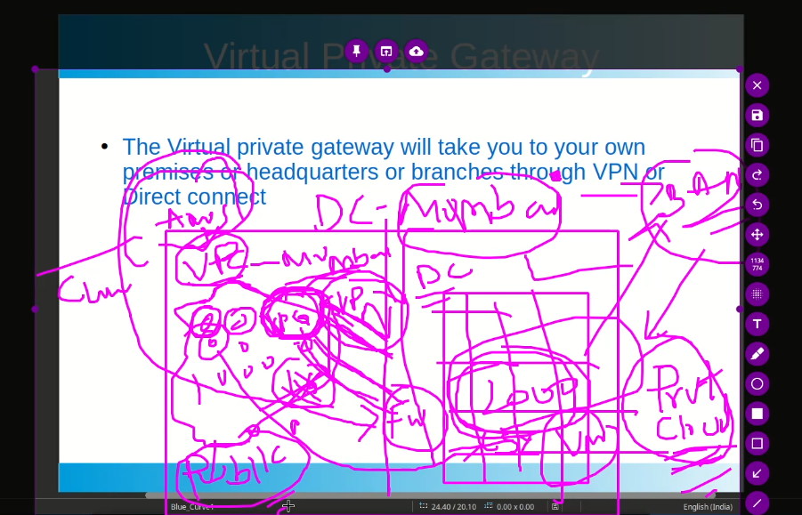
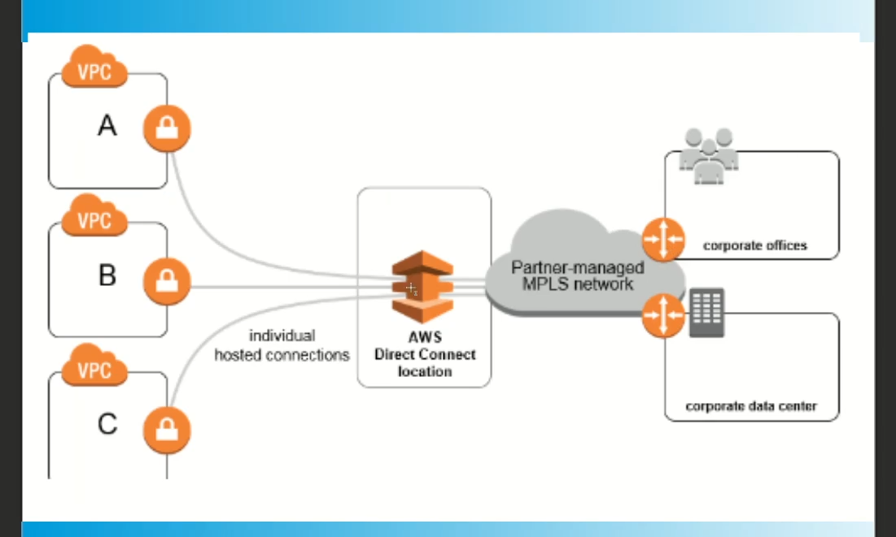

# **SYSOPS AND CLOUD ADVANCEMENT TRACK**

## **Lecture 1**:  Basic touch to aws services... IAAS, PAAS, SAAS

> IAAS (Infrastructure as a service)

- servers
- storages
- firewalls
- routers and switches, etc

> PAAS (Platform as a service)

- OS (linux, windows, etc)
- DBs (RDS | MySQL, Postgres, Oracle db etc)

> SAAS (Software as a service)

- httpd, tomcat, jboss, any sort of applications that we run inside servers or without servers like in fargates, etc???

Basics of cloud computing, IAM users/groups/roles, Regions (vpc) and Avilability zones (subnets).

> Three types of storages:

- **S3** :  Simple Storage Service - Object type - for data storage, static sites, etc (99.999999999 % HA) --- 11 (9s) of durability
- **EBS** : Elastic Block storage - acts as a hard disk attached to a server (for permanant storage of  system data, OS, etc) as compared to instance storage that acts as a RAM (wipes out when server shutdowns)
- **EFS** : Elastic File Sharing : it actually serverless storage of data over the network, we use this when we need to access same data from multiple servers.
    - We use EFS incase of Linux servers which uses NFS in the backend.
    - We use FSx incase of Windows server which uses samba in the backend.

# **Lecture 2**: Dive into VPC, Subnets, etc

Some basic concepts about vpc:

- VPC is region specific, means it cannot span accross the regions.
    - it means if server A is in ohio (vpc A) and server B is in ireland (vpc B), they cannot communicate with eachother, unless we do vpc peering.
- VPC is just like having your own data centre inside aws region (you can utililize all resources present within that region)
- VPC has as many default number of subnets as there are AZs in that regions.
- There can be multiple subnets within a same AZ.
- But same subnet cannot extend beyond the AZ.

> Reserved Private IP ranges:

```markdown
# Class A:
    - 10.0.0.0/8 - 10.255.255.255 
# Class B:
    - 172.16.0.0 - 172.31.255.255
# Class C: 
    - 192.168.0.0 - 192.168.255.255
```

> Here is a quick recap of IP classes

```yml
Class A : 1.0.0.0/8 - 126.0.0.0/8  # around 16M hosts  [2^24 = 16,777,216 hosts]
          127.0.0.0   # reserved for localhost
Class B : 128.0.0.0/16 - 191.255.0.0/16  # arrount 64k hosts [2^16 = 65536]
Class C : 192.0.0.0 - 223.255.255.0
Class D : 224 - 239
Class E : 240 - 255   # for research purposes

```

> Quick recap of how to convert IP into its binary value

Let's suppose we have an ip 192.168.37.200, it means this is a class B ip with 12 bits reserved for network

$2^7 + 2^6 + 2^5 + 2^4 + 2^3 + 2^2 + 2^1 + 2^0$ = 128 + 64 + 32 + 16 + 8 + 4 + 2 + 1 

0 0 0 0 0 0 0 0 ---> let's suppose these are 8 bits of each byte/octat

1 1 0 0 0 0 0 0 = 192\
1 0 1 0 1 0 0 0 = 168\
0 0 1 0 0 1 0 1 = 37\
1 1 0 0 1 0 0 0 = 200


```markdown
# A Question here:

Let's suppose, we have a class C IP address 202.127.31.13/24, normally, its subnet mask would be 255.255.255.0 (N.N.N.H) but if we have done subnetting and ip is 202.127.31.13/26, what would be its subnetmask?

normally class C ip have :

N.N.N.H
11111111.11111111.11111111.00000000

But in this case of 202.127.31.13/26, ip is subnetted as below:
11111111.11111111.11111111.11000000

As network address creeps from left to right, and so its subnetmask will be 255.255.255.192 
(last 192 is sum of values of last two network bits , i.e., 128+64)
```

```markdown
# Another task Question here:

Do subnetting of 192.168.1.0/24 into two subnets. (Here we have IPs from 192.168.1.0 to 192.168.0.255)

## Original Network:

The given network is 192.168.1.0/24, which means:

Network Address: 192.168.1.0
Subnet Mask: 255.255.255.0
Binary notation of Subnet Mask: `11111111.11111111.11111111.00000000` (/24)
IP range: 192.168.1.0 to 192.168.1.255

## Step 1: Determine the Subnet Mask for New Subnets

To divide the 192.168.1.0/24 network into two subnets, we need to borrow 1 bit from the host portion (from the last 8 bits in the original /24 mask).

The new subnet mask will be /25 because we borrowed 1 bit, making the network part 25 bits long.

- New Subnet Mask: 255.255.255.128 (or `11111111.11111111.11111111.10000000` in binary)
- Subnet Size: /25 means there will be 128 addresses per subnet (from 0 to 127 for one subnet, and 128 to 255 for the other).

## Step 2: Calculate the Two Subnets

Now, let's break down the two subnets.

### Subnet 1:

- Network Address: 192.168.1.0/25
- IP Range: 192.168.1.0 to 192.168.1.127
- Broadcast Address: 192.168.1.127
- Usable IPs: 192.168.1.1 to 192.168.1.126
- Subnet Mask: 255.255.255.128
- Binary Subnet Mask: `11111111.11111111.11111111.10000000` (or /25)

### Subnet 2:

- Network Address: 192.168.1.128/25
- IP Range: 192.168.1.128 to 192.168.1.255
- Broadcast Address: 192.168.1.255
- Usable IPs: 192.168.1.129 to 192.168.1.254
- Subnet Mask: 255.255.255.128
- Binary Subnet Mask: `11111111.11111111.11111111.10000000` (or /25)

```

```markdown
# One Last Question about subnetting before proceeding next:

Do Subnetting of 192.168.1.0/24 into Four Subnets

## Original Network:

The given network is 192.168.1.0/24, which means:

- Network Address: 192.168.1.0
- Subnet Mask: 255.255.255.0
- Binary notation of Subnet Mask: `11111111.11111111.11111111.00000000` (/24)
- IP range: 192.168.1.0 to 192.168.1.255

## Step 1: Determine the Subnet Mask for New Subnets

To divide the 192.168.1.0/24 network into four subnets, we need to borrow 2 bits from the host portion (from the last 8 bits in the original /24 mask).

The new subnet mask will be /26 because we borrowed 2 bits, making the network part 26 bits long.

- New Subnet Mask: 255.255.255.192 (or `11111111.11111111.11111111.11000000` in binary)
- Subnet Size: /26 means there will be 64 addresses per subnet (from 0 to 63 for one subnet, 64 to 127 for the second subnet, 128 to 191 for the third subnet, and 192 to 255 for the fourth subnet).

## Step 2: Calculate the Four Subnets

Now, let's break down the four subnets.

### Subnet 1:

- Network Address: 192.168.1.0/26
- IP Range: 192.168.1.0 to 192.168.1.63
- Broadcast Address: 192.168.1.63
- Usable IPs: 192.168.1.1 to 192.168.1.62
- Subnet Mask: 255.255.255.192
- Binary Subnet Mask: `11111111.11111111.11111111.11000000` (or /26)

### Subnet 2:

- Network Address: 192.168.1.64/26
- IP Range: 192.168.1.64 to 192.168.1.127
- Broadcast Address: 192.168.1.127
- Usable IPs: 192.168.1.65 to 192.168.1.126
- Subnet Mask: 255.255.255.192
- Binary Subnet Mask: `11111111.11111111.11111111.11000000` (or /26)

### Subnet 3:

- Network Address: 192.168.1.128/26
- IP Range: 192.168.1.128 to 192.168.1.191
- Broadcast Address: 192.168.1.191
- Usable IPs: 192.168.1.129 to 192.168.1.190
- Subnet Mask: 255.255.255.192
- Binary Subnet Mask: `11111111.11111111.11111111.11000000` (or /26)

### Subnet 4:

- Network Address: 192.168.1.192/26
- IP Range: 192.168.1.192 to 192.168.1.255
- Broadcast Address: 192.168.1.255
- Usable IPs: 192.168.1.193 to 192.168.1.254
- Subnet Mask: 255.255.255.192
- Binary Subnet Mask: `11111111.11111111.11111111.11000000` (or /26)
```

> How to find out that a certain Network address (192.168.1.0/25 or 192.168.1.0/26) has how many subnets?

>> We have a formula to calculate it:\
In 192.168.0.1/25, we know that normal network range for this class C ip is 24.\
n =  #no. of bits borrowed for subnetting = current CIDR value of network address - Actual CIDR value of that network class\
i.e., n = 25-24 = 1.\
Now, $2^n=no.of subnets$\
Here we have $2^1=2$, So, network ip of class C with CIDR of 25 has 2 subnets.\
And incase of /26, 26-24 =2, $2^2=4$, So, network ip of class C with CIDR 26 has 4 subnets.

> Similar to above qustion, How to find out that a CIDR can hold how many hosts(in total)?

>> Let's suppose we have network ip cidr 8 (10.0.0.0/8), here hosts have 24 bits (out of total 32), so total hosts are, **2^24 = 16777216**\
>> another example network ip cidr 8 (172.31.0.0/16), here hosts have 16 bits (out of total 32), so total hosts are, **2^16 = 65536**\
>> one more example network ip cidr 20 (172.31.0.0/20), here hosts have 12 bits (out of total 32), so total hosts are, **2^12 = 4096**

```markdown
# This is how, aws occupies/holds five IP addresses from each subnet:

Example subnet = 10.0.0.0/24

10.0.0.0/24 = Network IP
10.0.0.1/24 = VPC router IP
10.0.0.2/24 = DNS related IP
10.0.0.3/24 = Future use IP
10.0.0.255/24 = Broadcast IP
```

# Creating Custom VPC - Internet gateway, Route-tables

The steps and some basic things that must be kept in mind regarding creating/switching VPCs, internet gateways, route-tables, includes:

- By default there is one vpc in each region created by aws [but we can create custom VPCs within same region also]
- We cannot delete/or change default CIDR block from default vpc. [but we can add (and delete when needed) a new CIDR block within same default VPC to increase/decrease VPC range]
- CIDR block of custom VPC must be within this range : [/28 to /16] (/28 will hold 16 hosts/subnet and incase of 16 there will be 4096 hosts/subnet)
- and the custom VPCs CIDR block should not overlap with default CIDR block.
- 1 VPC <==> 1 internet gateway (Only 1 vpc can attach to 1 igw and vice verse).
- If we created a custome vpc (c_vpc) and we want to attach it to a default internet gateway (d_igw), we will firstly need to to dettach this d_igw from prvious vpc and then attach to c_vpc.
- But even after attaching d_igw to c_vpc, traffic will not be routed to internet, unless we update the rule in main route-table of the vpc pointing 0.0.0.0 to this d_igw.
- same will be the scene, if we kept the vpc same as default but needed to change the internet gateway. 

- > If we can attach only one igw with only one vpc, why do aws gives option to create custom igw?

- >> It is because, if we have a scenario where we need to create multiple VPCs, we will need multiple internet-gateways (one for each to make it accessible via internet) to attach to these VPCs.

# Firewalls | Security Groups | NACLs

- Security group works (blocks/allow traffic) at NIC level (or server level because NIC is also attached to a server as a gate for in/outgoing traffic) where as ACL works at subnet level.
- Netwok Access Control List is firewall at subnet-level / AZ-level and so acts as a "first line of defense".
- Wihtin AZs, we again have a firewall at server level, known as "security group".

# Virtual Private Gateway (VPG)



VPG is used in case of hybrid cloud, so to effectively understand vpg, let's first digest three main types of cloud:

- Public Cloud (or even VPC, although isolated but also comes under this type): A cloud that can be accessed from anywhere, just like as provided by aws, azure, gcp, etc
- Private Cloud : Fully on-premises cloud comprising of physical server, routers, switches, gateways, servers, cables, etc
- Hybrid Cloud : A cloud that comprises of some on-premises servers connected privately with some Public Cloud via vpn/direct connect.

So, to connect a public cloud with our private cloud (as in above discussed case of hybrib cloud model), we do not use internet gateway (because igw will connect cloud to internet). Whereas, we only need to establish connectivity between our aws hosted public and on-premises private cloud.

So, to do the need full, we remove igw from vpc and attach a VPG that forms a tunnel from VPG of public cloud to firewall of private cloud, and hence this creates a private network.

We can either use VPN or direct connect to connect VPG with out private cloud.

## Concept of AWS Direct Connect



It is actually a cloud provided service that enables you to to connect to your aws clouf from your on-premises private cloud via dedicated fiber.

- While creating a direct connect connection, we choose an aws (incase of aws cloud) vender location near us and choose the ISP to generate direct connect connection request.
- This request then goes to your selected ISP, they then reach out to you (via call/email) for confirmation of your request and rest of the required details.
- Once all is good, they create a dedicated connection from your on-premises data centers to aws paterner's location (that you had selected while submitting request).
- Once you are connected to aws direct connect partner's location, you can access your aws vpc.

- > The fun fact is, what will happen if let's suppose you have choosen TATA as ISP and their service goes down?

- >> It will obviously disconnect you from your aws vpc. So, to resolve this issue, we normally take multiple fiber connections from multiple ISPs for connecting our data center to aws location because if anyone ISP's service goes down, our connection will not be compromised.


############################################## ABOVE COURSE ACCESS REVOKED #############################################

[Now, will continue with aws of veermila]

