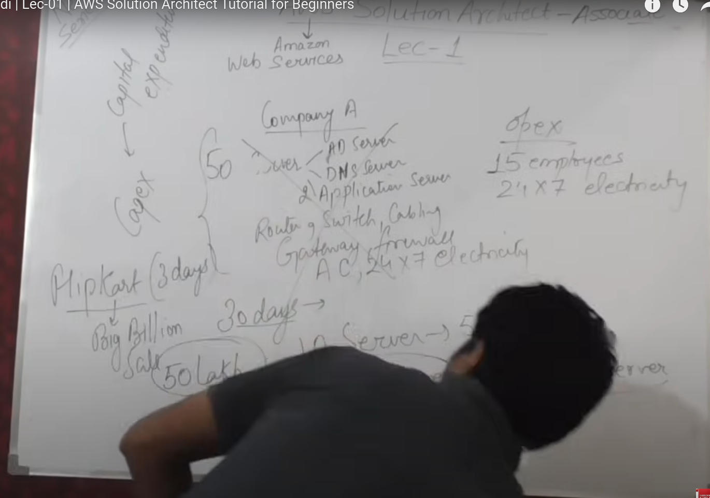
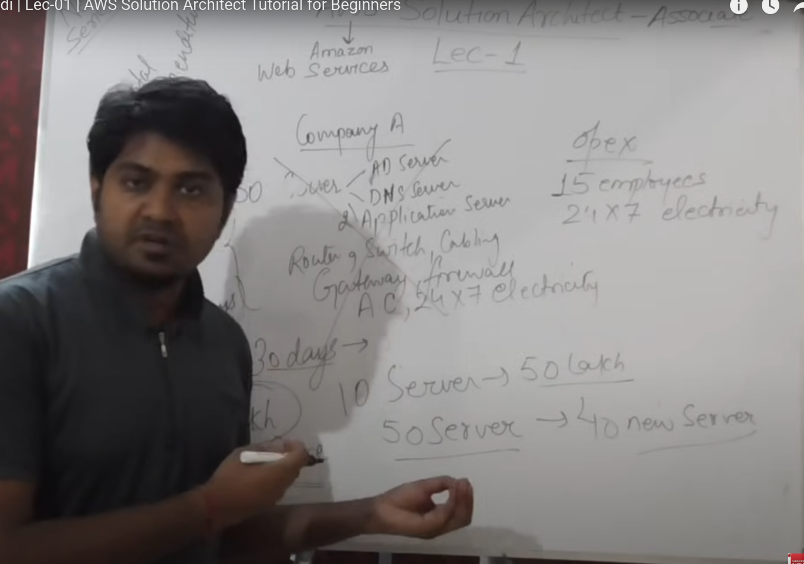
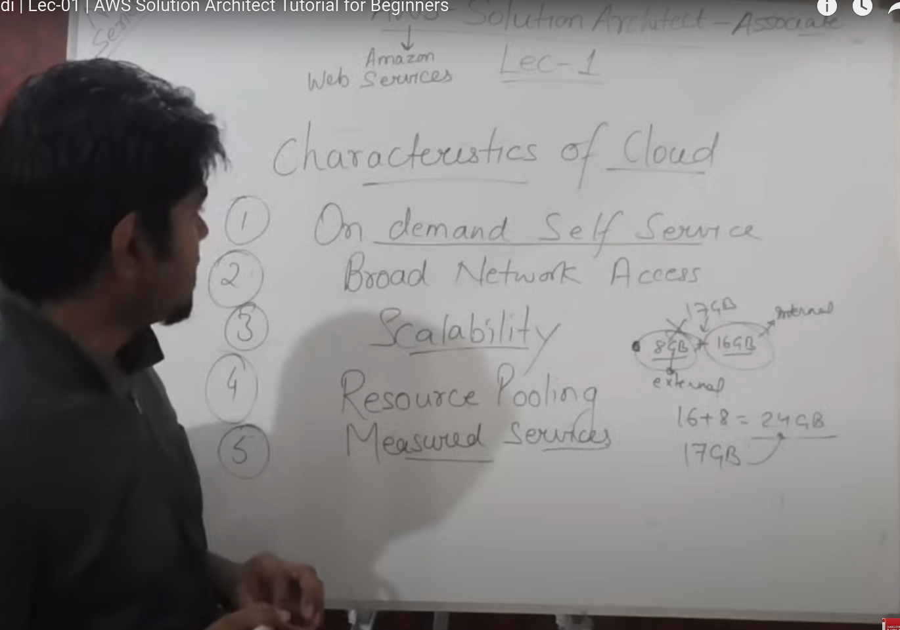
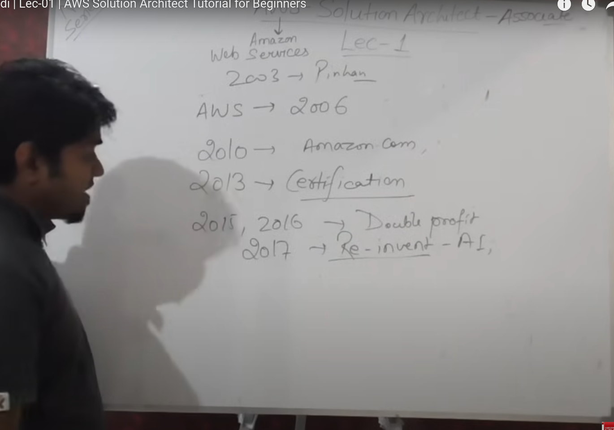
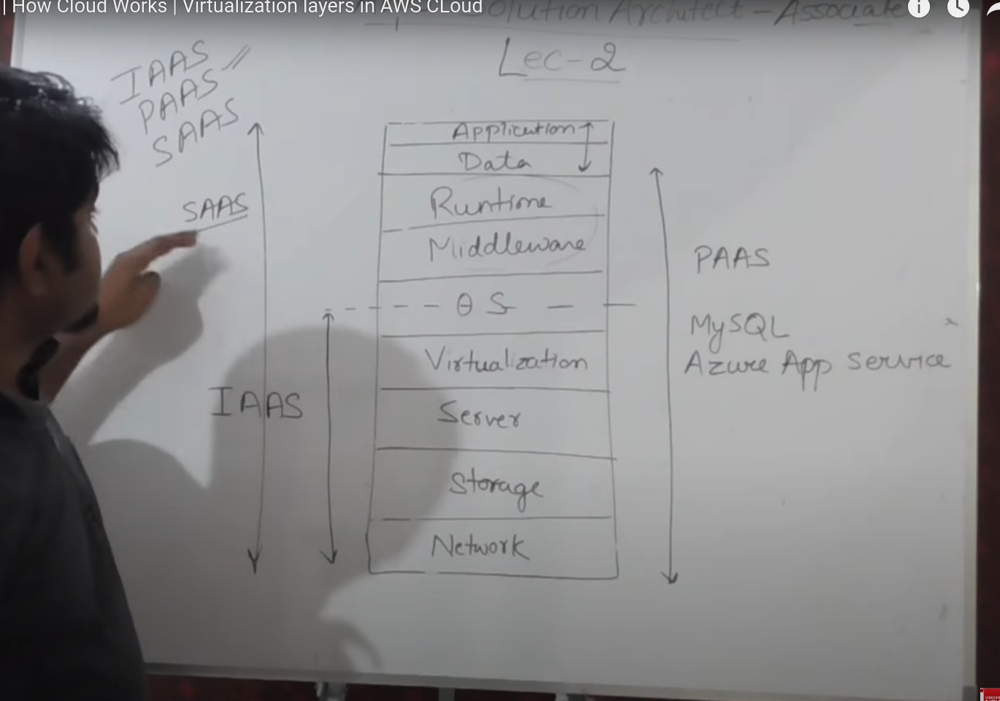
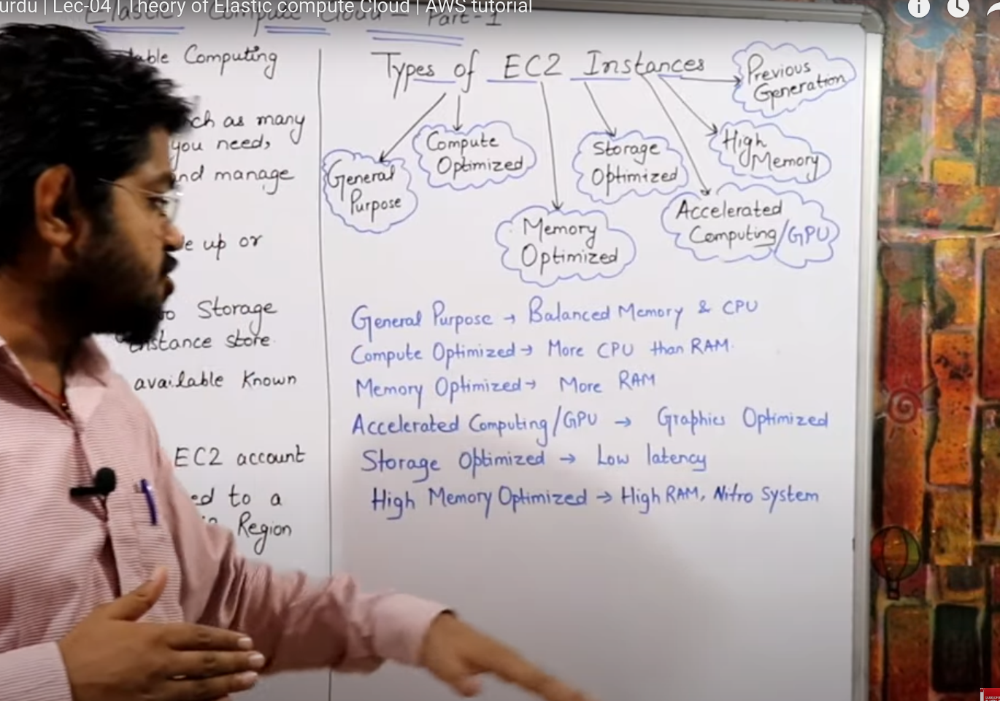
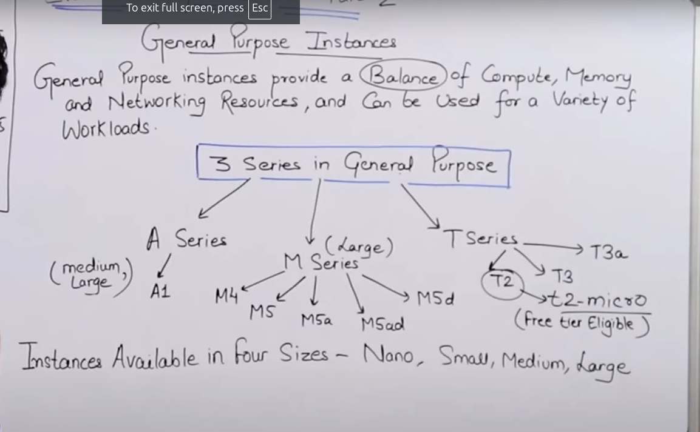
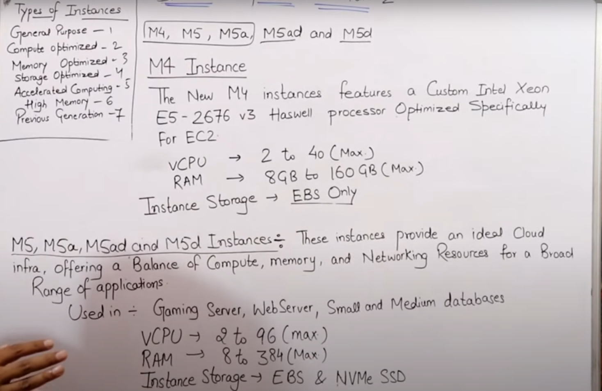
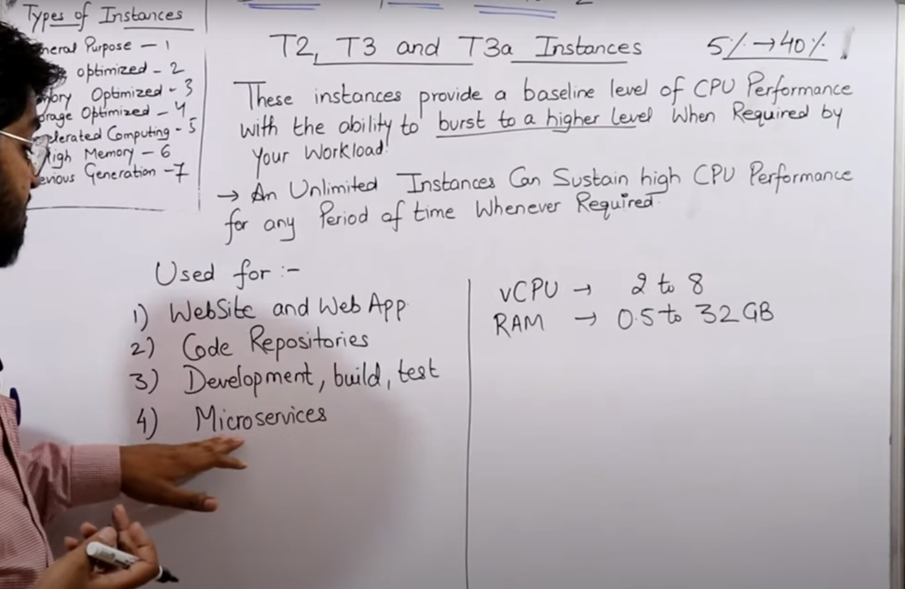
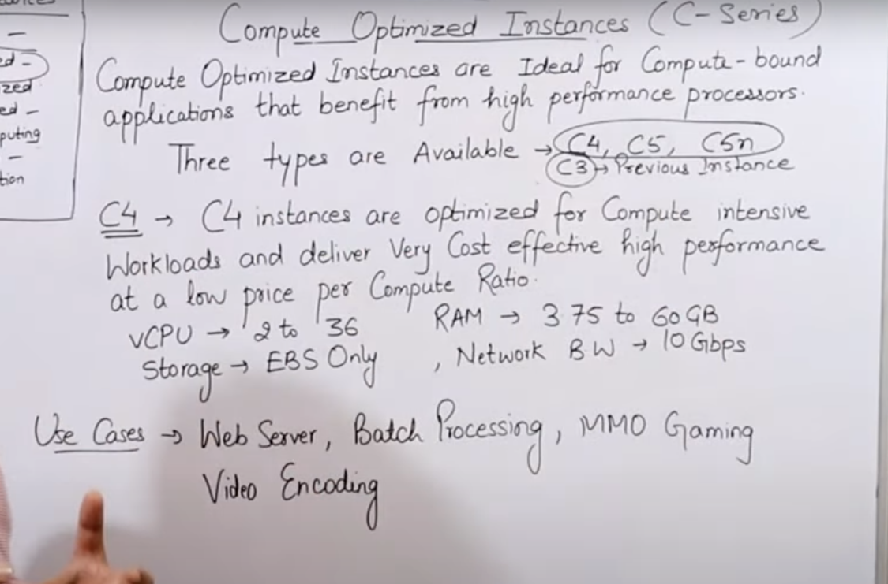

# **AWS Cloud (basic to architect level)**

## **Basic start** 

- **What is cloud?**
    - it is actually using remotely present computing resources via internet with pay as you go model.
- **Why do we need cloud services?**
    - 
    - 
- **Characteristics of a cloud:**
    - 
- **history about AWS**
    - 
- **AWS common certifications:**
    1. AWS Solution Architect (associate and then professional level)
    2. AWS devops ~ 150$ fee  (associate and then professional level)
    3. AWS sysops
- **Service models in cloud | Cloud services:**
    1. IAAS (Infrastructure as a service)
    2. PAAS (Software as a service)
    3. SAAS (Function as a service)
    4. FAAS (Function as a service)
    - Concept of cloud service models:
        - 

    - **AWS** uses --> citrix hypervisor
    - **VMWare** uses --> VSphere ESXi hypervisor
    - **Microsoft** uses --> Hyper-V hypervisor

## **Types of EC2 (Elastic Cloud Computing) instances**

These are of almost 6 types in broader level:

- General Purpose
- Compute Optimized
- Memory Optimized
- Accelerated computing
- Storage optimized
- High memory optimized

### **1. General Purpose Instances**

Balance of compute, memory and networking resources.

1. A series (medium and large size instances)
2. M series (just large size instances)
3. T series (micro, small, medium and large size instances)

#### **A Series**

Ideally suited for scale-out workloads and are suppoerted by the arm ecosystem (ARM technology refers to energy-efficient processor designs used in many devices like smartphones, tablets, IoT devices, and servers).

- webservers
- containerized services

#### **M Series**

Inside M series, there we have m4 (root volume EBS only), m5, m5a, m5ad, m5d (we can get in NVMe SSD for root volume, in some types of m5 instances)

#### **T Series**

- This series includes instances like T2, T3, T3a, etc
- These instances generally have very basic level of cpu performance and are generally used for testing purposes.
- e.g., website/application testings, code repositories, microservices, etc

### **2. Compute Optimized Instances**

- This is compute optimized series, means higher computing power. It might be =due paralled processig power of CPUs or multiple Virtual cores, etc
- c4 (it is now out-dated), c5, c5a
- 
- e.g., web-servers, gamings, batch processings, video encodings, etc

### 3. Memory Optimized

### 4. Accelerated computing

### 5. Storage optimized

### 6. High memory optimized

## VPC | Virtual Private Cloud

### Understanding Virtual Private Cloud
A Virtual Private Cloud (VPC) is essentially your private section of AWS cloud where you can create isolated network environments. Think of it like having your own private datacenter, but instead of physical hardware, everything is virtualized and managed by AWS.

#### Why VPC?
Traditional private clouds require:
- Significant upfront investment
- Physical servers and routers
- Network infrastructure
- Complex security configurations

VPC provides all these benefits virtually:
- No physical hardware needed
- Pay-as-you-go pricing
- Same level of security as private cloud
- Complete control over your network environment

### Core VPC Concepts

#### Regional and Availability Zone Architecture
1. **Regional Scope**
   - VPC exists at the regional level
   - Think of it as drawing a boundary around all resources in a region
   - Example: A VPC in Mumbai region encompasses all its availability zones

2. **Availability Zone Relationship**
   - A VPC spans multiple availability zones in a region
   - Like having offices in different buildings but connected to the same network
   - Cannot extend across regions (important architectural limitation)

#### Networking Components

##### 1. Default Components
When you create a VPC, AWS automatically sets up:
- **DHCP**: Handles IP address assignments
- **Network ACL**: Acts as a network-level firewall
- **Security Group**: Acts as a virtual firewall for resources

##### 2. Subnets: Public vs Private
Think of subnets like different departments in your organization:

**Public Subnets:**
- Have direct internet access
- Connected to internet gateway
- Suitable for web servers, load balancers
- Like a reception area that's accessible to visitors

**Private Subnets:**
- No direct internet access
- Protected from external access
- Suitable for databases, application servers
- Like secure areas only accessible to employees

### CIDR and IP Address Management

#### CIDR Block Rules
- **Primary CIDR**: Like choosing the size of your building
  - Cannot be changed once set
  - Must be planned carefully

- **Secondary CIDR**: Like adding an extension to your building
  - Added in 2017
  - Provides flexibility for growth
  - Not available in US Government Cloud and Beijing regions

#### IP Range Planning
- No overlapping CIDR blocks within same VPC
- Example:
  - If subnet A uses 10.0.1.0/24
  - Subnet B cannot use 10.0.1.0/24
  - Must use different range like 10.0.2.0/24

### Networking Architecture

#### Routing and Connectivity
1. **Implied Router**
   - VPC automatically acts as a router
   - No manual router configuration needed
   - Handles inter-subnet communication automatically

2. **Internet Gateway**
   - Like the main entrance to your network
   - Sits at region boundary
   - Provides internet connectivity to public subnets

3. **NAT Gateway**
   - Always placed in public subnet
   - Allows private subnet resources to access internet
   - Like a secure proxy for private resources

### Resource Limits and Scalability

#### Default Limits
- 5 VPCs per region (expandable)
- 200 subnets per VPC
- 5 Elastic IPs per account (expandable)

#### Best Practices for Scaling
1. **Plan for Growth**
   - Consider future expansion
   - Leave room in IP ranges
   - Use secondary CIDR when needed

2. **Subnet Strategy**
   - Distribute across availability zones
   - Balance between public and private
   - Consider workload requirements

### Security and Isolation

#### Network Isolation
- Each VPC is completely isolated from others
- Like separate secure buildings
- Even with same IP ranges, no conflict occurs

#### Security Layers
1. **Network ACLs**
   - Network level security
   - Stateless firewalls
   - Control traffic at subnet level

2. **Security Groups**
   - Instance level security
   - Stateful firewalls
   - More granular control

### Prerequisites and Knowledge Requirements
- **Essential Skills**:
  - Understanding of IP addressing
  - Basic networking concepts
  - Subnetting knowledge
  - Basic AWS understanding

This deep understanding of VPC concepts allows you to:
- Design robust cloud architectures
- Implement secure networking
- Efficiently manage cloud resources
- Scale applications effectively

## VPC Documentation

### Types of VPCs

In AWS, there are primarily two types of Virtual Private Clouds (VPCs):

1. **Default VPC**
2. **Custom VPC**

#### Default VPC

- Every AWS region comes with a **default VPC**. This is automatically created when you set up an AWS account.
- If you create an EC2 instance without specifying a VPC, it will be launched in the default VPC.
- The **default VPC** has several pre-configured settings, including:
  - **CIDR Block**
  - **Security Groups**
  - **Network Access Control List (NACL)**
  - **Routing Tables**
  - **Internet Gateway** connected by default, allowing EC2 instances within it to communicate with the internet.
  
- If the default VPC is deleted, it can be recreated manually.

#### Custom VPC

- A **custom VPC** is a VPC that is manually created by the AWS account owner (admin) based on specific requirements.
- Custom VPCs give you complete control over network configuration, including CIDR blocks, subnets, security settings, and more.
- By default, **custom VPCs** do not have an **Internet Gateway**. You must manually create and configure it if you need instances to access the internet.

#### Key Differences Between Default and Custom VPCs

| Feature                | Default VPC                          | Custom VPC                        |
|------------------------|--------------------------------------|-----------------------------------|
| **Internet Gateway**    | Connected by default                 | Needs to be manually created      |
| **CIDR Block**          | Pre-configured, typically `172.31.0.0/16` | Defined by user during creation  |
| **Routing Tables**      | Pre-configured and associated with the default subnet | User-configured routing tables    |

## VPC Creation Process

To create a **VPC**, follow these steps:

1. **Create the VPC**: Define the IP address range using a CIDR block.
2. **Create Subnets**: Divide the VPC into smaller subnets.
3. **Create an Internet Gateway (IGW)**: Attach this gateway to the VPC for internet access (if needed).
4. **Configure Routing Tables**: Define routing rules that allow traffic to and from the internet or other parts of the network.

### Important CIDR Block Ranges for Subnets

When creating a subnet in AWS, you can choose the CIDR block range. The allowed range for subnet sizes is between **/16 and /28**. 

- **/16** allows for 65,536 IP addresses.
- **/24** allows for 256 IP addresses (common for small subnets).
- You cannot use subnets with a range larger than /16 or smaller than /28.

Example:
- **10.0.0.0/16** → 65,536 IP addresses.
- **10.0.1.0/24** → 256 IP addresses.

### Reserved IP Addresses in Subnets

For every subnet, the first four and the last IP address in the range are reserved. 

- **First IP**: Network ID (not usable)
- **Last IP**: Broadcast address (not usable)
- **Second IP**: Reserved for VPC router
- **Third IP**: Reserved for other internal AWS purposes

For example, if you create a subnet with CIDR **10.0.0.0/24**, the usable IP addresses will be between **10.0.0.4** and **10.0.0.254** (excluding the reserved IPs).

### Public vs Private Subnets

In AWS, subnets are classified as either **public** or **private** based on their route to the **Internet Gateway (IGW)**.

#### Public Subnet
- A **public subnet** is one where the subnet's route table has a route to the Internet Gateway.
- EC2 instances in a public subnet can access the internet.
- To enable internet access for EC2 instances in a public subnet, you need to assign them a **public IP** (or an **Elastic IP**).
  - **Public IP**: Dynamic, changes on instance stop/start.
  - **Elastic IP**: Static, does not change.

#### Private Subnet
- A **private subnet** does not have a route to the internet via an Internet Gateway.
- Instances in a private subnet cannot directly access the internet, but they can communicate with other instances within the same VPC.
- Private subnets are typically used for databases, application servers, or other services that do not need to be exposed to the internet.

### How to Identify Public vs Private Subnet

You can determine whether a subnet is **public** or **private** by checking its **route table**:

- If the route table has a route to `0.0.0.0/0` pointing to an **Internet Gateway**, the subnet is **public**.
- If there is no route to the Internet Gateway, the subnet is **private**.

### Routing Table Example

- **Public Subnet** route table:
  - `0.0.0.0/0 → Internet Gateway`

- **Private Subnet** route table:
  - No route to `0.0.0.0/0` through an Internet Gateway (unless you set up a NAT Gateway for internet access from private subnets).

### Important Considerations

1. **VPC Peering**: VPCs in the same region can communicate with each other if they are peered.
2. **Security Groups**: By default, all traffic is denied. You must explicitly configure inbound and outbound rules.
3. **Network ACLs (NACLs)**: These provide an additional layer of security by controlling traffic at the subnet level.

### Conclusion

AWS VPCs are crucial for organizing and managing networks in the cloud. Understanding the key differences between default and custom VPCs, as well as public and private subnets, is fundamental for AWS architecture design. By following the proper steps to create and configure VPCs, subnets, and routing, you can ensure that your cloud network is secure, scalable, and meets your application’s requirements.

## VPC Documentation - Part 3

### Introduction

Good morning, नमस्ते, असलाम, वालेकुम दोस्तों! हाजिर हूँ मैं आपके सामने VPC का Part 3 लेकर, जिसमें आज हम देखेंगे कि **Implied Router** क्या होता है, **Route Table** क्या होती है, और **Internet Gateway** क्या होता है। इन तीनों चीजों को आज इस lecture में हम cover करेंगे।

### Implied Router

- आज हम जिस component को discuss करने वाले हैं, वह है हमारा **Implied Router**. 
- यह एक **virtual router** है, जो AWS VPC के अंदर behave करता है, पर असल में यह कहीं physically मौजूद नहीं होता। इसे **logical router** कहा जाता है क्योंकि यह एक router की तरह behave करता है।
- यह router **VPC** के अंदर मौजूद होता है, और यह VPC के विभिन्न **Availability Zones (AZs)** के बीच में connectivity स्थापित करता है।
- उदाहरण के लिए, अगर दो Availability Zones में EC2 instances हैं, तो यह implied router ही उन्हें आपस में connect करता है।

### Key Points about the Implied Router

- It is the **central routing function** within the VPC.
- It enables communication between **subnets** (e.g., public and private subnets) within the same VPC, even across multiple **Availability Zones (AZs)**.
- For example, if we have an EC2 instance in one AZ and another EC2 instance in a different AZ, they can communicate without having to define routing protocols.

### Route Tables

- A VPC can have **up to 200 route tables**.
- Each route table can have up to **50 route entries**.
- **Route table entries** define where the traffic should be directed within the VPC or to the internet.

### Route Table Rules

- **Each subnet must be associated with only one route table** at any given time. 
- If a subnet is associated with one route table, it will automatically be removed from any other associated route tables.
- If you don't associate a subnet with a custom route table, it will be associated with the **default route table** of the VPC by default.

#### Editing and Deleting Route Tables

- You can **edit** the main route table, but you **cannot delete** it while it is still the main route table.
- If you make another route table the main route table, you can then delete the old main route table.
- You can associate **multiple subnets** with the same route table, but **each subnet** can only be associated with **one route table at a time**.

### Internet Gateway

- An **Internet Gateway (IGW)** is essentially a virtual router that connects your VPC to the **internet**.
- It acts as a gateway for internet-bound traffic from your VPC.
- If you create a **new VPC**, you must manually attach an **Internet Gateway** to access the internet.
  
#### Default vs Custom VPC

- **Default VPC**: In every AWS region, the default VPC has an **Internet Gateway** attached by default, so you don't need to configure anything for internet access.
- **Custom VPC**: If you create a custom VPC, you must manually create and attach an **Internet Gateway** and add a routing entry in your route table to allow internet access.

### Route Table Configuration for Internet Access

- To allow internet traffic, add the following route in the route table:
  - `0.0.0.0/0 → Internet Gateway`
- This entry ensures that any traffic destined for the internet (0.0.0.0/0) will be directed to the Internet Gateway.
  
### NAT Gateway

- **NAT Gateway**: If you have private subnets that need to access the internet (e.g., to download updates or access external services), you need to use a **NAT Gateway**. 
- A **NAT Gateway** performs **Network Address Translation (NAT)** between your private subnet and the internet.
  
#### IPv4 and IPv6 Support

- **Internet Gateway** supports both **IPv4** and **IPv6** traffic.
- You can configure your VPC to use either IPv4, IPv6, or both, depending on your requirements.

### Important Concepts

- **Elastic IPs (EIPs)**: When you assign an Elastic IP to an EC2 instance in a public subnet, the Elastic IP is managed by the **Internet Gateway** and not the EC2 instance itself.
  
### Troubleshooting Tips

- When using the **Internet Gateway**, make sure the **route table** is updated to include the correct route (`0.0.0.0/0` pointing to the IGW).
- If you are unable to ping or connect to an EC2 instance from the internet, it could be because the route to the Internet Gateway was not correctly set in the **route table**.

### Conclusion

- In this session, we covered the concepts of the **Implied Router**, **Route Tables**, and **Internet Gateways** in AWS.
- These components are essential for setting up proper networking and internet connectivity in your VPC.
- In the lab, you will be able to configure these components practically, ensuring you understand their real-time functionality.

### Final Thoughts

I hope this session helped clarify the concept of **Internet Gateways** and **Route Tables** in AWS VPCs. Don't worry if some concepts are unclear at first—revisit the lecture and try to implement the configurations in the lab. I'll make sure you understand every aspect of VPC networking as we move forward.

- Share your thoughts, comments, and feedback in the comment box or on social media.
- Keep learning, stay connected, and continue exploring AWS VPCs to advance your cloud networking skills.

=====================

