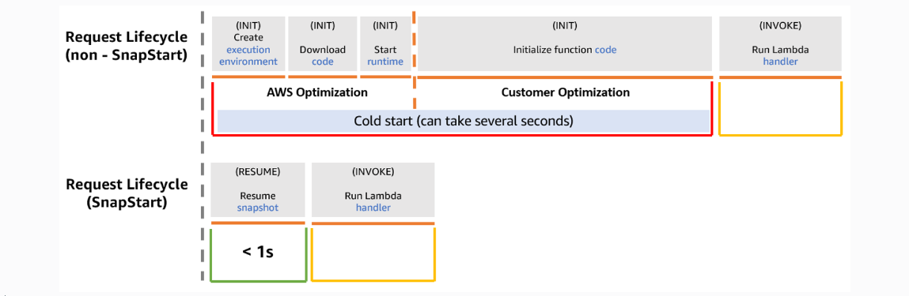

# AWS Solution Architect 

> **Lambda**

AWS Lambda is a compute service that lets you run code without provisioning or managing servers.

- *Concept of Cold start and related terms*:

With **Lambda SnapStart** for Java, Lambda initializes functions as new versions are published. Lambda then takes a Firecracker microVM snapshot of the memory and disk state of the initialized execution environment, encrypts the snapshot, and caches it for low-latency access.



In this scenario, leveraging the cached initialized environment in Lambda SnapStart is, in a way, cheating *cold starts*.


**Lambda provisioned concurrency** is incorrect. On the aspect of cold start times alone, this may be a viable option. However, running with provisioned concurrency incurs overhead costs that may not be warranted during periods when the function experiences minimal to zero invocations.

**Response streaming for Lambda functions** improves overall time-to-first-byte latencies. However, in cases where startup time drowns all other latencies, as in the case of Java runtimes, this solution is insufficient.

**Setting up Lambda layers for dependencies** can yield some startup time deduction, but it is more commonly utilized for build/space optimization or dependency reuse.

> **Important Services**

- **AWS Control Tower** is a high-level service offering a straightforward way to set up and govern an AWS multi-account environment, following prescriptive best practices. AWS Control Tower orchestrates the capabilities of several other AWS services, including AWS Organizations, AWS Service Catalog, and AWS IAM Identity Center, to *build a landing zone* in less than an hour.

Amazon WorkDocs is simply a fully managed, secure content creation, storage, and collaboration service. With Amazon WorkDocs, you can easily create, edit, and share content. And because it’s stored centrally on AWS, you can access it from anywhere on any device.

- **AWS Directory Service** provides multiple ways to use Amazon Cloud Directory and Microsoft Active Directory (AD) with other AWS services. Directories store information about users, groups, and devices, and administrators use them to manage access to information and resources. AWS Directory Service provides multiple directory choices for customers who want to use existing Microsoft AD or Lightweight Directory Access Protocol (LDAP)–aware applications in the cloud. It also offers those same choices to developers who need a directory to manage users, groups, devices, and access. You can assign an IAM Role to the users or groups from your Active Directory once it is integrated with your VPC via the *AWS Directory Service AD Connector*.

- **Amazon Aurora Global Database** is designed for globally distributed applications, allowing a single Amazon Aurora database to span multiple AWS regions. It replicates your data with no impact on database performance, enables fast local reads with low latency in each region, and provides disaster recovery from region-wide outages/*multi-region failure*.

-  **Amazon DynamoDB Global table** supports multi-region, fully replicated tables with low latency, it’s  suitable for NoSQL workloads.

- **Amazon Timestream for Analytics** is primarily a serverless time series database service that is commonly used for IoT and operational applications.

- **EBS** is *I/O* optimized with low latency, block-level, fit for databases, usually attached with single ec2 (or limited instances in the same AZ with Multi-Attach mode)

- **EFS** is *thoughput* optimized, suitable for 100s of EC2 instances to attach with them at a time...

- **Predictive scaling policy** needs all homogeneous servers (same size ec2 instances) in auto scaling group to predict correctly. 

- **AWS Aurora**
    - Aurora Replicas: You can have up to *15 Aurora Replicas* for scaling reads.
    - Endpoints in Aurora:
        - Cluster endpoint → writer (for read/write queries).
        - Reader endpoint → balances across all replicas (for read-only queries).
        - Instance endpoint → targets a specific DB instance.
        - Custom endpoint → groups a chosen set of replicas (e.g., high-performance for prod, low-cost for reporting).
    - High availability: Aurora supports automatic failover within ~30 seconds.
    - Aurora Global Database: For cross-region DR and low-latency reads (up to 16 replicas per region).

- **S3 Features**
    - *WORM* : Write Once Read Many
    - S3 Object Lock Modes
        - *Governance mode*: WORM that can be bypassed by users with s3:BypassGovernanceRetention.
        - *Compliance mode*: Cannot be bypassed by any user, including root. You can extend a retention period, but cannot shorten it.
    - Retention period vs Legal hold
        - *Retention period*: time-boxed (days/years). Object version is protected until the timestamp.
        - *Legal hold*: no expiry, just ON/OFF; blocks deletion regardless of retention mode until you remove it.

- **Concept of partitions in s3**

    - S3 stores objects in partitions for scalability.
    - When you upload or access objects, S3 decides which partition handles the request based on the object key (name).

    - *Problem*: **Hot partitioning**
        
        - If many objects share a similar prefix (e.g., 2025-08-19-log1, 2025-08-19-log2, …),
        - all requests may go to the same partition.
        - That single partition can become a *bottleneck*, causing slower performance or throttling.

        ```
            #❌ Bad (hot partition risk)

            logs/2025-08-19/log1.txt
            logs/2025-08-19/log2.txt
            logs/2025-08-19/log3.txt

        ```

    - *Solution*: **Randomized prefixes**
        
        - If you randomize part of the key name (e.g., add a hash or random characters at the start),
        - requests get spread across different partitions.
        - This balances the load and allows much higher request rates.

        ```
            #✅ Good (randomized prefixes)
            
            a1/logs/2025-08-19/log1.txt
            b7/logs/2025-08-19/log2.txt
            z9/logs/2025-08-19/log3.txt

        ```

- **ElasticCache**
    - Enabling Multi-AZ for ElastiCache Redis automatically provisions replica nodes in different AZs and configures :
        - *synchronous replication* (for Cluster Mode Disabled) or 
        - *asynchronous replication* with failover capabilities (Cluster Mode Enabled). 
    - If a primary node or AZ fails, ElastiCache automatically promotes a replica, ensuring high availability and minimizing data loss/downtime.

- **Data Firehose** is a managed service designed specifically for buffering streaming data and delivering it to S3 in batches.


- **AWS Cloudformation**

    - **Stack Policies** are JSON documents attached to a stack that define which update actions (Update, Delete) are allowed on which specific resources within the stack. A restrictive stack policy can prevent accidental deletion or updates to critical resources.

    - **Change Sets** allow you to create a preview of the changes that CloudFormation will perform if a stack is updated with a modified template or parameters. It lists the resources that will be added, modified, or deleted, allowing review before executing the changes.

- **Elastic Beanstalk deployment policies**

    - *All at once*: Deploys the new version to all existing instances simultaneously, causing downtime. No rollback mechanism described.
    - *Immutable*: Provisions a completely new set of instances in a separate Auto Scaling group with the new application version. Once the new instances pass health checks, Elastic Beanstalk swaps the CNAME or updates ALB rules to direct traffic to the new group and terminates the old instances. If the new instances fail health checks, the deployment fails, and the old instances remain, effectively providing a rollback.
    - *Rolling*: Updates a subset of instances at a time, potentially serving mixed versions. Rollback is manual.
    - *Rolling with additional batch*: Similar to rolling, but updates instances in batches. Rollback is manual.

- **Schema Conversion Toll (SCT)** analyzes and converts the source Oracle schema (tables, procedures, functions) to be compatible with Aurora PostgreSQL (or else). 

- **Database Migration Service (DMS)** performs the actual data migration, including full load and ongoing *Change Data Capture (CDC)* replication, allowing for minimal downtime during the final cutover.


- **Circuit Breaker pattern**: It monitors calls to a downstream service. If failures exceed a threshold, it 'opens' the circuit, causing subsequent calls to fail fast locally without hitting the downstream service. After a timeout, it enters a 'half-open' state to test recovery. This prevents cascading failures and overwhelming a struggling service.

- **Dead-letter queues** → useful for async processing, not synchronous (i.e., real-time REST calls).

- **Amazon ElastiCache** provides managed Redis or Memcached. Both offer the sub-milisecond latency. **Redis** typically has better built-in high availability features (*Multi-AZ with automatic failover*) compared to **Memcached**, making it a strong choice when HA is important for temporary session data.

- **AWS Storage Gateway - Tape Gateway**: *Tape Gateway* presents a virtual tape library (**VTL**) on-premises. Backup software writes to virtual tapes, which are then archived by AWS to S3 Glacier Flexible Retrieval or Deep Archive. This integrates with existing backup workflows and handles the transfer efficiently.

- **UltraWarm** is a storage tier for OpenSearch Service designed specifically for less frequently accessed data (like older logs). It uses S3 for underlying storage, significantly reducing costs compared to hot nodes, while still keeping the data searchable (with slightly higher query latency). Index lifecycle policies can automate moving data from **hot**(fast SSD/EBS, frequent queries) to **UltraWarm**(S3-backed, cheaper, occasional queries).

- **AWS CodeGuru Reviewer** is a machine learning service that provides automated code reviews. It integrates with code repositories like CodeCommit and includes security detectors that can automatically identify secrets (AWS credentials, API keys, passwords) accidentally hardcoded in the source code, helping prevent security breaches.


- **Amazon EMR (Elastic MapReduce)** is a managed big data processing service on AWS. You can run frameworks like *Apache Spark*, *Hadoop*, Hive, Presto, Flink without setting up clusters manually. 

Commonly used for ETL (Extract–Transform–Load), log analysis, machine learning, and data analytics.

👉 Think of EMR as AWS’s managed Spark/Hadoop cluster service.

- **What is Spark?** It is a fast, distributed processing engine:
    - Breaks large datasets into smaller tasks.
    - Runs those tasks in parallel across a cluster of machines (nodes).
    - Very popular for data analytics, real-time streaming, and ML.

🔹 **Spark Nodes in EMR**

When you create an EMR cluster running Spark, the cluster has different types of nodes:

- *Master Node*
    - Manages the cluster.
    - Decides which tasks go to which worker nodes.
    - Must stay stable → usually On-Demand.

- *Core Nodes*
    - Run Spark executors (do actual processing).
    - Store data in HDFS if used.
    - In S3-based setups, they are less critical for storage.

- *Task Nodes*
    - Optional.
    - Only run Spark executors (compute tasks).
    - Do not store data (stateless).
    - Best for Spot Instances → cheapest, no risk since they don’t hold permanent data.

- **AWS Site-to-Site VPN** is the managed AWS service for establishing secure IPsec VPN tunnels between an on-premises network and a VPC. It can be attached to either: 
    - a Virtual Private Gateway (associated with a single VPC) or 
    - a Transit Gateway (for connecting multiple VPCs and on-prem networks). 
    - It supports encryption and BGP.

- **BGP (Border Gateway Protocol)** is a dynamic routing protocol used on the internet and in private networks.
    - With BGP, routers automatically advertise the networks (subnets) they know about to each other.
    - That means if something changes (like you add a new subnet or a route fails), the routers update each other dynamically.

- In AWS Site-to-Site VPN, you can set up routing in two ways:
    - *Static routes* → you manually enter which subnets should be routed.
    - *Dynamic routes (BGP)* → your AWS Virtual Private Gateway (VGW) and your on-prem router exchange routes automatically.

- **STS API Operations**
    - AssumeRole 
        - Used when you want to obtain temporary credentials for a role.
        - Perfect when granting third parties temporary access.
        - You define an IAM Role with policy (like S3 upload permissions), then call AssumeRole to get short-lived creds (up to 1 hour, minimum 15 minutes).

    - GetSessionToken
        - Provides temporary creds, but tied to an IAM user’s long-term credentials.
        - Not role-based, less secure for third parties.

    - AssumeRoleWithWebIdentity
        - For apps that authenticate via an identity provider (IdP) like Google, Facebook, or Amazon Cognito.
        - For web based identity federation.

    - AssumeRoleWithSAML
        - For enterprise identity federation via SAML-based IdPs.
        - Used for employees/SSO, not this case.

- **Kinesis Data Streams** is designed specifically for ingesting and processing large-scale, real-time data streams. It provides ordered, durable storage and allows multiple consumer applications (like Kinesis Data Analytics, Lambda, KCL apps) to process the data concurrently in near real-time.

- **Amazon DynamoDB Accelerator (DAX)** is a fully managed, highly available, in-memory cache specifically designed for DynamoDB. It's API-compatible with DynamoDB, allowing applications to use DAX with minimal code changes while providing microsecond read latency for cached items.

- **AWS Glue Data Catalog** stores metadata (schemas) about data in S3, enabling query engines like Athena to understand the data structure. However, Glue Data Catalog itself doesn't enforce column-level permissions.

- **AWS Lake Formation** provides a centralized service to build, secure, and manage data lakes. It allows defining fine-grained permissions (including table-level and column-level access control) on data stored in S3 and registered with the Glue Data Catalog. These permissions are enforced across integrated services like Athena, Redshift Spectrum, and Glue ETL.

- **AWS service mesh** (like App Mesh) injects sidecar proxies (e.g., Envoy) alongside application containers/instances. These proxies can be configured to automatically establish mutual TLS (mTLS) connections between themselves, encrypting all traffic between services transparently without requiring application code changes.

- **AWS Backup** doesn't support 1-minute RPO for EBS snapshots. (can schaduled for min hourly range)

- **EBS Volume Types** 

    - *gp3 (General Purpose SSD)*
        - Balanced price/performance.
        - Up to 16,000 IOPS & 1,000 MB/s throughput.
        - Not the absolute fastest.

    - *io1 / io2 (Provisioned IOPS SSD)*
        - Designed for high-performance, IOPS-sensitive workloads.
        - You can provision up to 64,000 IOPS per volume (depending on instance type).
        - Throughput up to 1,000 MB/s.
        - io2 Block Express (newer generation) → up to 256,000 IOPS & 4,000 MB/s throughput.
        - Best choice for mission-critical apps that demand the highest performance and durability (99.999%).

    - *st1 (Throughput Optimized HDD) and sc1 (Cold HDD)*
        - For big, sequential data (logs, backups, streaming).
        - Not good for low-latency or high-IOPS workloads.
        

- **IAM policies** operate on the principle of *implicit deny*. If an action is not explicitly allowed by an applicable Identity-based policy, Resource-based policy, Permissions Boundary, SCP, etc., it is implicitly denied.

- **AWS Transit Gateway** is a managed service that provides a central point for routing traffic between VPCs. This can be more operationally efficient than setting up VPC peering connections between each VPC, as it eliminates the need to update route tables in each VPC.


- **AWS Organizations** is service that helps you centrally manage and govern multiple AWS accounts. It allows you to create a hierarchy of accounts under a single management account, enabling centralized billing, security, and compliance management.

- **Control Tower** is a service that helps you set up and govern a secure, multi-account AWS environment based on AWS best practices. It provides a pre-configured landing zone with security and compliance controls.

    - *Landing Zone* is a well-architected, multi-account AWS environment that follows security and compliance best practices. Control Tower automatically creates this environment with proper account structure and security controls

- **Control Tower Features:**

    - *Guardrails*: Pre-configured security controls that help you maintain compliance and security across your organization. Guardrails can be preventive (blocking actions) or detective (monitoring and alerting)

    - *Account Factory*: A service that automatically creates new accounts with the proper security controls and configurations. This ensures all new accounts follow your organization's security standards

    - *Centralized Governance*: The ability to manage security, compliance, and operational policies from a central location. This reduces administrative overhead and ensures consistent policy enforcement


