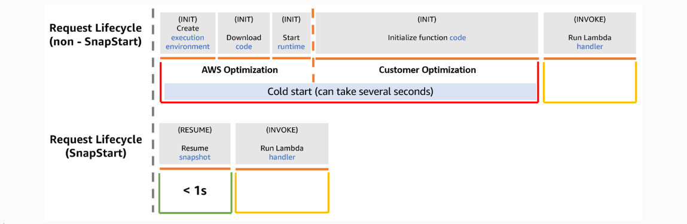
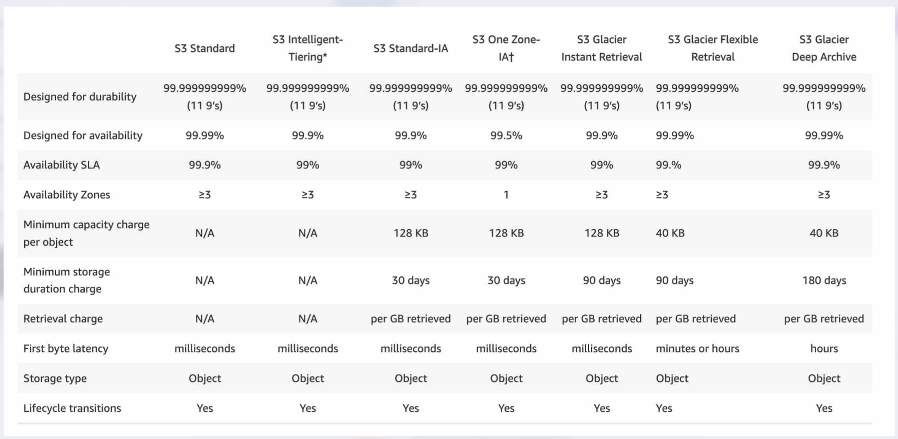
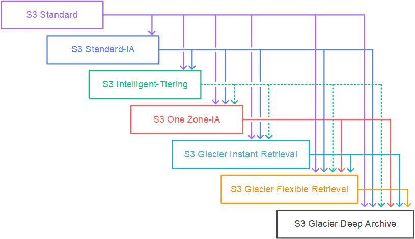
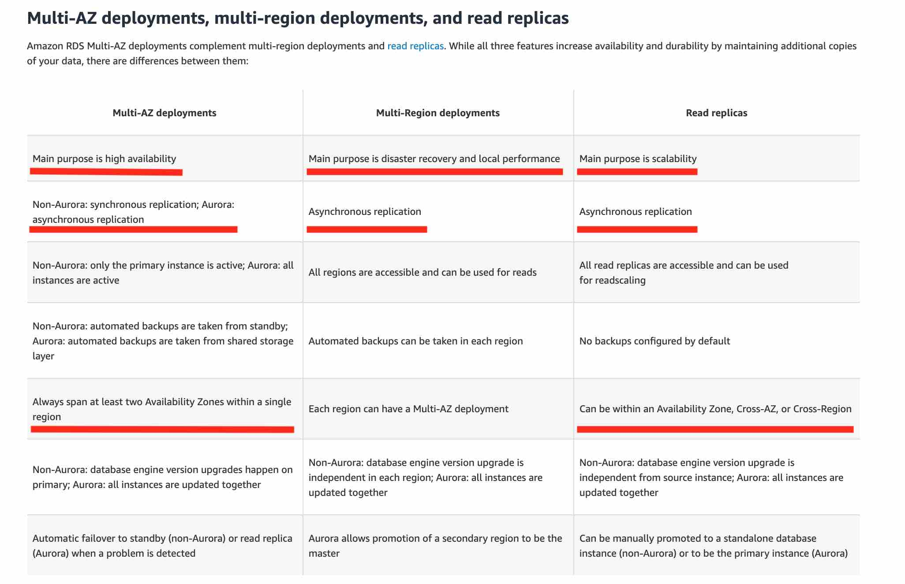
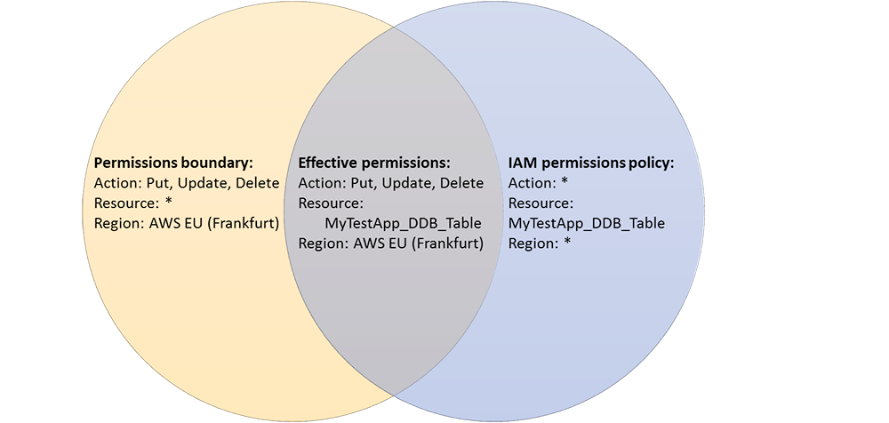

# AWS Solution Architect 

> **Lambda**

AWS Lambda is a compute service that lets you run code without provisioning or managing servers.

- *Concept of Cold start and related terms*:

With **Lambda SnapStart** for Java, Lambda initializes functions as new versions are published. Lambda then takes a Firecracker microVM snapshot of the memory and disk state of the initialized execution environment, encrypts the snapshot, and caches it for low-latency access.



In this scenario, leveraging the cached initialized environment in **Lambda SnapStart** is, in a way, cheating *cold starts*.


**Lambda provisioned concurrency** is incorrect. On the aspect of cold start times alone, this may be a viable option. However, running with provisioned concurrency incurs overhead costs that may not be warranted during periods when the function experiences minimal to zero invocations.

**Response streaming for Lambda functions** improves overall time-to-first-byte latencies. However, in cases where startup time drowns all other latencies, as in the case of Java runtimes, this solution is insufficient.

**Setting up Lambda layers for dependencies** can yield some startup time deduction, but it is more commonly utilized for build/space optimization or dependency reuse.

> AWS Lambda currently supports **1000 concurrent executions per AWS account per region**. If your Amazon SNS message deliveries to AWS Lambda contribute to crossing these concurrency quotas, your Amazon SNS message deliveries will be throttled. You need to contact AWS support to raise the account limit.


> **Important Services**

- **AWS Control Tower** is a high-level service offering a straightforward way to set up and govern an AWS multi-account environment, following prescriptive best practices. AWS Control Tower orchestrates the capabilities of several other AWS services, including AWS Organizations, AWS Service Catalog, and AWS IAM Identity Center, to *build a landing zone* in less than an hour.

Amazon WorkDocs is simply a fully managed, secure content creation, storage, and collaboration service. With Amazon WorkDocs, you can easily create, edit, and share content. And because it’s stored centrally on AWS, you can access it from anywhere on any device.

- **AWS Directory Service** provides multiple ways to use Amazon Cloud Directory and Microsoft Active Directory (AD) with other AWS services. Directories store information about users, groups, and devices, and administrators use them to manage access to information and resources. AWS Directory Service provides multiple directory choices for customers who want to use existing Microsoft AD or Lightweight Directory Access Protocol (LDAP)–aware applications in the cloud. It also offers those same choices to developers who need a directory to manage users, groups, devices, and access. You can assign an IAM Role to the users or groups from your Active Directory once it is integrated with your VPC via the *AWS Directory Service AD Connector*.

- **Amazon Aurora Global Database** is designed for globally distributed applications, allowing a single Amazon Aurora database to span multiple AWS regions. It replicates your data with no impact on database performance, enables fast local reads with low latency in each region, and provides disaster recovery from region-wide outages/*multi-region failure*.

-  **Amazon DynamoDB Global table** supports multi-region, fully replicated tables with low latency, it’s  suitable for NoSQL workloads.

- **Amazon Timestream for Analytics** is primarily a serverless time series database service that is commonly used for IoT and operational applications.

- **EBS** is *I/O* optimized with low latency, block-level, fit for databases, usually attached with single ec2 (or limited instances in the same AZ with Multi-Attach mode)

- **EFS** is *thoughput* optimized, suitable for 100s of EC2 instances to attach with them at a time...
    - With Amazon EFS, you pay only for the resources that you use. 
    - The Amazon EFS Standard Storage pricing is **$0.30 per GB per month**.

- **AWS EFS One Zone** One Zone variant provides single‑AZ NFS with lower latency than regional EFS and a **47 TiB burst credit model**, ideal for tightly coupled container workloads

> Commonly used scaling policies for AWS ASG

1. Target Tracking Scaling (Recommended): Sets a target metric (e.g., 60% CPU utilization or 1000 requests per target) and the ASG adds/removes instances to maintain that average, acting like a thermostat.

2. Step Scaling: Enables more granular adjustments by defining different scaling adjustments (add 1, add 5) based on the size of the threshold breach in CloudWatch alarms.

3. Simple Scaling: Similar to step scaling but applies a single, straightforward adjustment based on an alarm, with a cooldown period before acting again.

4. Scheduled Scaling: Adjusts capacity automatically according to a predetermined, predictable schedule (e.g., scaling up every Monday at 9 AM).

5. Predictive Scaling: Uses machine learning to analyze historical traffic patterns and proactively launches instances before demand spikes. It needs all homogeneous servers (same size ec2 instances) in auto scaling group to predict correctly.

6. Manual Scaling: Manually changing the minimum, maximum, or desired capacity of the group. 


- **AWS Aurora**
    - Aurora Replicas: You can have up to *15 Aurora Replicas* for scaling reads.
    - Endpoints in Aurora:
        - Cluster endpoint → writer (for read/write queries).
        - Reader endpoint → balances across all replicas (for read-only queries).
        - Instance endpoint → targets a specific DB instance.
        - Custom endpoint → groups a chosen set of replicas (e.g., high-performance for prod, low-cost for reporting).
    - High availability: Aurora supports automatic failover within ~30 seconds.
    - Aurora Global Database: For cross-region DR and low-latency reads (up to 16 replicas per region).

- **S3 Features**
    - *WORM* : Write Once Read Many
    - S3 Object Lock Modes (*object lock requires versioning to be enabled while creating bucket*)
        - *Governance mode*: WORM that can be bypassed by users with s3:BypassGovernanceRetention.
        - *Compliance mode*: Cannot be bypassed by any user, including root. You can extend a retention period, but cannot shorten it.
    - Retention period vs Legal hold
        - *Retention period*: time-boxed (days/years). Object version is protected until the timestamp.
        - *Legal hold*: no expiry, just ON/OFF; blocks deletion regardless of retention mode until you remove it.

- **Backup vault lock** enforces WORM at the vault level. Once a lock configuration is applied in **compliance mode**, even an admin cannot change retention or delete the backups, satisfying strict compliance regulations.

- **Concept of partitions in s3**

    - S3 stores objects in partitions for scalability.
    - When you upload or access objects, S3 decides which partition handles the request based on the object key (name).

    - *Problem*: **Hot partitioning**
        
        - If many objects share a similar prefix (e.g., 2025-08-19-log1, 2025-08-19-log2, …),
        - all requests may go to the same partition.
        - That single partition can become a *bottleneck*, causing slower performance or throttling.

        ```
            #❌ Bad (hot partition risk)

            logs/2025-08-19/log1.txt
            logs/2025-08-19/log2.txt
            logs/2025-08-19/log3.txt

        ```

    - *Solution*: **Randomized prefixes**
        
        - If you randomize part of the key name (e.g., add a hash or random characters at the start),
        - requests get spread across different partitions.
        - This balances the load and allows much higher request rates.

        ```
            #✅ Good (randomized prefixes)
            
            a1/logs/2025-08-19/log1.txt
            b7/logs/2025-08-19/log2.txt
            z9/logs/2025-08-19/log3.txt

        ```

        - we can achieve at least `3,500 PUT/COPY/POST/DELETE` or `5,500 GET/HEAD` requests `per second per prefix` in a bucket.

    > S3 automatically scales by partition. Adding even a small random prefix (two alphanumeric characters gives **3792** partitions) distributes traffic uniformly, removing partition hotspots, and S3 Standard sustains the highest request concurrency at the lowest per‑request cost for frequently accessed public data sets.

- S3 Storage class transitions and some pricings:

    - you cannot transition objects smaller then 128kb from standard to IA type.
    - minimum 30 days retention in S3 standard is required before transitioning object to some S3 standard IA or S3-intelligent-tiering or S3-One-Zone-IA.
    - The minimum storage duration charge is **30 days** for s3 standarade-IA and S3 one-zone-IA.
    - The minimum storage duration charge is **90 days** for s3 glacier instant/flexible retrieval.
    - The minimum storage duration charge is **180 days** for s3 glacier deep archive.
    - S3 Standard storage, the pricing is $0.023 per GB per month

> Pic below shows different s3 classes, their pricings and retrival times, etc.



> and here are the storage class lifecycle transitions for objects stored on Amazon S3




- **ElasticCache**
    - Enabling Multi-AZ for ElastiCache Redis automatically provisions replica nodes in different AZs and configures :
        - *synchronous replication* (for Cluster Mode Disabled) or 
        - *asynchronous replication* with failover capabilities (Cluster Mode Enabled). 
    - If a primary node or AZ fails, ElastiCache automatically promotes a replica, ensuring high availability and minimizing data loss/downtime.

- **Data Firehose** is a managed service designed specifically for buffering streaming data and delivering it to S3 in batches.


- **AWS Cloudformation**

    - **Stack Policies** are JSON documents attached to a stack that define which update actions (Update, Delete) are allowed on which specific resources within the stack. A restrictive stack policy can prevent accidental deletion or updates to critical resources.

    - **Change Sets** allow you to create a preview of the changes that CloudFormation will perform if a stack is updated with a modified template or parameters. It lists the resources that will be added, modified, or deleted, allowing review before executing the changes.

- **Elastic Beanstalk deployment policies**

    - *All at once*: Deploys the new version to all existing instances simultaneously, causing downtime. No rollback mechanism described.
    - *Immutable*: Provisions a completely new set of instances in a separate Auto Scaling group with the new application version. Once the new instances pass health checks, Elastic Beanstalk swaps the CNAME or updates ALB rules to direct traffic to the new group and terminates the old instances. If the new instances fail health checks, the deployment fails, and the old instances remain, effectively providing a rollback.
    - *Rolling*: Updates a subset of instances at a time, potentially serving mixed versions. Rollback is manual.
    - *Rolling with additional batch*: Similar to rolling, but updates instances in batches. Rollback is manual.

- **Schema Conversion Toll (SCT)** analyzes and converts the source Oracle schema (tables, procedures, functions) to be compatible with Aurora PostgreSQL (or else). 

- **Database Migration Service (DMS)** performs the actual data migration, including full load and ongoing *Change Data Capture (CDC)* replication, allowing for minimal downtime during the final cutover.


- **Circuit Breaker pattern**: It monitors calls to a downstream service. If failures exceed a threshold, it 'opens' the circuit, causing subsequent calls to fail fast locally without hitting the downstream service. After a timeout, it enters a 'half-open' state to test recovery. This prevents cascading failures and overwhelming a struggling service.

- **Dead-letter queues** → useful for async processing, not synchronous (i.e., real-time REST calls).

- **Amazon ElastiCache** provides managed Redis or Memcached. Both offer the sub-milisecond latency. **Redis** typically has better built-in high availability features (*Multi-AZ with automatic failover*) compared to **Memcached**, making it a strong choice when HA is important for temporary session data.

- **AWS ParallelCluster**: Used for HPC (High Performance Computing) clusters.

- **UltraWarm** is a storage tier for OpenSearch Service designed specifically for less frequently accessed data (like older logs). It uses S3 for underlying storage, significantly reducing costs compared to hot nodes, while still keeping the data searchable (with slightly higher query latency). Index lifecycle policies can automate moving data from **hot**(fast SSD/EBS, frequent queries) to **UltraWarm**(S3-backed, cheaper, occasional queries).

- **AWS CodeGuru Reviewer** is a machine learning service that provides automated code reviews. It integrates with code repositories like CodeCommit and includes security detectors that can automatically identify secrets (AWS credentials, API keys, passwords) accidentally hardcoded in the source code, helping prevent security breaches.


- **Amazon EMR (Elastic MapReduce)** is a managed big data processing service on AWS. You can run frameworks like *Apache Spark*, *Hadoop*, Hive, Presto, Flink without setting up clusters manually. 

Commonly used for ETL (Extract–Transform–Load), log analysis, machine learning, and data analytics.

👉 Think of EMR as AWS’s managed Spark/Hadoop cluster service.

- **What is Spark?** It is a fast, distributed processing engine:
    - Breaks large datasets into smaller tasks.
    - Runs those tasks in parallel across a cluster of machines (nodes).
    - Very popular for data analytics, real-time streaming, and ML.

🔹 **Spark Nodes in EMR**

When you create an EMR cluster running Spark, the cluster has different types of nodes:

- *Master Node*
    - Manages the cluster.
    - Decides which tasks go to which worker nodes.
    - Must stay stable → usually On-Demand.

- *Core Nodes*
    - Run Spark executors (do actual processing).
    - Store data in HDFS if used.
    - In S3-based setups, they are less critical for storage.

- *Task Nodes*
    - Optional.
    - Only run Spark executors (compute tasks).
    - Do not store data (stateless).
    - Best for Spot Instances → cheapest, no risk since they don’t hold permanent data.

- **AWS Site-to-Site VPN** is the managed AWS service for establishing secure IPsec VPN tunnels between an on-premises network and a VPC. It can be attached to either: 
    - a Virtual Private Gateway (associated with a single VPC) or 
    - a Transit Gateway (for connecting multiple VPCs and on-prem networks). 
    - It supports encryption and BGP.

- **BGP (Border Gateway Protocol)** is a dynamic routing protocol used on the internet and in private networks.
    - With BGP, routers automatically advertise the networks (subnets) they know about to each other.
    - That means if something changes (like you add a new subnet or a route fails), the routers update each other dynamically.

- In AWS Site-to-Site VPN, you can set up routing in two ways:
    - *Static routes* → you manually enter which subnets should be routed.
    - *Dynamic routes (BGP)* → your AWS Virtual Private Gateway (VGW) and your on-prem router exchange routes automatically.

- **AWS Storage Gateway - Tape Gateway**: *Tape Gateway* presents a virtual tape library (**VTL**) on-premises. Backup software writes to virtual tapes, which are then archived by AWS to S3 Glacier Flexible Retrieval or Deep Archive. This integrates with existing backup workflows and handles the transfer efficiently.

- **Volume Gateway** provides iSCSI block storage, not file-based access.

- **Gateway Endpoints** Great if use case is only S3 & DynamoDB as they only support S3 and DynamoDB

- **Interface endpoints** provide private connectivity (**PrivateLink**) from your VPC to supported AWS services (KMS, SSM, SNS, SQS, Secrets Manager, CloudWatch Logs, etc.) over the AWS backbone.
    - Traffic stays internal → no NAT Gateway data-processing fees for those service calls.
    - You control access with endpoint policies and security groups on the endpoint ENIs.


- **STS API Operations**
    - AssumeRole 
        - Used when you want to obtain temporary credentials for a role.
        - Perfect when granting third parties temporary access.
        - You define an IAM Role with policy (like S3 upload permissions), then call AssumeRole to get short-lived creds (up to 1 hour, minimum 15 minutes).

    - GetSessionToken
        - Provides temporary creds, but tied to an IAM user’s long-term credentials.
        - Not role-based, less secure for third parties.

    - AssumeRoleWithWebIdentity
        - For apps that authenticate via an identity provider (IdP) like Google, Facebook, or Amazon Cognito.
        - For web based identity federation.

    - AssumeRoleWithSAML
        - For enterprise identity federation via SAML-based IdPs.
        - Used for employees/SSO, not this case.

- **Kinesis Data Streams** is designed specifically for ingesting and processing large-scale, real-time data streams. It provides ordered, durable storage and allows multiple consumer applications (like Kinesis Data Analytics, Lambda, KCL apps) to process the data concurrently in near real-time.

- **Kinesis Data Analytics** can be used to transform and analyze streaming data in real-time with **Apache Flink**. It enables you to quickly build end-to-end stream processing applications for log analytics, clickstream analytics, Internet of Things (IoT), ad tech, gaming, etc. 

The four most common use cases are:
    - streaming extract-transform-load (ETL), 
    - continuous metric generation, 
    - responsive real-time analytics, 
    - and interactive querying of data streams. 
    
> Kinesis Data Analytics for Apache Flink applications provides your app **50 GB of running application storage per Kinesis Processing Unit (KPU)**.

- **Amazon DynamoDB Accelerator (DAX)** is a fully managed, highly available, in-memory cache specifically designed for DynamoDB. It's API-compatible with DynamoDB, allowing applications to use DAX with minimal code changes while providing microsecond read latency for cached items. It can deliver up to a 10 times performance improvement—from milliseconds to microseconds—even at millions of requests per second.

- **AWS Glue Data Catalog** stores metadata (schemas) about data in S3, enabling query engines like Athena to understand the data structure. However, Glue Data Catalog itself doesn't enforce column-level permissions.

- **AWS Lake Formation** provides a centralized service to build, secure, and manage data lakes. It allows defining fine-grained permissions (including table-level and column-level access control) on data stored in S3 and registered with the Glue Data Catalog. These permissions are enforced across integrated services like Athena, Redshift Spectrum, and Glue ETL.

- **AWS service mesh** (like App Mesh) injects sidecar proxies (e.g., Envoy) alongside application containers/instances. These proxies can be configured to automatically establish mutual TLS (mTLS) connections between themselves, encrypting all traffic between services transparently without requiring application code changes.

- **AWS Backup** doesn't support 1-minute RPO for EBS snapshots. (can schaduled for min hourly range)

| Requirement	                         | AWS Native Solution	    | Why  |
| -------------                          | -------------------      | ---- |
| RTO ≤ 5 min, RPO = 0	                 | RDS Multi-AZ	            | Synchronous replication + auto failover |
| RTO < 30 sec, RPO = 0	                 | Aurora Multi-AZ	        | Fast failover storage-level sync |
| Cross-Region: RTO < 1 min, RPO ~1 sec  | Aurora Global DB  	    | Dedicated global replication |
| Cross-Region: RTO hours, low cost	     | RDS snapshots	        | Cold DR |
| Analytics read scaling, no HA	         | Read Replicas	        | Async, no RPO or RTO guarantees |


> Amazon RDS Proxy helps manage connection pooling and throttling, which are common causes of Aurora timeouts during high-load scenarios.

- **Multi-AZ** follows *synchronous* replication and spans at least two Availability Zones (AZs) within a single region. 
- **Read replicas** follow *asynchronous* replication and can be within an Availability Zone (AZ), Cross-AZ, or Cross-Region.

Please review this comparison vis-a-vis Multi-AZ vs Read Replica for Amazon RDS: 



**Amazon RDS Custom** allows you to access and customize your database server host and operating system (simple RDS does not allow you this).

- **EBS Volume Types** 

    - *gp3 (General Purpose SSD)*
        - Balanced price/performance.
        - Up to 16,000 IOPS & 1,000 MB/s throughput.
        - Not the absolute fastest.

    - *io1 / io2 (Provisioned IOPS SSD)*
        - Designed for high-performance, IOPS-sensitive workloads.
        - You can provision up to 64,000 IOPS per volume (depending on instance type).
        - Throughput up to 1,000 MB/s.
        - io2 Block Express (newer generation) → up to 256,000 IOPS & 4,000 MB/s throughput.
        - Best choice for mission-critical apps that demand the highest performance and durability (99.999%).

    - *st1 (Throughput Optimized HDD) and sc1 (Cold HDD)*
        - For big, sequential data (logs, backups, streaming).
        - Not good for low-latency or high-IOPS workloads.
        

- **IAM policies** operate on the principle of *implicit deny*. If an action is not explicitly allowed by an applicable Identity-based policy, Resource-based policy, Permissions Boundary, SCP, etc., it is implicitly denied.

- **AWS Transit Gateway** is a managed service that provides a central point for routing traffic between VPCs. This can be more operationally efficient than setting up VPC peering connections between each VPC, as it eliminates the need to update route tables in each VPC.

- **VPC peering** allows users to create a network connection between two VPCs in the same AWS account or in different AWS accounts within the same region. VPC peering enables the instances in the peered VPCs to communicate with each other as if they are on the same network. This helps in creating a more isolated and secure network environment within AWS.

- **AWS Organizations** is service that helps you centrally manage and govern multiple AWS accounts. It allows you to create a hierarchy of accounts under a single management account, enabling centralized billing, security, and compliance management.

- **AWS RAM**: AWS Resource Access Manager enables cross-account resource sharing (Transit Gateway, Route 53 rules, License Manager, etc.) within the Organization.

- Route 53 now supports *cross-account sharing of Private Hosted Zones* (PHZs) and Resolver rules using AWS Resource Access Manager (RAM). Once shared, any VPC that accepts the share can automatically resolve DNS records in the private zone — no conditional forwarding, no custom DNS proxy, no Transit Gateway routing, no peering DNS hacks.

- **Control Tower** is a service that helps you set up and govern a secure, multi-account AWS environment based on AWS best practices. It provides a pre-configured landing zone with security and compliance controls.

    - *Landing Zone* is a well-architected, multi-account AWS environment that follows security and compliance best practices. Control Tower automatically creates this environment with proper account structure and security controls

- **Control Tower Features:**

    - *Guardrails*: Pre-configured security controls that help you maintain compliance and security across your organization. Guardrails can be preventive (blocking actions) or detective (monitoring and alerting)

    - *Account Factory*: A service that automatically creates new accounts with the proper security controls and configurations. This ensures all new accounts follow your organization's security standards

    - *Centralized Governance*: The ability to manage security, compliance, and operational policies from a central location. This reduces administrative overhead and ensures consistent policy enforcement

- **AWS Identity and Access Management (IAM) Access Analyzer** is an AWS service that helps to analyze resource-based policies to ensure the resources in an AWS account are only accessible by the intended principals.

- **IAM credential report**: you can generate and download a credential report that lists all users in your account and the status of their various credentials, including passwords, access keys, and MFA devices.

- **Amazon Kendra** is an enterprise search service that allows developers to add search capabilities to their applications. This enables their end users to discover information stored within the vast amount of content spread across their company.

- **Amazon FSx For Lustre** is a high-performance file system for fast processing of workloads. Lustre is a popular open-source parallel file system which stores data across multiple network file servers to maximize performance and reduce bottlenecks. It makes it easy and cost-effective to launch and run the world’s most popular high-performance file system. It is used for workloads such as machine learning, high-performance computing (HPC), video processing, and financial modeling. The open-source Lustre file system is designed for applications that require fast storage – where you want your storage to keep up with your compute.

    - High throughput but designed for batch HPC(High Performance Compute) and **deletes after 14 days** by default.


- **Amazon FSx for Windows File Server** is a fully managed Microsoft Windows file system with full support for the SMB protocol, Windows NTFS, and Microsoft Active Directory (AD) Integration.

- **Amazon API Gateway** provides throttling at multiple levels including global and by a service call. Throttling limits can be set for standard rates and bursts. For example, API owners can set a rate limit of 1,000 requests per second for a specific method in their REST APIs, and also configure Amazon API Gateway to handle a burst of 2,000 requests per second for a few seconds.
    - Amazon API Gateway tracks the number of requests per second. Any requests over the limit will receive a `429 HTTP response`.

- **AWS File Gateway** It provides access to objects in S3 as files or file share mount points. With a file gateway, you can do the following:
    - You can store and retrieve files directly using the NFS version 3 or 4.1 protocol.
    - You can store and retrieve files directly using the SMB file system version, 2 and 3 protocol.
    - You can access your data directly in Amazon S3 from any AWS Cloud application or service.
    - You can manage your Amazon S3 data using lifecycle policies, cross-region replication, and versioning. You can think of a file gateway as a file system mount on S3.

- **EBS CSI driver** EBS Container Storage Interface Encrypts storage volumes only, not eks etcd or Secrets.

- **Secrets Manager** External secret store — good for apps to retrieve secrets, but it doesn’t encrypt eks etcd data directly.

- **EBS volume encryption** Only protects data on attached disks, not eks etcd contents.

- **RDS**

    - **IAM DB Auth** allows EC2 instances (or users) with IAM roles/policies to generate temporary authentication tokens (via AWS CLI or SDK). 
    - These tokens are valid for **15 minutes** and are used instead of passwords when connecting to RDS.
    - Supported for MySQL and PostgreSQL RDS engines.

- **Redshift Serverless** Decouples Compute From Storage, In Redshift Serverless:
    - Storage is in Redshift Managed Storage (RMS).
    - Compute is provided via workgroups (RPU-based).
    - Multiple workgroups can access the same database and same data.

- **Pre-signed URLs** can allow direct file download

- **Security Hub** is a security and compliance service that helps customers consolidate and prioritize security alerts and findings from various AWS services.

- **Amazon Inspector** is primarily used for analyzing the behavior of applications running on EC2 instances for security vulnerabilities and deviations from best practices.

- Standard **Step Functions** retain full execution history for 90 days. The **StartFromFailure** pattern (or Console *Retry from this state*) re‑creates an execution beginning at the chosen failed state, saving time and cost in multi‑hour workflows.

- IoT Core **Rules Engine** can execute SQL‑like transformations on message payloads and insert results into DynamoDB directly. Eliminating Lambda removes per‑message startup latency, higher concurrency limits, and cost, providing a leaner path for millions of small updates per second.

- **Glue 3.0** can pool executors. Setting *NumberOfWorkers* and *MaxConcurrentRuns* >1 and enabling `--job-language python` with continuous logging keeps nodes alive between runs, slashing cold starts without operators managing clusters. (Glue 3.0 keeps workers idle for N minutes so subsequent runs reuse JVMs, reducing init to ~ **2 min**)

- **Governed tables** gather statistics and maintain indexes so Presto/Athena push‑down selects just the partitions matching predicates, reducing scanned data and improving performance without rewriting queries.

- **Amazon Glue** is a serverless, managed ETL service designed for easier, automated data preparation and integration (ETL/ELT).

- **AWS Glue DataBrew** is a fully managed, serverless data preparation tool that enables users to *visually* clean, transform, and normalize raw datasets—all without writing any code. It is specifically designed for data analysts, business users, and data engineers who need to prepare data for analytics or machine learning workflows using an intuitive point-and-click interface.

- **Amazon EMR (Elastic MapReduce)** is a managed web service that simplifies processing and analyzing large datasets on the AWS cloud using big data frameworks like Apache Hadoop and Apache Spark

- **Spark on Amazon EMR** Placing **Spot only on task nodes** means interruptions merely slow compute, not corrupt **HDFS**(as it is held by core nodes). Core nodes that hold replicated blocks remain On‑Demand, keeping fault tolerance and still delivering major cost savings from Spot task nodes.

- EMR’s **multi‑master** feature (HA) replicates *HDFS NameNode* and *YARN ResourceManager*. If primary master fails (e.g., Spot termination), standby takes over automatically, ensuring job progress continues.
    - HA option launches two master nodes in different AZs using **Zookeeper** for leader election; NameNode lives on both, preventing cluster loss.

- **ENA Express** is a networking feature that uses the AWS Scalable Reliable Datagram (SRD) protocol to improve network performance in two key ways: higher single flow bandwidth and lower tail latency for network traffic between EC2 instances (Latency ~ 5 ms).

- AWS IoT Core’s **Fleet Provisioning** + JITR + Fleet Indexing provides scalable, automated certificate lifecycle management for IoT clients. Devices can automatically receive new certs through Jobs, ensuring continuous secure MQTT uploads even when old certs expire.

- **AWS telemetry** is the automated process of collecting and transmitting data about your AWS services and applications for monitoring, diagnosis, and optimization. AWS provides tools like the *AWS Distro for OpenTelemetry* (ADOT) and integrates telemetry into services such as Amazon CloudWatch and AWS X-Ray.

- **AWS capacity-optimized Spot Fleet** selects Spot pools with the *highest available capacity*, not the cheapest price. By spreading across multiple AZs and several instance types, you dramatically increase the number of Spot pools available. More pools = far lower chance of interruption, and no code changes to the batch workflow.

- A **mixed Compute Environment** lets Batch opportunistically consume low‑cost Spot pools, filling gaps with On‑Demand when markets are tight. *CAPACITY_OPTIMIZED* chooses pools with lowest interruption rate, balancing reliability and cost without manual intervention.

- **AWS Local Zones** are extensions of AWS cloud infrastructure that bring services closer to large populations and industries, enabling low-latency applications and compliance with data residency requirements.

- A KMS **key policy** can grant another account full decrypt permission. The external principal does not rely on IAM of the suspended account. AWS will honor the key policy, so the logging account can still decrypt logs even if the primary account is locked, ensuring business continuity.

- **NetworkPolicies** act as internal firewalls for Kubernetes clusters. They define exactly which pods/namespaces can communicate. On EKS, enabling **Calico** alongside the **AWS VPC CNI** allows these policies to be enforced at the ENI level with minimal setup—no extra proxies or service meshes—giving strong runtime isolation across tenant namespaces.

- **Amazon OpenSearch Service with UltraWarm nodes**: UltraWarm stores infrequently accessed, append‑only data cheaply and still allows search via Lucene indices under 1 sec query latency.

- **RA3 nodes** decouple compute and storage, offering fast NVMe local cache and high throughput to S3. Auto Copy listens to S3 event notifications and ingests new objects continuously, allowing the heavy ETL process to complete incrementally and drastically reducing the end‑to‑end lag before dashboards can query the fresh data.

- **KPL (Kinesis Producer Library) fragmentation** is the only solution in streaming architectures that fixes (files') oversize errors with almost zero application changes, keeps real-time streaming, and preserves the same consumer logic using KCL (Kinesis Consumer Library).

- **Babelfish for Aurora PostgreSQL** is a translation layer that allows Amazon Aurora to understand commands from applications written for Microsoft SQL Server. It enables Aurora PostgreSQL to become "bilingual," supporting both the PostgreSQL dialect and SQL Server's proprietary T-SQL dialect simultaneously.

    - Dual Protocol Support: The same database cluster listens on two different ports: 
    
        - Port 1433 (the standard SQL Server TDS port) and Port 5432 (the standard PostgreSQL port).

- **Instance store** offers high-performance, temporary block storage at no extra cost since it's physically attached to the host. It is ideal for volatile data (caches, buffers) or replicated fleets where the architecture can tolerate instance loss. For high-speed I/O at the lowest price point, use Instance Store-backed EC2 instances.

- **AWS Global Accelerator** is a service that improves the availability and performance of your applications with local or global users. It provides static IP addresses that act as a fixed entry point to your application endpoints in a single or multiple AWS Regions, such as your ALB, NLB or Amazon EC2 instances.

- **AWS Outposts Rack** brings native AWS services, including EKS, EC2, S3, and CloudWatch, into the customer’s local on-prem data center.

- **Permissions boundary** can be used to control the maximum permissions employees can grant to the IAM principals (that is, users and roles) that they create and manage. As the IAM administrator, you can define one or more permissions boundaries using managed policies and allow your employee to create a principal with this boundary. The employee can then attach a permissions policy to this principal. However, the effective permissions of the principal are the intersection of the permissions boundary and permissions policy. As a result, the new principal cannot exceed the boundary that you defined. Therefore, using the permissions boundary offers the right solution for this use-case.

Example of permission boundary:


> Difference between ELB (regional) and AWS Global Accelerator (multi-regional):

**AWS Global Accelerator** relies on **ELB** to provide the traditional load balancing features such as support for internal and non-AWS endpoints, pre-warming, and Layer 7 routing. However, while ELB provides load balancing within one Region, AWS Global Accelerator provides traffic management across multiple Regions.

- **Amazon GuardDuty** offers threat detection that enables you to continuously monitor and protect your AWS accounts, workloads, and data stored in Amazon S3. GuardDuty analyzes continuous streams of meta-data generated from your account and network activity found in AWS CloudTrail Events, Amazon VPC Flow Logs, and DNS Logs. It also uses integrated threat intelligence such as known malicious IP addresses, anomaly detection, and machine learning to identify threats more accurately.

- **Amazon Simple Queue Service (SQS)** is a fully managed message queuing service that enables you to decouple and scale microservices, distributed systems, and serverless applications. SQS offers two types of message queues - Standard queues vs FIFO queues.

    - By default, FIFO queues support up to 300 messages per second (300 send, receive, or delete operations per second). When you batch 10 messages per operation (*maximum*), FIFO queues can support up to 3,000 messages per second.

- **S3 Transfer Acceleration** speeds-up the content transfer to/from aws s3 upto 50-500%m but even with S3TA, you pay only for the transfers that are accelerated.

- REST API ----> stateless
- Websocket api ---> stateful
