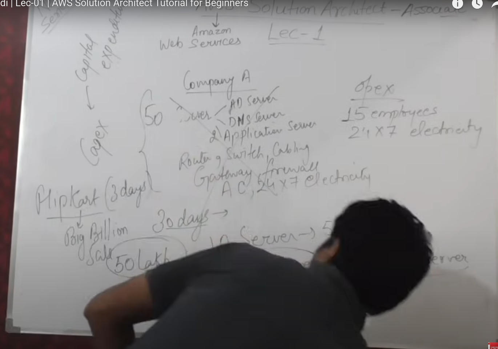
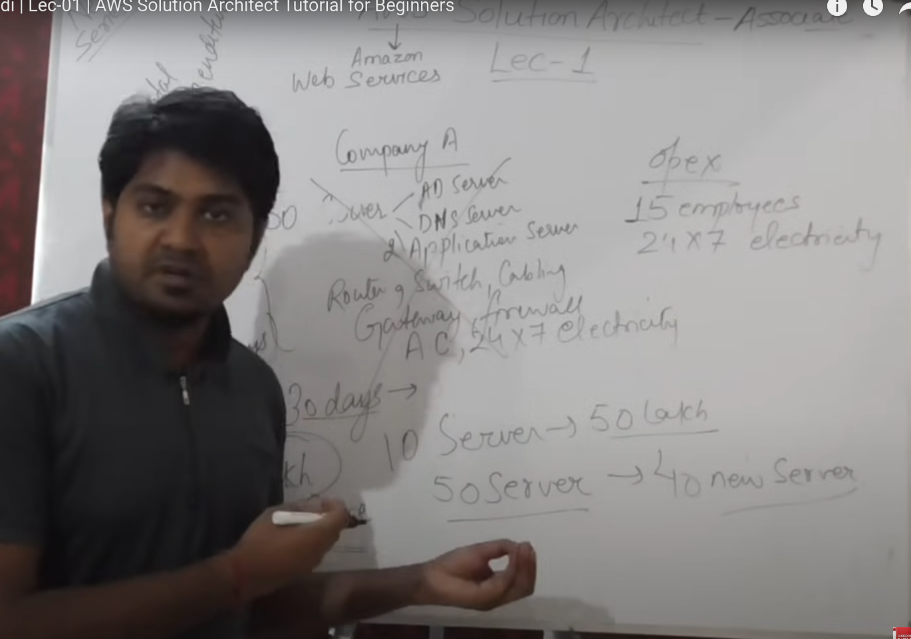
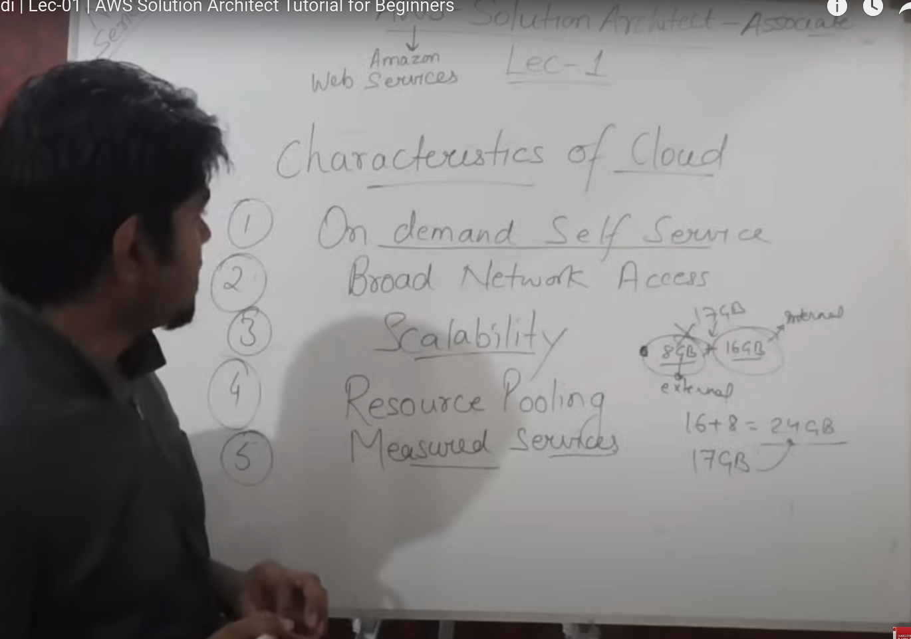
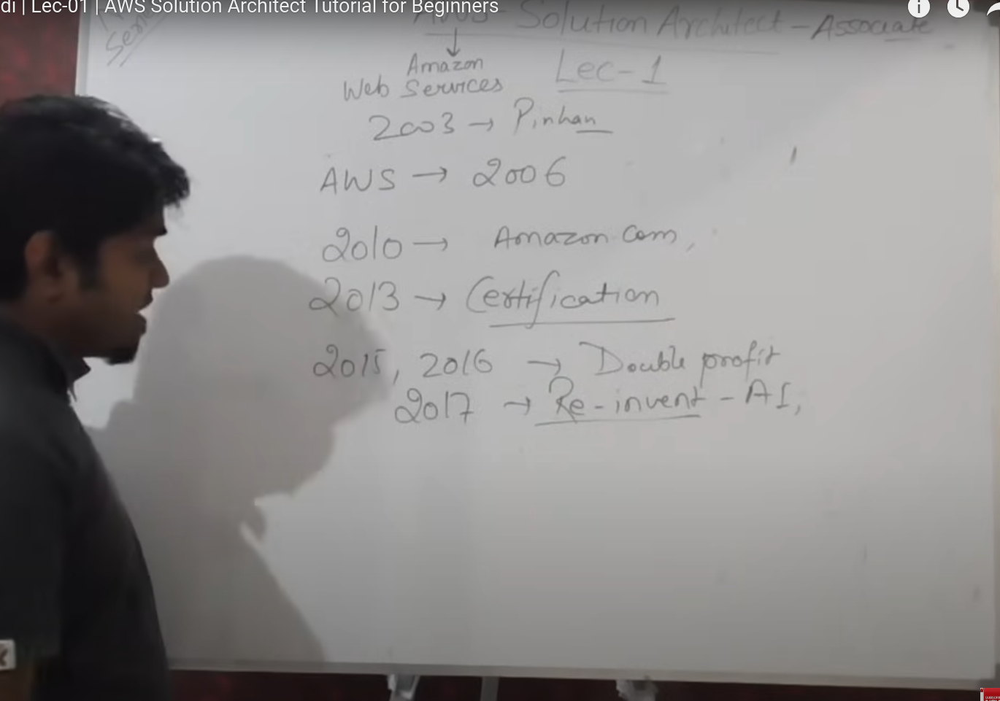
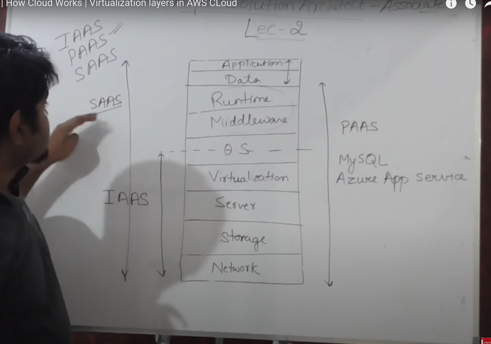
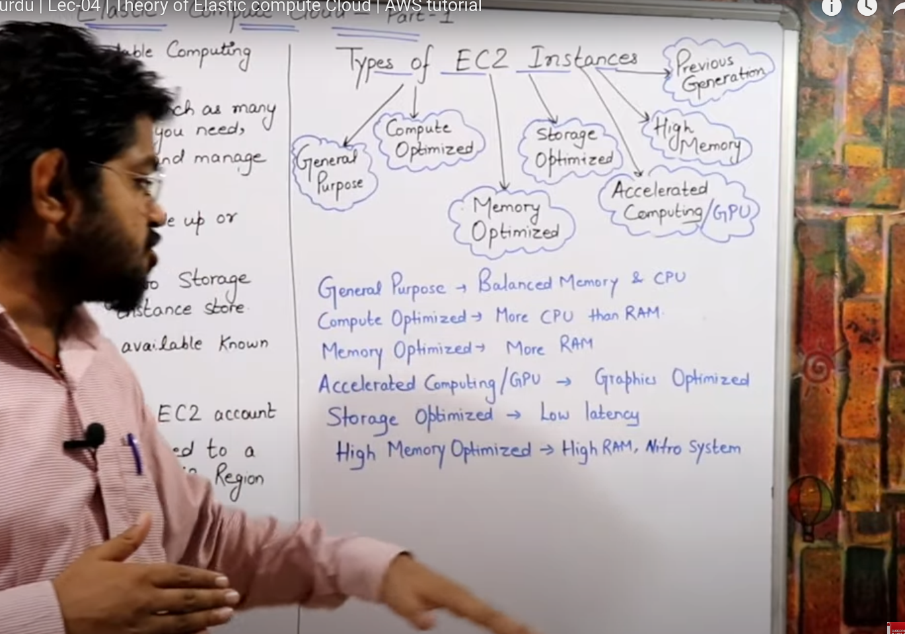
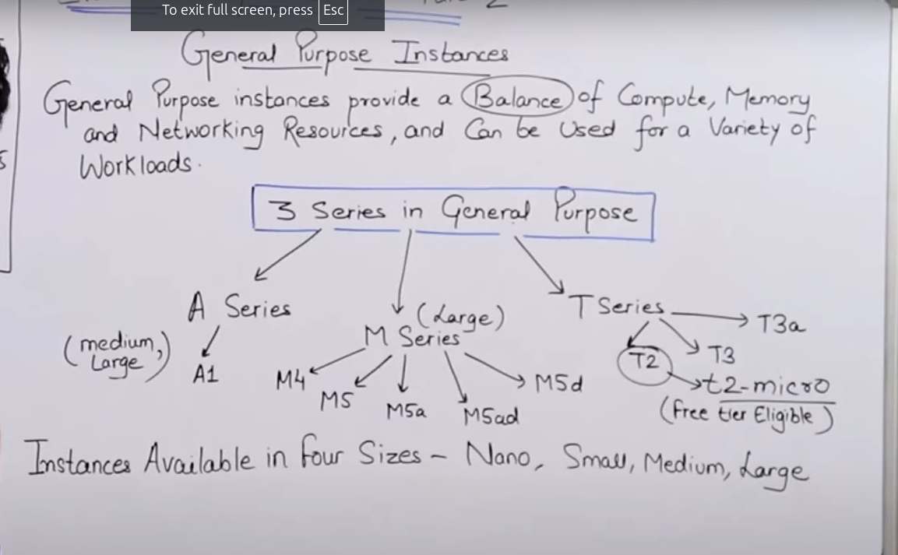

# **AWS Cloud (basic to architect level)**

## **Basic start** 

- **What is cloud?**
    - it is actually using remotely present computing resources via internet with pay as you go model.
- **Why do we need cloud services?**
    - 
    - 
- **Characteristics of a cloud:**
    - 
- **history about AWS**
    - 
- **AWS common certifications:**
    1. AWS Solution Architect (associate and then professional level)
    2. AWS devops ~ 150$ fee  (associate and then professional level)
    3. AWS sysops
- **Service models in cloud | Cloud services:**
    1. IAAS (Infrastructure as a service)
    2. PAAS (Software as a service)
    3. SAAS (Function as a service)
    4. FAAS (Function as a service)
    - Concept of cloud service models:
        - 

    - **AWS** uses --> citrix hypervisor
    - **VMWare** uses --> VSphere ESXi hypervisor
    - **Microsoft** uses --> Hyper-V hypervisor

## **Types of EC2 (Elastic Cloud Computing) instances**

These are of almost 6 types in broader level:

- General Purpose
- Compute Optimized
- Memory Optimized
- Accelerated computing
- Storage optimized
- High memory optimized

### **General Purpose Instances**

1. A series (medium and large size instances)
2. M series (just large size instances)
3. T series (micro, small, medium and large size instances)

#### A series

