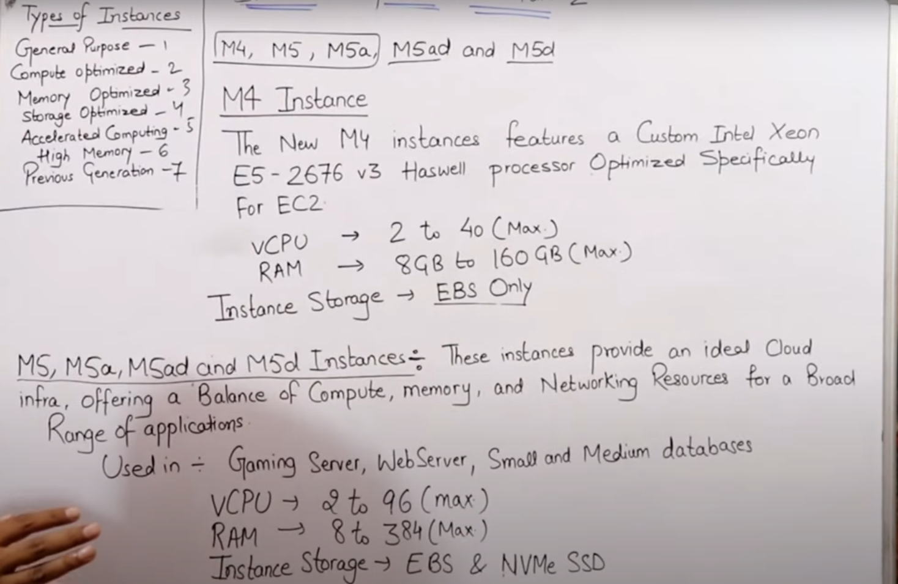
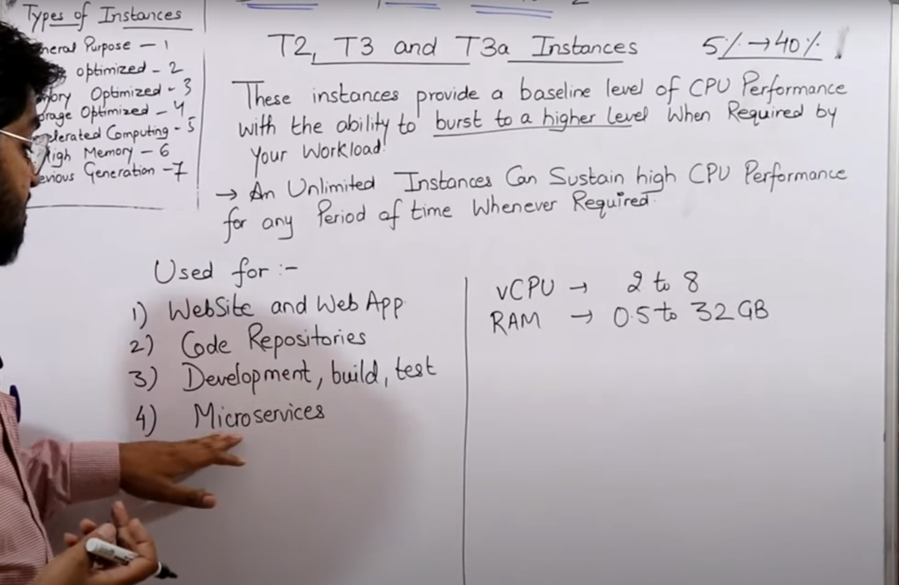
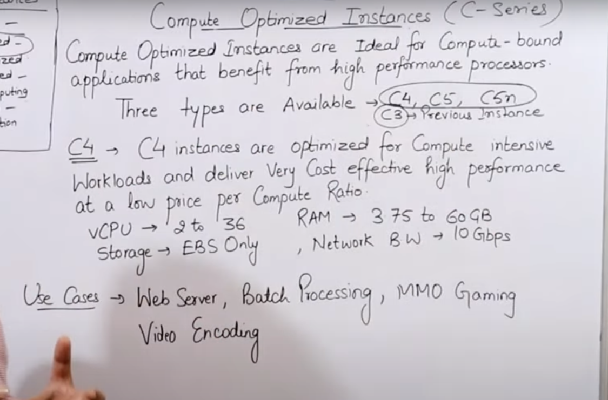

# **AWS Cloud (basic to architect level)**

## **Basic start** 

- **What is cloud?**
    - it is actually using remotely present computing resources via internet with pay as you go model.
- **Why do we need cloud services?**
    - 
    - 
- **Characteristics of a cloud:**
    - 
- **history about AWS**
    - 
- **AWS common certifications:**
    1. AWS Solution Architect (associate and then professional level)
    2. AWS devops ~ 150$ fee  (associate and then professional level)
    3. AWS sysops
- **Service models in cloud | Cloud services:**
    1. IAAS (Infrastructure as a service)
    2. PAAS (Software as a service)
    3. SAAS (Function as a service)
    4. FAAS (Function as a service)
    - Concept of cloud service models:
        - 

    - **AWS** uses --> citrix hypervisor
    - **VMWare** uses --> VSphere ESXi hypervisor
    - **Microsoft** uses --> Hyper-V hypervisor

## **Types of EC2 (Elastic Cloud Computing) instances**

These are of almost 6 types in broader level:

- General Purpose
- Compute Optimized
- Memory Optimized
- Accelerated computing
- Storage optimized
- High memory optimized

### **1. General Purpose Instances**

Balance of compute, memory and networking resources.

1. A series (medium and large size instances)
2. M series (just large size instances)
3. T series (micro, small, medium and large size instances)

#### **A Series**

Ideally suited for scale-out workloads and are suppoerted by the arm ecosystem (ARM technology refers to energy-efficient processor designs used in many devices like smartphones, tablets, IoT devices, and servers).

- webservers
- containerized services

#### **M Series**

Inside M series, there we have m4 (root volume EBS only), m5, m5a, m5ad, m5d (we can get in NVMe SSD for root volume, in some types of m5 instances)

#### **T Series**

- This series includes instances like T2, T3, T3a, etc
- These instances generally have very basic level of cpu performance and are generally used for testing purposes.
- e.g., website/application testings, code repositories, microservices, etc

### **2. Compute Optimized Instances**

- This is compute optimized series, means higher computing power. It might be =due paralled processig power of CPUs or multiple Virtual cores, etc
- c4 (it is now out-dated), c5, c5a
- 
- e.g., web-servers, gamings, batch processings, video encodings, etc

### 3. Memory Optimized

### 4. Accelerated computing

### 5. Storage optimized

### 6. High memory optimized

## VPC | Virtual Private Cloud

