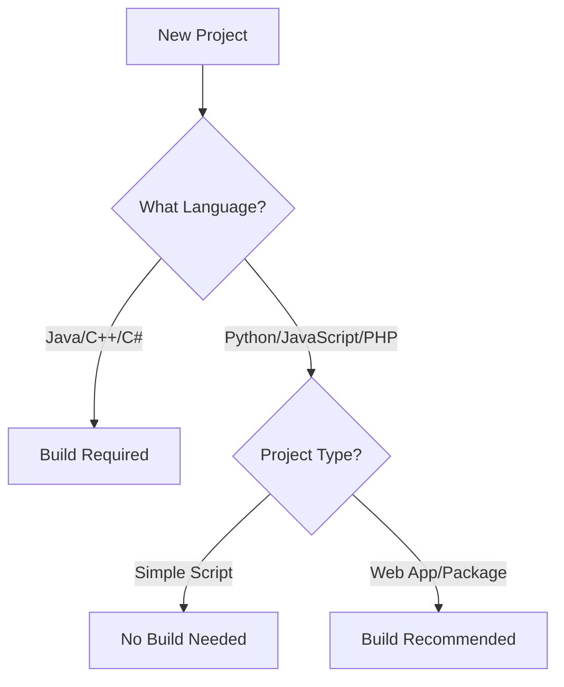
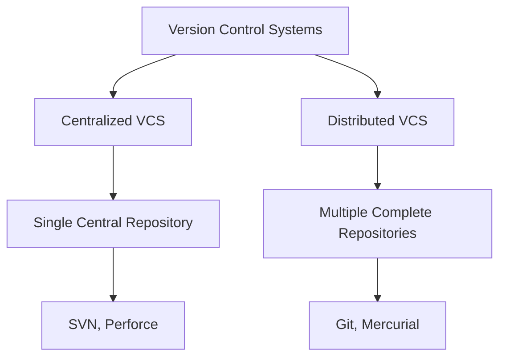
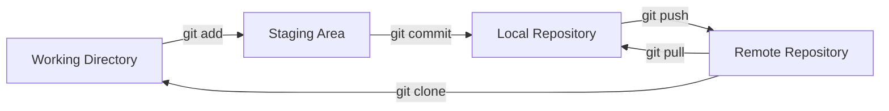
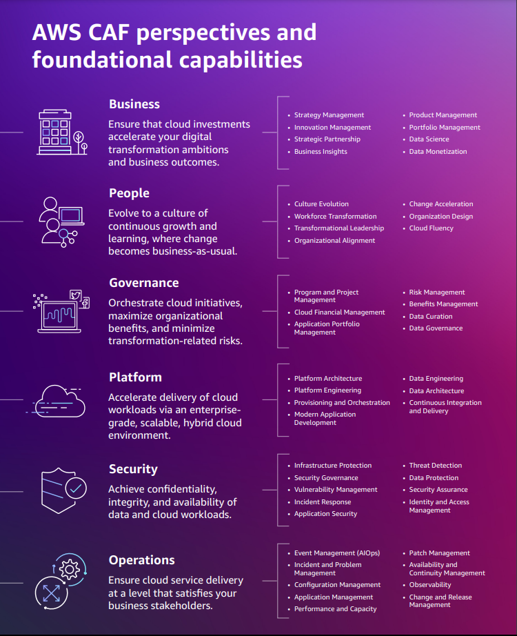

# Topics and important interview questions:

## DevOps Lead Interview at Netflix

(Below are the questions, initial-concepts, answers)

### Round 1 – Systems at Scale, K8s, Cloud & Linux (45 mins)

> 1. How would you implement fine-grained service discovery across 1000+ microservices using Envoy or Istio?

**Concept:**

Key Concepts and Terms:

Microservices: Small, independent services that perform specific functions (e.g., user authentication or video streaming) and communicate over a network.\
Service Discovery: The process of automatically finding the location (IP, port) of a service in a dynamic environment where services scale or move.\
Envoy: A high-performance proxy used to route traffic between microservices. It handles tasks like load balancing and retries.\
Istio: A service mesh tool that manages communication between microservices using Envoy proxies. It provides features like traffic routing, security, and observability.\
xDS Protocol: A set of APIs (Discovery Services) used by Envoy to dynamically fetch configuration (e.g., service endpoints) from a control plane like Istio.\
Control Plane: The management layer in Istio that configures Envoy proxies and defines rules for traffic, security, etc.\
ServiceEntry/VirtualService: Istio resources for defining external services and routing rules, respectively.\
Locality-aware Load Balancing: Routing traffic to services in the same region to reduce latency.\
Prometheus/Grafana/Jaeger: Tools for monitoring (Prometheus collects metrics), visualization (Grafana displays dashboards), and tracing (Jaeger tracks request flows).

*Why It Matters*: 

In large systems (1000+ services), manually tracking service locations is impossible. Service discovery ensures services find each other automatically, and Istio/Envoy makes this scalable and observable.


**Answer:**

To implement fine-grained service discovery for 1000+ microservices, I’d leverage Istio’s service mesh capabilities, built on Envoy, for its robust control plane and observability. Istio’s ServiceEntry and VirtualService resources enable precise traffic routing. I’d configure Istio’s Pilot to integrate with Kubernetes Service resources and an external discovery mechanism (e.g., Consul or Eureka) for non-K8s services. Envoy’s xDS protocol dynamically updates service endpoints, ensuring low-latency discovery. For scalability, I’d shard the control plane across regions and use Istio’s locality-aware load balancing to reduce cross-region traffic. To handle 1000+ services, I’d optimize Envoy’s memory footprint by tuning xDS update intervals and implementing outlier detection to isolate unhealthy endpoints. Observability is key—integrating Prometheus and Grafana for metrics and Jaeger for tracing ensures visibility into discovery latency and errors.

> 2. Explain how you’d leverage eBPF + Cilium to enforce network security policies at runtime, and what the advantages are over traditional CNIs?

**Key Concepts and Terms:**

eBPF: Extended Berkeley Packet Filter, a Linux kernel technology that runs small programs to inspect and filter network packets without changing applications.\
Cilium: A Container Network Interface (CNI) that uses eBPF for networking and security in Kubernetes.\
Network Policy: Kubernetes rules defining what traffic is allowed between pods (e.g., “allow HTTP from service A to B”).\
L3/L4/L7: Layers of the OSI model—L3 (network, e.g., IP), L4 (transport, e.g., TCP), L7 (application, e.g., HTTP).\
CNI: Container Network Interface, a plugin that manages networking for Kubernetes pods (e.g., Calico, Flannel).\
Hubble: Cilium’s observability tool for monitoring network traffic and policies.\
SPIFFE: A framework for assigning secure identities to services in a mesh.\
bpftool: A command-line tool to manage eBPF programs.

*Why It Matters*: 

eBPF enables fast, kernel-level network control, and Cilium uses it to enforce security rules dynamically, offering better performance and visibility than traditional CNIs like iptables-based solutions.

**Answer:**

eBPF with Cilium enables kernel-level network observability and policy enforcement without modifying application code. I’d use Cilium’s NetworkPolicy to define L3/L4 and L7 rules, enforced via eBPF programs attached to network hooks (e.g., TC or XDP). For example, I’d write a policy to restrict egress traffic to specific DNS domains, using eBPF to inspect packet metadata at runtime. Cilium’s Hubble provides real-time visibility into policy violations. Compared to traditional CNIs (e.g., Calico or Flannel), eBPF offers lower overhead (no iptables), faster packet processing, and richer L7 insights (e.g., HTTP headers). It also supports identity-aware policies, tying rules to Kubernetes workloads rather than IPs, which is critical in dynamic environments. I’d monitor eBPF program performance using bpftool and ensure compatibility with kernel versions across EKS nodes.

> 3. Netflix runs multi-cloud. Describe your approach to cross-cloud routing, IAM, and secret syncing.

**Key Concepts and Terms:**

Multi-cloud: Running workloads across multiple cloud providers (e.g., AWS, GCP) for redundancy or flexibility.\
Service Mesh: A layer that manages communication between services, often across clouds (e.g., Istio).\
VPC Peering: Connecting virtual networks between clouds for secure communication.\
IAM: Identity and Access Management, controlling who/what can access cloud resources.\
OIDC: OpenID Connect, a protocol for federating identities across systems (e.g., linking Kubernetes to AWS IAM).\
Secrets: Sensitive data like API keys or database passwords.\
HashiCorp Vault: A tool for managing and syncing secrets securely.\
External Secrets Operator: A Kubernetes tool to sync secrets from external systems (e.g., Vault, AWS Secrets Manager) into Kubernetes.\
CRD: Custom Resource Definition, a Kubernetes extension for custom objects (e.g., secret syncing rules).

*Why It Matters*: 

Multi-cloud setups require secure, consistent routing and access control across providers, with secrets synced to avoid manual errors and ensure security.

**Answer**

For cross-cloud routing, I’d deploy a service mesh (Istio) with a multi-cluster setup, using a shared control plane or split-horizon DNS for inter-cloud communication. Envoy’s gRPC-based routing minimizes latency, and I’d use AWS Transit Gateway or GCP Cloud Interconnect for secure VPC peering. For IAM, I’d federate identity using OIDC providers (e.g., AWS IAM Roles for Service Accounts and GCP Workload Identity), mapping Kubernetes service accounts to cloud-specific roles. Secret syncing requires a centralized vault (e.g., HashiCorp Vault or AWS Secrets Manager) with cross-cloud access via federated IAM roles. I’d use Vault’s dynamic secrets for ephemeral credentials and sync them to Kubernetes using External Secrets Operator. To ensure consistency, I’d implement a CRD-based secret reconciliation loop and monitor drift with Prometheus.

> 4. What happens when systemd units fail intermittently on EKS nodes? How do you detect and heal?

**Key Concepts and Terms:**

systemd: A Linux system manager that runs services (units) like daemons or scripts.\
EKS: Elastic Kubernetes Service, AWS’s managed Kubernetes platform.\
Node: A physical or virtual machine running Kubernetes pods.\
Prometheus node_exporter: A tool that collects system metrics (e.g., CPU, memory) from nodes.\
journalctl: A command to view systemd logs.\
DaemonSet: A Kubernetes resource that runs a pod on every node.\
Cluster Autoscaler: A Kubernetes tool that automatically scales nodes based on demand.\
Taint: A Kubernetes feature to mark nodes as unsuitable for certain pods.

*Why It Matters*: 

Systemd units run critical services on EKS nodes. Failures can disrupt Kubernetes, so detecting and healing them ensures cluster stability.

**Answer:**

Intermittent systemd unit failures on EKS nodes could stem from resource contention, misconfigured units, or kernel issues. I’d detect failures using Prometheus node_exporter to scrape systemd metrics (e.g., systemd_unit_state) and set alerts for frequent restarts. Logs from journalctl and kubectl describe node help pinpoint root causes (e.g., OOM or cgroup misconfiguration). For healing, I’d use a DaemonSet to run a custom script checking unit health and restarting failed units via systemctl. If issues persist, I’d trigger node drainage and replacement using Cluster Autoscaler with a custom taint for unhealthy nodes. To prevent recurrence, I’d audit systemd unit dependencies and resource limits, ensuring alignment with EKS node AMIs.

> 5. Your app teams demand custom AMIs. What’s your pre-prod vetting strategy at kernel and runtime?


**Key Concepts and Terms:**

AMI: Amazon Machine Image, a template for EC2 instances with OS, kernel, and software.\
Packer: A tool to build AMIs consistently.\
CIS Benchmarks: Security standards for hardening systems.\
Trivy: A vulnerability scanner for images and AMIs.\
QEMU: A virtualization tool to test AMIs in a sandbox.\
OpenSCAP: A tool for compliance scanning (e.g., STIG standards).\
Chaos Mesh: A Kubernetes tool for injecting failures (e.g., network delays) to test resilience.\
SSM Parameter Store: AWS service for storing configuration data.\
ASG: Auto Scaling Group, AWS feature to manage EC2 instances.

*Why It Matters*: 

Custom AMIs must be secure and reliable before deployment. Vetting ensures they meet security, performance, and compliance standards.

**Answer:**

For custom AMIs, I’d enforce a pre-prod vetting pipeline using a GitOps approach. First, I’d require AMIs to be built with Packer, embedding security baselines (e.g., CIS benchmarks) and kernel parameters (e.g., mitigations=off for performance-critical workloads, if safe). The pipeline would include:

- Static Analysis: Scan AMIs with Trivy for CVEs and misconfigurations.
- Kernel Validation: Boot AMIs in a QEMU sandbox to verify kernel modules (e.g., eBPF compatibility) and sysctl settings.
- Runtime Testing: Deploy AMIs to a staging EKS cluster, running chaos tests (e.g., Chaos Mesh) to simulate network partitions and CPU stress.
- Compliance Checks: Use OpenSCAP to enforce STIG compliance.

Approved AMIs are tagged in AWS SSM Parameter Store and integrated into ASGs. I’d maintain a rollback AMI in case of failures.

```
{
  "variables": {
    "aws_region": "us-west-2",
    "base_ami": "ami-12345678"
  },
  "builders": [
    {
      "type": "amazon-ebs",
      "region": "{{user `aws_region`}}",
      "source_ami": "{{user `base_ami`}}",
      "instance_type": "t3.medium",
      "ami_name": "custom-eks-ami-{{timestamp}}"
    }
  ],
  "provisioners": [
    {
      "type": "shell",
      "inline": [
        "sudo yum install -y trivy",
        "trivy image --severity HIGH,CRITICAL",
        "sudo sysctl -w net.ipv4.ip_forward=1",
        "sudo modprobe br_netfilter"
      ]
    }
  ]
}
```


> 6. Walk through advanced kube-probe configurations to detect business logic failures, not just HTTP 200.

**Key Concepts and Terms:**

Kubernetes Probes: Health checks for pods (liveness: is it alive? readiness: is it ready to serve?).\
HTTP 200: A status code indicating a successful HTTP request, often insufficient for complex apps.\
exec Probe: A Kubernetes probe that runs a command inside a container to check health.\
Business Logic Failures: Issues specific to an app’s functionality (e.g., a queue is full or a database query fails).\
Prometheus Metrics: Custom metrics exposed by an app (e.g., queue depth) for monitoring.\
Chaos Mesh: Tool to simulate failures for testing probe reliability.

*Why It Matters:* 

Probes ensure pods are healthy, but generic checks miss app-specific issues. Advanced probes catch business logic failures, improving reliability.

**Answer:**

To detect business logic failures, I’d configure Kubernetes liveness and readiness probes with custom logic beyond HTTP 200. For example, I’d use an exec probe to run a script inside the container, checking application-specific metrics (e.g., queue depth or transaction failure rate). For HTTP-based services, I’d implement a /healthz endpoint returning 200 only if business invariants (e.g., database query success or cache hit rate > 80%) are met. I’d set failureThreshold and timeoutSeconds to balance sensitivity and stability, avoiding premature pod restarts. For complex cases, I’d integrate with Prometheus, using a http probe to query a custom metric endpoint exposed by the app. To validate, I’d simulate failures using Chaos Mesh and monitor probe outcomes via Grafana.

• How do you handle DNS-level outages inside a service mesh without a full app redeploy?

For DNS-level outages in a service mesh like Istio, I’d first verify if the issue is with CoreDNS or external resolvers. I’d use istioctl proxy-status to check Envoy’s DNS resolution state and kubectl logs on CoreDNS pods for errors. To mitigate without redeploy, I’d inject temporary VirtualService rules to reroute traffic to static IPs or alternative endpoints, using Istio’s DestinationRule for failover. If CoreDNS is overwhelmed, I’d scale its replicas and tune cache settings via ConfigMap. For external DNS, I’d configure Envoy’s DNS resolver to use a fallback provider (e.g., 8.8.8.8). Long-term, I’d implement a local DNS cache (e.g., nscd) on EKS nodes and monitor resolution latency with Prometheus.

• Terraform remote_state backend suddenly times out. What’s your recovery and damage containment strategy?

A Terraform remote_state backend timeout (e.g., S3 or DynamoDB) could indicate network issues, backend saturation, or IAM misconfiguration. My recovery steps:

Diagnose: Check AWS CloudTrail for S3/DynamoDB API errors and verify IAM permissions for the Terraform role.
Containment: Pause Terraform runs to prevent state corruption. Use terraform state pull to download a local copy of the state file.
Recovery: Switch to a fallback backend (e.g., local state or another S3 bucket in a different region) by updating the backend configuration. Re-run terraform init to migrate state.
Mitigation: Increase DynamoDB throughput or enable S3 request retries in Terraform config. Implement a multi-region backend for redundancy.
Monitoring: Set CloudWatch alarms for S3/DynamoDB latency and integrate with PagerDuty for alerts.

To prevent recurrence, I’d enforce state encryption and versioning, and use Atlantis for GitOps-based Terraform runs to audit changes.

```
terraform {
  backend "s3" {
    bucket         = "my-terraform-state"
    key            = "prod/terraform.tfstate"
    region         = "us-west-2"
    dynamodb_table = "terraform-locks"
    encrypt        = true
  }
}
```

### Round 2 – RCA, Fire Drills, and Netflix-Scale Chaos (75 mins)

• A new Envoy config rollout silently broke mTLS between edge and mesh. What’s your RCA trace?

For an mTLS failure post-Envoy config rollout, I’d start with istioctl proxy-config to inspect Envoy’s listener and cluster configurations on edge and mesh proxies. I’d check for mismatched certificates or misconfigured DestinationRules using kubectl describe destinationrule. Using Jaeger, I’d trace mTLS handshake failures, looking for TLS errors (e.g., certificate mismatch or expired CA). I’d verify the Istio CA (Citadel) logs for certificate issuance issues and cross-check SPIFFE IDs in the mesh. If the issue is isolated to the rollout, I’d rollback the Istio control plane config using GitOps (e.g., ArgoCD). To confirm, I’d use tcpdump with eBPF to capture TLS handshake packets on affected pods. Long-term, I’d automate mTLS validation in the CI/CD pipeline using istioctl analyze.

• HPA refuses to scale even though Prometheus shows CPU > 80%. Diagnose with cloud + K8s metrics.

If the Horizontal Pod Autoscaler (HPA) isn’t scaling despite high CPU, I’d check:

Metrics Pipeline: Verify the Prometheus adapter is scraping custom metrics correctly (kubectl describe hpa shows target metrics). Check prometheus-adapter logs for errors.
K8s Metrics Server: Ensure metrics-server is running and reporting CPU metrics (kubectl top pods).
HPA Configuration: Confirm minReplicas, maxReplicas, and targetCPUUtilizationPercentage align with workload needs. Use kubectl get hpa to check status conditions.
Cloud Metrics: Cross-check AWS CloudWatch for EC2 instance metrics to rule out node-level throttling.
Pod Limits: Ensure pods have CPU limits set, as HPA relies on them for scaling decisions.

If metrics are missing, I’d restart the Prometheus adapter or scale metrics-server replicas. For root cause, I’d enable debug logging in the HPA controller and monitor scaling events via Kubernetes Event Exporter.

• You introduced a sidecar-based caching layer. Suddenly, tail latency spikes. What’s your debug path?

Tail latency spikes post-sidecar caching (e.g., Redis or Varnish) suggest cache misses, serialization overhead, or resource contention. My debug path:

Metrics: Use Prometheus to query cache hit/miss ratios and sidecar latency (envoy_cluster_upstream_rq_time).
Tracing: Use Jaeger to trace requests through the sidecar, identifying bottlenecks (e.g., Redis query latency).
Resource Check: Inspect pod resource usage (kubectl top) for CPU/memory saturation in the sidecar or app.
Cache Config: Verify Redis eviction policies (e.g., LRU) and memory limits. Check for key hotspots using redis-cli MONITOR.
Network: Use eBPF (via Cilium’s Hubble) to detect network latency between sidecar and cache.

To mitigate, I’d tune cache size, enable compression, or shard Redis instances. I’d also inject chaos (e.g., delay via Chaos Mesh) to reproduce and validate fixes.

• 504 errors on the playback service. Cloud LB shows healthy, mesh sidecars pass, but users can’t stream. Triage?

504 errors despite healthy LBs and sidecars suggest backend or dependency issues. Triage steps:

Trace Requests: Use Jaeger to trace requests from the LB to the playback service, checking for timeouts in downstream services (e.g., media servers or DRM).
Metrics: Query Prometheus for envoy_cluster_upstream_rq_504 and backend latency metrics. Check CloudWatch for ALB target group health.
Logs: Inspect playback service logs (kubectl logs) for errors like connection timeouts or database failures.
Dependencies: Verify external services (e.g., CDN or S3) using curl or eBPF packet tracing to detect network issues.
Mitigation: Inject an Istio VirtualService to reroute traffic to a fallback region or retry failed requests with exponential backoff.

I’d simulate the issue in staging with Chaos Mesh to inject 504s and validate resilience.

• You notice surging NAT costs. No infra changes this week. What could silently trigger that?

Surging NAT costs without infra changes could stem from:

Traffic Spikes: Increased egress traffic (e.g., microservices calling external APIs). I’d use VPC Flow Logs and CloudWatch to identify high-traffic subnets.
DNS Resolution: Excessive DNS queries to external resolvers. I’d check CoreDNS metrics (dns_request_count) and enable local caching.
Misconfigured Routing: Traffic unexpectedly routed through NAT Gateway instead of VPC peering. I’d audit route tables and Istio routing rules.
Data Transfer: Large data transfers (e.g., S3 cross-region replication). I’d analyze S3 access logs for anomalies.

To mitigate, I’d implement VPC endpoints for AWS services, tune DNS caching, and set budget alerts in CloudWatch.

Round 3 – Leadership, Chaos Culture & Engineering Influence (30 mins)
• How do you build an engineering culture where SLOs are owned, not ignored?

To foster SLO ownership, I’d:

Educate: Run workshops on SLO/SLI definitions, tying them to user experience (e.g., 99.9% playback availability).
Empower Teams: Use a service catalog (e.g., Backstage) to assign SLO ownership to app teams, with clear dashboards in Grafana.
Automate: Implement automated SLO violation alerts via Prometheus Alertmanager, escalating to PagerDuty.
Incentivize: Tie SLO adherence to team OKRs and celebrate wins in postmortems.
Lead by Example: As a DevOps Lead, I’d model SLO-driven decisions (e.g., prioritizing latency fixes over new features).

Regular blameless postmortems reinforce accountability without fear.

• You’re asked to ship a multi-region failover in 3 weeks no DNS layer allowed. Your plan?

Without DNS, I’d use Istio’s service mesh for multi-region failover:

Architecture: Deploy active-active clusters across regions, using Istio’s Locality Load Balancing to prioritize local traffic.
Routing: Configure VirtualService to route traffic to a secondary region on primary failure, using health checks (e.g., /healthz endpoint).
Data Sync: Use CRDB or Spanner for low-latency data replication across regions.
Testing: Simulate region failures with Chaos Mesh, validating failover within 3 seconds.

Timeline:
Week 1: Set up Istio multi-cluster and CRD-based routing.
Week 2: Implement data sync and health checks.
Week 3: Run chaos tests and document runbooks.

I’d monitor failover success rate with Prometheus and ensure zero-downtime cutover.

• Describe how you’d test infra chaos and graceful degradation for a Netflix Originals release.

For a Netflix Originals release, I’d design a chaos engineering program:

Scope: Target critical services (playback, recommendation, CDN) using Chaos Mesh.
Tests:

Network Chaos: Inject latency/packet loss to simulate CDN failures.
Node Chaos: Crash EKS nodes to test auto-recovery via Cluster Autoscaler.
Dependency Chaos: Throttle database connections to verify graceful degradation.


Monitoring: Use Prometheus, Jaeger, and CloudWatch to track SLOs (e.g., 99.99% streaming success).
Runbooks: Document recovery steps and automate via Kubernetes operators.
Execution: Run tests in staging, then low-traffic regions, with rollback plans.

Post-release, I’d analyze chaos test outcomes in postmortems to refine resilience.

• How do you prove ROI of infra modernization to non-technical execs?

To prove ROI to non-technical execs, I’d:

Translate Metrics: Map infra improvements (e.g., 20% latency reduction) to business outcomes (e.g., 5% increase in viewer retention).
Visualize: Use Grafana dashboards to show before/after metrics (e.g., cost savings from NAT optimization).
Storytelling: Share case studies of outages prevented by modernization (e.g., multi-region failover).
Cost Analysis: Quantify savings from reduced cloud spend or fewer incidents, using AWS Cost Explorer data.
Align with Goals: Tie modernization to strategic objectives (e.g., global scalability for new markets).

I’d present a concise slide deck with clear visuals and customer-centric metrics, avoiding technical jargon.

💡 TL;DR:
If you haven’t:
1. Used eBPF to trace a TCP reset at runtime
2. Investigated TLS outages across sidecars
3. Debugged Redis inconsistency under pressure
4. Simulated a kubelet crash mid-streaming session


========================

5. Can you explain the Kubernetes architecture?

6. What is the role of worker nodes in a Kubernetes cluster?

7. A pod is stuck in CrashLoopBackOff. What command would you use to debug it? What could be the reasons for this error?

8. What are DaemonSets in Kubernetes?

9. How are IP addresses assigned to pods?

10. Which control plane component handles pod scheduling and node lifecycle?

11. What is CNI (Container Network Interface) in Kubernetes?

12. In Python, if num = "1", what happens when you run print(num + 1)?
 And what if you try int("1" + 1)?

13. How do you verify if a Kubernetes Job ran successfully? 

=======================


# 1: Agile   

1. **Agile** - A mindset and approach to project management that emphasizes:
   - Iterative development
   - Flexibility to change
   - Customer collaboration
   - Working software over comprehensive documentation
   - Responding to change over following a rigid plan

2. **Agile Manifesto** - The founding document of Agile (created in 2001) that outlines 4 core values:
   - Individuals and interactions over processes and tools
   - Working software over comprehensive documentation
   - Customer collaboration over contract negotiation
   - Responding to change over following a plan

3. **Scrum** - The most popular Agile framework that includes:
   - Defined roles:
     * Scrum Master (process facilitator) Facilitates the Scrum process, removes obstacles, and ensures the team follows Scrum principles.
     * Product Owner (value maximizer) Responsible for defining and prioritizing features (user stories) in the product backlog.
     * Development Team (creators)
   
   - Ceremonies/Events:
     * Sprint Planning
     * Daily Standup/Daily Scrum
     * Sprint Review
     * Sprint Retrospective
     * Backlog Refinement

4. **Sprint** - A fixed time period (usually 2-4 weeks) where:
   - Team commits to delivering specific work items
   - No scope changes during sprint
   - Ends with a potentially shippable product increment

5. **Product Backlog** - A prioritized list of:
   - Features
   - Bug fixes
   - Technical work
   - Knowledge acquisition
   Managed by the Product Owner

6. **Kanban Board** - Visual management tool showing:
   - Work items in different stages (To Do, In Progress, Done)
   - Work in progress limits
   - Flow of work

7. **Jira Backlog** - Digital implementation of:
   - Product backlog
   - Sprint backlog
   - Kanban boards
   - Agile reporting tools

Additional Related Concepts You Should Know:

8. **User Stories** - Format for describing features:
   - "As a [user type], I want [goal] so that [benefit]"
   - Includes acceptance criteria

9. **Story Points** - Relative measure of:
   - Effort
   - Complexity
   - Uncertainty
   Used for estimation

10. **Velocity** - Measure of team's delivery rate:
    - Average story points completed per sprint
    - Used for planning and forecasting

11. **Definition of Done (DoD)** - Checklist of criteria that:
    - Must be met to consider work complete
    - Applies to all work items

12. **Lean Principles** - Complementary to Agile:
    - Eliminate waste
    - Amplify learning
    - Decide as late as possible
    - Deliver as fast as possible
    - Empower the team
    - Build quality in
    - See the whole

How These Concepts Link Together:

1. **Framework Hierarchy**:
   - Agile is the overarching mindset
   - Scrum and Kanban are frameworks implementing Agile
   - User Stories and Story Points are tools used within these frameworks

2. **Process Flow**:
   - Product Backlog feeds into Sprint Planning
   - Sprint Planning creates Sprint Backlog
   - Sprint Backlog is tracked on Kanban Board
   - Daily Standups review Kanban Board progress
   - Sprint Review shows completed work
   - Retrospective improves process

3. **Tool Integration**:
   - Jira implements digital versions of:
     * Product Backlog
     * Sprint Backlog
     * Kanban Board
     * Burndown Charts
     * Velocity Tracking

_______________________________________________________________

4. **Core Agile Concept**
Let's say you're building an e-commerce mobile app. Instead of planning and building the entire app at once (traditional approach), you break it down into smaller pieces that provide value to users quickly.

1. **Product Backlog Creation**
The Product Owner creates a list of all features needed:
```
High Priority:
- User registration/login
- Product browsing
- Shopping cart
- Basic checkout

Medium Priority:
- Product search
- User reviews
- Wish list

Lower Priority:
- Social sharing
- Personalized recommendations
- Chat support
```

3. **User Stories**
Each feature is written as a user story. For example:
```
Feature: Shopping Cart
User Story: "As a shopper, I want to add items to my cart so that I can buy multiple items at once"

Acceptance Criteria:
- User can add items to cart
- Cart shows total items and price
- User can modify quantities
- User can remove items
- Cart persists after app closure
```

4. **Sprint Planning in Action**
The team plans a 2-week sprint:

```
Sprint Goal: "Enable users to browse and add products to cart"

Selected Stories:
1. Basic product listing
2. Product detail view
3. Add to cart functionality
4. Cart view
```

5. **Daily Work Management**
The team uses a Kanban board to track progress:

```
To Do | In Progress | Testing | Done
------|-------------|---------|------
Task 3 | Task 1     | Task 2  | Task 4
Task 5 | Task 6     |         |
```

Let me show you a complete workflow with a real-world example:

**Sprint 1: Basic Shopping Feature**

1. **Pre-Sprint**:
   - Product Owner prioritizes backlog
   - Team estimates stories using story points
   - Team's velocity is determined (let's say 20 points per sprint)

2. **Sprint Planning Meeting**:
   ```
   Date: Monday Morning
   Duration: 2 hours
   Attendees: Whole team
   Outcome: Sprint backlog with selected stories
   ```

3. **During Sprint**:
   ```
   Daily Standup (15 minutes each morning):
   Each team member answers:
   - What did I complete yesterday?
   - What am I working on today?
   - Any blockers?
   ```

4. **Sprint Work Example**:
   ```
   Day 1-3: Product Listing
   - Set up basic API integration
   - Create product grid layout
   - Implement image loading

   Day 4-6: Product Details
   - Create detail view
   - Add product information
   - Implement image gallery

   Day 7-10: Shopping Cart
   - Create cart database
   - Implement add/remove functionality
   - Build cart interface

   Day 11-12: Testing & Refinement
   - Bug fixes
   - Performance optimization
   - User testing
   ```

5. **End of Sprint**:

   a. **Sprint Review**:
   ```
   Demo to stakeholders:
   - Show working product listing
   - Demonstrate add to cart
   - Get feedback for improvements
   ```

   b. **Sprint Retrospective**:
   ```
   Team Discussion:
   What went well?
   - Completed all planned stories
   - Good team collaboration

   What could improve?
   - Need better test coverage
   - API documentation was unclear
   ```

6. **Tools Used**:
   ```
   Jira Board Layout:

   Backlog | To Do | In Progress | Testing | Done
   --------|-------|-------------|---------|------
   Future   | This  | Currently   | Being   | Completed
   Stories  | Sprint| Worked On   | Verified| Work
   ```

**Key Ceremonies Schedule**:
```
Week 1:
Monday 10 AM: Sprint Planning
Daily 9:30 AM: Stand-up
Thursday 2 PM: Backlog Refinement

Week 2:
Daily 9:30 AM: Stand-up
Friday 10 AM: Sprint Review
Friday 2 PM: Sprint Retrospective
```

**Practical Example of Progress Tracking**:

1. **Sprint Burndown**:
```
Day 1: 20 points remaining
Day 5: 15 points remaining
Day 8: 10 points remaining
Day 12: 2 points remaining
Day 14: 0 points remaining
```

2. **Velocity Tracking**:
```
Sprint 1: 18 points
Sprint 2: 20 points
Sprint 3: 22 points
Average Velocity: 20 points
```

This workflow repeats every sprint, with each iteration:
1. Delivering working software
2. Gathering feedback
3. Improving the process
4. Planning next priorities

_______________________________________
Let me break down both Retrospective and Iteration in detail - both their literal meanings and their technical applications in Agile:

**RETROSPECTIVE:**

1. **Literal Meaning:**
- Looking back at past events/actions
- Reflecting on what has happened
- Analyzing past experiences

2. **Technical Meaning in Agile:**
A structured meeting held at the end of each sprint where the team:

A. Standard Format:
```
1. What went well? (Keep)
2. What didn't go well? (Remove/Change)
3. What should we try next? (Add)
4. What puzzles us? (Discuss)
```

B. Practical Example of a Retrospective:
```
Sprint 6 Retrospective Meeting:

WENT WELL (✅):
- Completed all user stories
- Good communication in daily standups
- New testing approach reduced bugs

NEEDS IMPROVEMENT (⚠️):
- Too many late requirement changes
- Some team members overloaded
- Documentation updates delayed

ACTION ITEMS (📋):
1. Create change request process
2. Redistribute work more evenly
3. Add documentation as part of DoD

FOLLOW-UP (🔄):
- Review these actions in next retro
- Track improvement metrics
```

3. **Key Components of an Effective Retrospective:**
   ```
   Time: Usually 1-2 hours
   Participants: Entire Scrum team
   Facilitator: Usually Scrum Master
   Output: Concrete action items
   Follow-up: Track previous actions
   ```

**ITERATION:**

1. **Literal Meaning:**
- Repetition of a process
- Doing something again and again
- Incremental progression

2. **Technical Meaning in Agile:**
A single development cycle (sprint) that produces a working increment of the product.

3. **Iteration Structure:**
```
START:
│
├── Sprint Planning
│   ├── Select User Stories
│   └── Set Sprint Goal
│
├── Development Phase
│   ├── Daily Standups
│   ├── Development Work
│   └── Testing
│
├── Sprint Review
│   ├── Demo Working Software
│   └── Get Stakeholder Feedback
│
└── Retrospective
    └── Plan Improvements
```

4. **Practical Example of Iterations:**
```
Project: E-commerce Website

Iteration 1 (Sprint 1):
- Basic user login
- Product listing page
Output: Viewable product catalog

Iteration 2 (Sprint 2):
- Shopping cart
- Basic checkout
Output: Users can add items

Iteration 3 (Sprint 3):
- Payment integration
- Order confirmation
Output: Complete purchase flow

Each iteration builds on previous work
```

5. **Key Characteristics of Agile Iterations:**
```
Duration: Fixed timebox (usually 1-4 weeks)
Goal: Potentially shippable product increment
Components:
- Planning
- Development
- Testing
- Review
- Retrospective
```

**How They Work Together:**

```
Iteration Cycle with Retrospective:

Sprint 1 → Retrospective → Improvements →
Sprint 2 → Retrospective → Improvements →
Sprint 3 → Retrospective → Improvements →
```

**Real-World Example:**

```
Project: Mobile Banking App

Iteration 1:
Features: Login & Account View
Retrospective Findings:
✅ Good: API integration smooth
⚠️ Issue: Security review took too long
📋 Action: Add security review earlier

Iteration 2:
Features: Transfer Money
Applied Previous Learnings:
- Started security review day 1
- Parallel security & development
Retrospective Findings:
✅ Good: Earlier security review worked
⚠️ Issue: UI feedback delayed

Iteration 3:
Features: Bill Payment
Applied Previous Learnings:
- Security review day 1
- Daily UI feedback
Results: Faster delivery, fewer issues
```

**Key Differences:**
```
Retrospective:
- Looking backward
- Focus on process improvement
- Team learning
- Creates action items

Iteration:
- Moving forward
- Focus on product development
- Feature delivery
- Creates working software
```
________________

# 2: CI / CD 

**CI/CD** stands for **Continuous Integration** and **Continuous Delivery** (or **Continuous Deployment**).

### Continuous Integration (CI)
- **Definition**: CI is a practice where developers frequently integrate their code changes into a shared repository, usually several times a day.
- **Goal**: To detect integration issues early by testing code automatically on each commit, ensuring the codebase remains stable.
- **Process**: After each integration, automated tests and builds are triggered to verify that the code works as expected.

### Continuous Delivery (CD)
- **Definition**: CD extends CI by automating the release process so that code changes are ready to deploy to production at any time.
- **Goal**: To ensure that the application is always in a deployable state and to enable frequent, reliable releases with minimal manual intervention.
- **Process**: Once CI completes, CD includes additional steps like packaging and testing in production-like environments, so the code is ready for deployment.

### Continuous Deployment (CD)
- **Definition**: Continuous Deployment is an extension of Continuous Delivery, where every code change that passes automated tests is deployed to production automatically.
- **Goal**: To fully automate the release process and deliver features to users rapidly and continuously.
- **Process**: Every successful test triggers an automatic deployment to production, requiring a high level of test automation and monitoring.

### Differences between CI and CD
| Feature                       | Continuous Integration (CI)                                | Continuous Delivery (CD)                               | Continuous Deployment (CD)                               |
|-------------------------------|-----------------------------------------------------------|--------------------------------------------------------|----------------------------------------------------------|
| **Focus**                     | Integrating code changes frequently                       | Automating the process of delivering code to deployment-ready state | Automatically deploying code to production               |
| **Testing Scope**             | Unit and integration tests                                | Full suite of tests, including acceptance tests       | Same as Continuous Delivery                              |
| **Frequency**                 | Multiple times a day for each code commit                 | After each successful CI build                         | After each successful CD pipeline                        |
| **Automation Level**          | Automated builds and tests                                | Automated testing and packaging                        | Fully automated deployment to production                 |
| **Primary Benefit**           | Early detection of integration issues                     | Faster, more reliable release cycles                   | Instantaneous updates to production without manual steps

_______________________________

In Jenkins, CI and CD stages are typically organized to ensure smooth integration and deployment. Here’s a recommended breakdown of stages for each process:

### Recommended Stages for **Continuous Integration (CI)**

1. **Source**:
   - Pull the latest code from the version control system (e.g., Git).
   - Trigger the CI pipeline on code commit or pull request.

2. **Build**:
   - Compile and build the code.
   - Generate artifacts or binaries if needed (e.g., `.jar` for Java projects).
   - Run linters and code quality checks.

3. **Unit Testing**:
   - Run unit tests to verify code functionality at a basic level.
   - Ensure code changes don’t break individual functions or methods.

4. **Static Code Analysis**:
   - Run code analysis tools (e.g., SonarQube) to check for security vulnerabilities, code quality issues, and adherence to coding standards.
   - Provide feedback to the developer if issues are found.

5. **Integration Testing**:
   - Run tests to verify that different modules or services work together correctly.
   - This may involve API tests or service communication tests.

6. **Packaging**:
   - Package the code into an artifact (e.g., Docker image, `.zip`, or `.jar`) for further testing and potential deployment in later stages.

7. **Publishing Artifacts**:
   - Push artifacts to a storage or artifact repository (e.g., Nexus, Artifactory, Docker Registry) for future use in deployment.

8. **Notification**:
   - Notify developers of the CI pipeline results through email, Slack, or other communication tools.

### Recommended Stages for **Continuous Delivery (CD)**

1. **Deploy to Staging**:
   - Deploy the packaged artifact to a staging or pre-production environment that closely mirrors production.
   - Run end-to-end tests to verify application functionality in a near-production setup.

2. **Acceptance Testing**:
   - Run acceptance tests to ensure the system meets functional and non-functional requirements.
   - This can include user acceptance testing (UAT), performance testing, and load testing.

3. **Approval (Manual Gate)**:
   - (Optional) Include a manual approval step before promoting changes to production, especially for critical or high-impact releases.
   - This step is more common in Continuous Delivery than in Continuous Deployment.

4. **Deploy to Production**:
   - Deploy the application to production, either through a blue-green deployment, canary release, or rolling update strategy.
   - In Continuous Deployment, this step would be fully automated, but in Continuous Delivery, it might still require a manual trigger.

5. **Smoke Testing**:
   - Perform quick, automated tests to verify that the basic functionality of the application works after deployment.
   - These tests are minimal but confirm that the deployment was successful.

6. **Post-Deployment Monitoring**:
   - Monitor application metrics (e.g., uptime, response time) and error logs to identify any issues after deployment.
   - Integrate monitoring tools (e.g., Zabbix, Prometheus, ELK stack) for real-time tracking and alerting.

7. **Notification**:
   - Notify stakeholders and the team about the successful deployment, or send alerts if any issues arise.

### Summary Table of CI/CD Stages in Jenkins

| CI Stage                  | Description                                           |
|---------------------------|-------------------------------------------------------|
| Source                    | Pull code from version control                        |
| Build                     | Compile and build code, run linters                   |
| Unit Testing              | Run unit tests                                        |
| Static Code Analysis      | Check code quality and security                       |
| Integration Testing       | Verify module/service interactions                    |
| Packaging                 | Package artifacts for deployment                      |
| Publishing Artifacts      | Store artifacts for CD use                            |
| Notification              | Send CI results to team                               |

| CD Stage                  | Description                                           |
|---------------------------|-------------------------------------------------------|
| Deploy to Staging         | Deploy to a staging environment                       |
| Acceptance Testing        | Run functional and non-functional tests               |
| Approval (Manual Gate)    | Optional manual approval before production            |
| Deploy to Production      | Deploy to the production environment                  |
| Smoke Testing             | Verify basic functionality post-deployment            |
| Post-Deployment Monitoring| Monitor application health and performance            |
| Notification              | Send CD results and alerts to stakeholders            |

This CI/CD stage breakdown helps maintain code quality, reliability, and smooth deployment in Jenkins.

________________________________

Let me explain the differences between commits and pull requests with clear examples, and then explain artifacts in detail.

1. **CODE COMMIT vs PULL REQUEST:**

```markdown
COMMIT:
- Like taking a snapshot of your code changes
- Individual unit of change
- Local or remote action
- Direct changes to code

PULL REQUEST (PR):
- Request to merge a set of commits
- Review process for code changes
- Collaborative feature
- Contains multiple commits usually
```

Let's see a practical example:

```bash
# SCENARIO: Adding a Login Feature

1. COMMITS (Individual Changes):
├── Commit 1: "Add login form HTML"
│   └── Changes: login.html added
│
├── Commit 2: "Add login styling"
│   └── Changes: login.css added
│
└── Commit 3: "Add login validation"
    └── Changes: login.js added

2. PULL REQUEST:
Title: "Implement User Login Feature"
Branch: feature/user-login → main
Contains: All 3 commits above
Reviews: Team reviews all changes together
```

Visual Difference:
```
COMMIT (Single Change):
Before:                After:
function user() {      function user() {
                      + console.log("Hi");
}                     }

PULL REQUEST (Complete Feature):
- Contains multiple commits
- Shows all changes together
- Allows team discussion
- Can be approved/rejected
```

2. **ARTIFACTS & ARTIFACT REPOSITORIES:**

A. **What are Artifacts?**
```
Definition: Built/compiled versions of your code ready for deployment
```

B. **Types of Artifacts:**

```markdown
1. Compiled Applications:
   └── app.jar
   └── app.war
   └── app.exe

2. Libraries/Packages:
   └── mylib.dll
   └── package.zip
   └── framework.tar.gz

3. Docker Images:
   └── myapp:1.0.0
   └── backend:latest

4. Documentation:
   └── api-docs.pdf
   └── user-manual.html
```

C. **Artifact Repositories:**

1. **Popular Artifact Repositories:**
```markdown
1. JFrog Artifactory
   - Stores: All types
   - Structure:
     └── libs-release/
         └── com/
             └── company/
                 └── app/
                     └── 1.0.0/
                         └── app-1.0.0.jar

2. Nexus Repository
   - Similar structure
   - Different repos for different artifacts

3. Docker Hub
   - Specifically for Docker images
   - Structure:
     └── organization/
         └── image-name:tag

4. AWS S3/Azure Artifacts
   - Cloud-based storage
   - Custom structure
```
### Functional Requirements:
User Management:
1. Users must be able to register
2. Users must be able to login
3. Users must be able to reset password

Example Implementation:
function registerUser(email, password) {
  // Validation
  if (!isValidEmail(email)) {
    throw new Error('Invalid email');
  }
  // Create user
  return database.users.create({
    email,
    password: hashPassword(password)
  });
}

###  Non-Functional Requirements:

Performance:
1. Page load time < 2 seconds
2. Support 1000 concurrent users
3. 99.9% uptime

Security:
1. Data encryption at rest
2. HTTPS only
3. Password hashing

Example Implementation:
// Performance monitoring
app.use(async (req, res, next) => {
  const start = Date.now();
  await next();
  const duration = Date.now() - start;
  
  if (duration > 2000) {
    alert('Performance threshold exceeded');
  }
});

__________________________


# Build 

Let me explain this systematically with clear examples of when and why builds are needed for different languages.

1. **BUILD BASICS:**
```markdown
BUILD = Process of converting source code into executable/deployable format
```

2. **LANGUAGE CATEGORIES & BUILD REQUIREMENTS:**

A) **COMPILED LANGUAGES (BUILD REQUIRED)**
```markdown
These languages MUST be built before running:

1. Java
   BUILD REQUIRED BECAUSE: Java code must be compiled to bytecode
   BUILD TOOL: Maven or Gradle
   EXAMPLE:
   Source: HelloWorld.java → BUILD → Output: HelloWorld.class
   ```
   
```java
// HelloWorld.java (Cannot run directly)
public class HelloWorld {
    public static void main(String[] args) {
        System.out.println("Hello");
    }
}

// Needs build command:
mvn clean package
// Creates: target/myapp.jar
```

```markdown
2. C++
   BUILD REQUIRED BECAUSE: Must be compiled to machine code
   BUILD TOOL: Make, CMake
   EXAMPLE:
   Source: main.cpp → BUILD → Output: executable
```

```cpp
// main.cpp (Cannot run directly)
int main() {
    cout << "Hello";
    return 0;
}

// Needs build command:
g++ main.cpp -o program
// Creates: program.exe
```

B) **INTERPRETED LANGUAGES (BUILD OPTIONAL)**
```markdown
These languages can run directly but might need build for optimization:

1. Python
   BUILD OPTIONAL BECAUSE: Can run .py files directly
   BUILD TOOL: PyInstaller, setuptools
   WHEN TO BUILD:
   - Creating distributable package
   - Making standalone executable
```

```python
# script.py (Can run directly)
print("Hello")

# Optional build for distribution:
python setup.py bdist_wheel
```

```markdown
2. JavaScript
   BUILD OPTIONAL BECAUSE: Browser runs .js directly
   BUILD TOOL: Webpack, Babel
   WHEN TO BUILD:
   - Bundling multiple files
   - Minification
   - Modern syntax conversion
```

3. **BUILD REQUIREMENT DECISION GUIDE:**



4. **PRACTICAL EXAMPLES BY PROJECT TYPE:**

A) **Web Application:**
```markdown
Frontend (JavaScript/TypeScript):
BUILD NEEDED FOR:
- Bundling files
- Minifying code
- Processing CSS/assets
- Transpiling modern JavaScript
```

```yaml
# Example React Build
build:
  tool: npm/yarn
  commands:
    - npm install
    - npm run build
  when_needed:
    - Multiple JS files
    - Using modern JS features
    - Need optimization
```

B) **Backend Service:**
```markdown
Java Backend:
BUILD ALWAYS NEEDED FOR:
- Compiling code
- Managing dependencies
- Creating deployable package
```

```yaml
# Example Java Build
build:
  tool: Maven
  commands:
    - mvn clean package
  always_needed:
    - Compilation required
    - JAR/WAR creation needed
```

5. **QUICK REFERENCE BUILD REQUIREMENTS:**

```markdown
ALWAYS NEEDS BUILD:
1. Java
   Tool: Maven/Gradle
   Why: Compilation required
   Output: .jar, .war

2. C++
   Tool: Make/CMake
   Why: Compilation required
   Output: executable

3. C#
   Tool: MSBuild
   Why: Compilation required
   Output: .exe, .dll

OPTIONAL BUILD:
1. JavaScript
   Tool: Webpack/Babel
   When: Web apps, modern JS
   Output: bundled .js

2. Python
   Tool: PyInstaller
   When: Distribution needed
   Output: .whl, executable

3. PHP
   Tool: Composer
   When: Package management
   Output: vendor directory
```

6. **HOW TO RECOGNIZE BUILD NEEDS:**

```markdown
CHECK THESE FACTORS:

1. Language Type:
   Compiled → Always needs build
   Interpreted → Might need build

2. Project Complexity:
   Single file → Probably no build
   Multiple files → Likely needs build

3. Dependencies:
   No dependencies → Might skip build
   Has dependencies → Build recommended

4. Deployment Requirements:
   Direct run → Might skip build
   Server deploy → Build recommended
```

Example Decision Process:
```yaml
Project Analysis:
  - Language: JavaScript
  - Framework: React
  - Dependencies: Many
  - Deployment: Production server
  
Decision: BUILD NEEDED
Reason:
  - Multiple files need bundling
  - Dependencies need management
  - Production optimization required
```
# Languages and frameworks 

Let me break this down clearly:

Frontend Languages & Technologies:
1. HTML, CSS, JavaScript - These are the fundamental frontend technologies
2. Popular Frontend Frameworks/Libraries:
   - React
   - Vue.js 
   - Angular
   - Svelte

Backend Languages:
1. Python (Django, Flask)
2. JavaScript (Node.js, Express.js)
3. Java (Spring)
4. PHP (Laravel)
5. Ruby (Ruby on Rails)
6. C# (.NET)

How to recognize Frontend vs Backend code:

Frontend indicators:
- Deals with visual elements and user interface
- Contains HTML tags
- CSS styling
- DOM manipulation
- Event handlers (click, submit etc.)
- API calls to backend
- Browser-specific code

Example frontend code:
```javascript
// Frontend React component
function LoginForm() {
  const [email, setEmail] = useState('');
  
  return (
    <form onSubmit={handleSubmit}>
      <input 
        type="email"
        value={email}
        onChange={(e) => setEmail(e.target.value)}
      />
      <button>Login</button>
    </form>
  );
}
```

Backend indicators:
- Database operations
- Server configuration
- API endpoints/routes
- Authentication logic
- File system operations
- Business logic

Example backend code:
```python
# Backend Python/Flask route
@app.route('/api/login', methods=['POST'])
def login():
    data = request.get_json()
    user = User.query.filter_by(email=data['email']).first()
    if user and check_password(user.password, data['password']):
        return jsonify({'token': generate_token(user)})
    return jsonify({'error': 'Invalid credentials'}), 401
```

Building Process:

Yes, frontend and backend are typically built separately because:
1. They use different technologies
2. They can be deployed to different servers
3. They have different build processes

Frontend Build:
- Bundling (webpack, vite etc.)
- Minification
- Transpiling (Babel)
- Creates static files (HTML, CSS, JS)
- Deployed to static hosting/CDN

Backend Build:
- Compiling code
- Installing dependencies
- Environment configuration
- Database migrations
- Deployed to application server

They communicate through APIs (usually REST or GraphQL).

______________________________

Ah, let me clarify this better!

How to Recognize Languages Used:

Frontend:
1. Look at the file extensions:
   - `.html` = HTML files
   - `.css` = CSS files
   - `.js`, `.jsx`, `.tsx` = JavaScript/React files
   - `.vue` = Vue files
   - `.ts` = TypeScript files

2. Look at the project's `package.json` file for frontend projects - it lists dependencies like:
```json
{
  "dependencies": {
    "react": "^18.0.0",
    "vue": "^3.0.0",
    "angular": "^15.0.0"
  }
}
```

Backend:
1. File extensions tell you the language:
   - `.py` = Python
   - `.java` = Java
   - `.php` = PHP
   - `.rb` = Ruby
   - `.cs` = C#
   - `.js` (in a server folder) = Node.js

2. Configuration files are clues:
   - `requirements.txt` or `Pipfile` = Python
   - `pom.xml` or `build.gradle` = Java
   - `composer.json` = PHP
   - `Gemfile` = Ruby

Frontend Frameworks - Why We Need Them:
1. Vanilla (plain) JavaScript is hard to manage for large applications
2. Frameworks provide:
   - Reusable components
   - State management
   - Routing
   - Performance optimizations
   - Developer tools

Example without framework:
```javascript
// Vanilla JavaScript - messy and hard to maintain
document.getElementById('button').addEventListener('click', function() {
    const data = document.getElementById('input').value;
    document.getElementById('output').innerHTML = data;
});
```

Example with React framework:
```javascript
// React - cleaner and more maintainable
function MyComponent() {
    const [data, setData] = useState('');
    return (
        <div>
            <input value={data} onChange={e => setData(e.target.value)} />
            <p>{data}</p>
        </div>
    );
}
```

Backend Frameworks DO Exist! Here are the main ones:

1. Python Frameworks:
   - Django
   - Flask
   - FastAPI

2. Node.js Frameworks:
   - Express.js
   - Nest.js
   - Koa.js

3. Java Frameworks:
   - Spring Boot
   - Hibernate

4. PHP Frameworks:
   - Laravel
   - Symfony

Why Backend Frameworks?
1. Handle routing
2. Database operations
3. Authentication
4. Security
5. API creation

Example without framework:
```javascript
// Raw Node.js - complicated
const http = require('http');
const server = http.createServer((req, res) => {
    if (req.url === '/api/users' && req.method === 'GET') {
        // handle request
    }
});
```

Example with Express framework:
```javascript
// Express.js - much simpler
const express = require('express');
const app = express();

app.get('/api/users', (req, res) => {
    // handle request
});
```

Quick Tips for Recognition:
1. Frontend code always runs in browser
2. Frontend deals with what user sees/interacts with
3. Backend code runs on server
4. Backend handles data, business logic, security
_________________________________________________________________


# Tests

I'll break this down comprehensively to help clarify the different types of testing and their roles in software development.

1. Unit Tests
- Purpose: Test individual components/functions in isolation
- Scope: Smallest testable parts of software
- Characteristics:
  - Fast execution
  - No external dependencies
  - Tests one thing at a time
  - Usually written by developers
  
Example:
```python
# Function to test
def calculate_total(price, tax_rate):
    return price + (price * tax_rate)

# Unit test
def test_calculate_total():
    assert calculate_total(100, 0.1) == 110
    assert calculate_total(0, 0.1) == 0
```

Common Tools:
- Python: pytest, unittest
- JavaScript: Jest, Mocha
- Java: JUnit, TestNG
- .NET: NUnit, MSTest

2. API Tests
- Purpose: Test external interfaces and APIs
- Scope: Endpoints, request/response cycles
- Types:
  - REST API testing
  - SOAP API testing
  - GraphQL API testing

Example:
```python
def test_user_api():
    response = requests.get('/api/users/1')
    assert response.status_code == 200
    assert 'username' in response.json()
```

Tools:
- Postman
- REST Assured
- Swagger
- Karate DSL

3. Service Communication Tests
- Purpose: Test interaction between services
- Scope: Multiple services working together
- Types:
  - Integration tests
  - Contract tests
  - End-to-end tests

Example of a service test:
```python
def test_order_processing():
    # Test communication between order and payment services
    order = create_order()
    payment_result = payment_service.process(order.id)
    order_status = order_service.get_status(order.id)
    
    assert payment_result.success
    assert order_status == 'PAID'
```

Tools:
- Pact (Contract testing)
- Docker Compose (Integration testing)
- Cucumber (End-to-end testing)
- WireMock (Service mocking)

4. Testing in Pipeline
Typical CI/CD pipeline stages:

1. Build Stage:
   - Run unit tests
   - Code coverage checks
   - Static code analysis

2. Integration Stage:
   - Run integration tests
   - API tests
   - Contract tests

3. Deployment Stage:
   - End-to-end tests
   - Smoke tests
   - Performance tests

Example Jenkins pipeline:
```groovy
pipeline {
    stages {
        stage('Unit Tests') {
            steps {
                sh 'pytest tests/unit'
            }
        }
        stage('API Tests') {
            steps {
                sh 'pytest tests/api'
            }
        }
        stage('Integration Tests') {
            steps {
                sh 'docker-compose up'
                sh 'pytest tests/integration'
            }
        }
    }
}
```

5. When to Use Different Tests

Unit Tests:
- During development
- When implementing new features
- When fixing bugs
- Before code review

API Tests:
- After implementing new endpoints
- When changing API contracts
- Before deploying to staging
- When testing third-party integrations

Service Tests:
- When multiple services interact
- Before major releases
- After architectural changes
- During system integration

6. Test Types by Code Category:

Business Logic:
- Unit tests
- Integration tests
- Behavior tests (BDD)

Tools: JUnit, pytest, RSpec

Data Access Layer:
- Integration tests
- Database tests
- ORM tests

Tools: DBUnit, TestContainers

UI/Frontend:
- Component tests
- E2E tests
- Visual regression tests

Tools: Cypress, Selenium, Jest

Microservices:
- Contract tests
- Integration tests
- Service tests

Tools: Pact, Spring Cloud Contract

Best Practices:
1. Follow testing pyramid:
   - Many unit tests
   - Fewer integration tests
   - Few end-to-end tests

2. Test coverage:
   - Aim for 80%+ unit test coverage
   - Critical paths should have integration tests
   - Key user journeys need E2E tests

3. Test maintainability:
   - Use test fixtures and factories
   - Implement clean test data management
   - Follow arran
### API tests

Let me explain API testing in detail with clear examples.

API Tests verify your application's endpoints work correctly. Think of them like testing a vending machine:
- You put money in (send request)
- Press button (hit endpoint)
- Expect specific item (response)

Let's break it down with real examples:

1. Basic API Test Types:

```javascript
// Example using Jest & Supertest for a User API
describe('User API Tests', () => {
    // 1. GET Test (Reading data)
    test('should get user by ID', async () => {
        const response = await request(app)
            .get('/api/users/123')
            .expect(200);  // Expecting success status code
        
        // Verify response structure
        expect(response.body).toHaveProperty('id', '123');
        expect(response.body).toHaveProperty('name');
        expect(response.body).toHaveProperty('email');
    });

    // 2. POST Test (Creating data)
    test('should create new user', async () => {
        const newUser = {
            name: 'John Doe',
            email: 'john@example.com',
            age: 25
        };

        const response = await request(app)
            .post('/api/users')
            .send(newUser)
            .expect(201);  // Expecting created status code

        // Verify user was created correctly
        expect(response.body).toHaveProperty('id');
        expect(response.body.name).toBe('John Doe');
    });

    // 3. Error Test
    test('should handle invalid user data', async () => {
        const invalidUser = {
            name: '',  // Empty name - should fail
            email: 'invalid-email'  // Invalid email
        };

        const response = await request(app)
            .post('/api/users')
            .send(invalidUser)
            .expect(400);  // Expecting bad request status

        // Verify error message
        expect(response.body).toHaveProperty('errors');
        expect(response.body.errors).toContain('Name is required');
    });
});
```

###  end-to-end (E2E) testing

Let me explain end-to-end (E2E) testing comprehensively.

End-to-End (E2E) Testing:
- Purpose: Test the entire application flow from start to finish
- Simulates real user scenarios
- Tests the integration of all components together
- Verifies business requirements in a production-like environment

Here's a detailed breakdown:

1. Key Characteristics:
```python
# Example of what E2E tests verify:
- User Interface
- Backend Services
- Database Interactions
- Third-party Integrations
- Network Communication
- System State Changes
```

2. Common E2E Test Scenario Example:
```python
# E2E test for an e-commerce checkout flow
def test_complete_purchase():
    # 1. User login
    login_page.enter_credentials("user@example.com", "password")
    login_page.submit()
    
    # 2. Product selection
    product_page.select_product("iPhone")
    product_page.add_to_cart()
    
    # 3. Cart verification
    assert cart_page.get_total_items() == 1
    
    # 4. Checkout process
    checkout_page.enter_shipping_details({
        "name": "John Doe",
        "address": "123 Main St",
        "city": "New York"
    })
    checkout_page.enter_payment_details({
        "card_number": "4111111111111111",
        "expiry": "12/25",
        "cvv": "123"
    })
    
    # 5. Order confirmation
    checkout_page.submit_order()
    assert confirmation_page.get_order_status() == "SUCCESS"
    
    # 6. Verify email notification
    assert email_service.last_email_sent_to("user@example.com")
```

3. Popular E2E Testing Tools:

Frontend Testing:
- Cypress
- Selenium
- Playwright
- TestCafe
- Puppeteer

API Testing:
- Postman
- REST Assured
- SoapUI
- Karate DSL

Mobile Testing:
- Appium
- XCUITest
- Espresso

### UAT Testing 

Let me explain User Acceptance Testing (UAT) comprehensively.

UAT Testing:
- Purpose: Verify that a system meets business requirements and is acceptable for delivery
- Performed by: End users or client representatives (not developers or testers)
- Stage: Final testing phase before production deployment
- Focus: Business processes and real-world usage scenarios

Here's a detailed breakdown:

1. Types of UAT:

A. Alpha Testing:
```
- Internal testing by users within organization
- Controlled environment
- Usually at developer's site
```

B. Beta Testing:
```
- External testing by real users
- Real environment
- At client's site
```

2. UAT Process Steps:

```python
# 1. UAT Planning
def uat_planning():
    # Define test scenarios
    scenarios = [
        "New user registration",
        "Product purchase workflow",
        "Report generation"
    ]
    
    # Define acceptance criteria
    criteria = {
        "performance": "Page load < 3 seconds",
        "usability": "Tasks completed without support",
        "functionality": "All features working as specified"
    }
    
    # Define test schedule
    schedule = {
        "start_date": "2024-01-01",
        "end_date": "2024-01-15",
        "daily_sessions": 2
    }
    
    return test_plan

# 2. Test Case Preparation
def create_test_cases():
    test_cases = [
        {
            "id": "UAT-001",
            "scenario": "User Registration",
            "steps": [
                "Navigate to registration page",
                "Fill in required fields",
                "Submit form",
                "Verify confirmation email"
            ],
            "expected_result": "Account created successfully"
        }
    ]
```

3. UAT Documentation Example:

A. Test Case Template:
```markdown
# UAT Test Case Document

## Test Case ID: UAT-001
- Feature: User Registration
- Priority: High
- Tester: [User Name]
- Date: [Test Date]

### Prerequisites:
- Valid email address
- System access credentials

### Test Steps:
1. Access the registration page
2. Enter required information:
   - Username
   - Email
   - Password
   - Confirm Password
3. Click Submit button

### Expected Results:
- Account created successfully
- Confirmation email received
- Able to login with new credentials

### Actual Results:
[To be filled by tester]

### Pass/Fail Status:
□ Pass
□ Fail

### Comments:
[Any observations or issues]
```

4. UAT Test Environment Setup:

```yaml
# Environment Configuration
environment:
  type: Production-like
  data: Sanitized production data
  access:
    url: https://uat.example.com
    credentials:
      - role: Admin User
      - role: Regular User
      - role: Guest User
  
  integrations:
    - payment_gateway: Test mode
    - email_service: Configured
    - third_party_apis: Test endpoints
```

5. UAT Sign-off Template:

```markdown
# UAT Sign-off Document

## Project Details
- Project Name: [Project Name]
- Version: [Version Number]
- Test Period: [Start Date] to [End Date]

## Test Summary
- Total Test Cases: [Number]
- Passed: [Number]
- Failed: [Number]
- Not Tested: [Number]

## Outstanding Issues
1. [Issue Description]
   - Severity: [High/Medium/Low]
   - Impact: [Description]
   - Mitigation Plan: [Plan]

## Sign-off
We confirm that the system has been tested according to the UAT plan and meets the business requirements:

- Business Representative: [Name, Signature, Date]
- Project Manager: [Name, Signature, Date]
- Technical Lead: [Name, Signature, Date]
```

6. Best Practices:

A. Test Case Organization:
```python
# Example test case structure
test_cases = {
    "critical_path": [
        "user_login",
        "place_order",
        "payment_processing"
    ],
    "business_processes": [
        "generate_reports",
        "inventory_management",
        "user_management"
    ],
    "edge_cases": [
        "system_timeout",
        "invalid_inputs",
        "concurrent_users"
    ]
}
```

B. Defect Reporting Template:
```markdown
## Defect Report

- ID: DEF-001
- Title: Payment Processing Error
- Severity: High
- Steps to Reproduce:
  1. Add item to cart
  2. Proceed to checkout
  3. Enter payment details
  4. Click Submit
- Expected Result: Payment processed
- Actual Result: System timeout error
- Screenshots: [Attached]
- Environment: UAT
- Reported By: [Name]
- Date: [Date]
```

7. UAT Checklists:

Pre-UAT Checklist:
```
□ Test environment ready
□ Test data prepared
□ User access granted
□ Test cases reviewed
□ Training completed
```

During UAT Checklist:
```
□ Daily progress tracking
□ Defect logging
□ User feedback collection
□ Regular status updates
□ Documentation maintenance
```

Post-UAT Checklist:
```
□ All test cases executed
□ Critical defects resolved
□ Sign-off obtained
□ Documentation completed
□ Lessons learned documented
```

8. Common UAT Metrics:

```python
def calculate_uat_metrics():
    metrics = {
        "test_case_completion_rate": completed_tests / total_tests * 100,
        "defect_density": total_defects / test_cases,
        "critical_defects": count_critical_defects(),
        "user_satisfaction_score": average_user_ratings,
        "test_execution_time": actual_time / planned_time
    }
    return metrics
```
___________________________________________
#  SDLC team hierarchy

Let me break down the SDLC team hierarchy and associated testing responsibilities.

1. SDLC Team Hierarchy:

```markdown
# Top-Level Management
- Chief Technology Officer (CTO)
  └─ VP of Engineering/Technology
      └─ Director of Engineering
          ├─ Engineering Managers
          └─ Project Managers

# Development Teams
- Technical Lead/Team Lead
  ├─ Senior Developers
  ├─ Mid-level Developers
  └─ Junior Developers

# Quality Assurance Teams
- QA Manager
  ├─ QA Lead
  ├─ Senior QA Engineers
  └─ QA Engineers

# DevOps/Infrastructure
- DevOps Manager
  ├─ DevOps Engineers
  └─ Site Reliability Engineers (SRE)

# Business Teams
- Product Owner
- Business Analysts
- UX/UI Designers
```

2. Testing Hierarchy (Bottom to Top):

```plaintext
Level 1: Developer Testing
├─ Unit Tests
└─ Component Tests

Level 2: QA Testing
├─ Integration Tests
├─ System Tests
└─ Regression Tests

Level 3: Business Testing
├─ User Acceptance Tests (UAT)
└─ Beta Testing

Level 4: Production Testing
├─ Smoke Tests
└─ Monitoring/Performance Tests
```
1. Test Environment Management:

```yaml
environments:
  development:
    access: Development Team
    scope: Unit/Component Testing
    data: Mock Data
    
  testing:
    access: QA Team
    scope: Integration/System Testing
    data: Test Data Set
    
  staging:
    access: Business Users
    scope: UAT/Performance Testing
    data: Production-like Data
    
  production:
    access: Operations Team
    scope: Live Monitoring
    data: Real Data
```

1. Documentation Hierarchy:

```markdown
# Documentation Levels

## Development Level
- Technical Specifications
- API Documentation
- Unit Test Reports
- Code Coverage Reports

## QA Level
- Test Plans
- Test Cases
- Bug Reports
- Test Automation Scripts

## Business Level
- Requirements Documents
- UAT Scripts
- Sign-off Documents
- Release Notes

## Operations Level
- Deployment Guides
- Monitoring Setup
- Incident Reports
- Performance Reports
```
___________________

# Environments and Devops role 

In the **Software Development Life Cycle (SDLC)**, environments represent different stages that a product goes through from initial development to deployment. Each environment has specific purposes, and DevOps engineers, developers, testers, and other stakeholders interact with these environments at various stages.

### Typical Environments in SDLC

1. **Development (Dev) Environment**
   - **Purpose**: Where developers build and test new code, experiment with features, and conduct initial debugging.
   - **Subcomponents**:
     - **Code Repository**: Version control systems like Git, GitHub, GitLab.
     - **Local Development Machines**: Developer workstations.
     - **Continuous Integration (CI)**: Systems like Jenkins or GitHub Actions to build and test code automatically.
   - **Teams**: Primarily used by developers; DevOps manages integration with CI systems.

2. **Testing/QA Environment**
   - **Purpose**: Where code undergoes various levels of testing, including unit tests, integration tests, and performance tests.
   - **Subcomponents**:
     - **Automated Testing Tools**: Tools like Selenium, JUnit.
     - **Staging Database**: A database that mirrors production but holds test data.
     - **QA Tools**: Performance testing and error-tracking tools.
   - **Teams**: Quality Assurance (QA) teams, DevOps engineers for environment management, developers for bug fixing.
   
3. **Staging/Pre-Production Environment**
   - **Purpose**: A near-identical replica of production used to test final versions of the code before deployment.
   - **Subcomponents**:
     - **Production-like Infrastructure**: Includes the same configuration, data, and resources as the production environment.
     - **Monitoring and Logging Tools**: Same as those in production, like Prometheus, Grafana, ELK Stack.
   - **Teams**: DevOps engineers (for environment management), developers (for final tests), QA, and sometimes product managers for review.

4. **Production Environment**
   - **Purpose**: Where the live application is hosted and accessed by end-users.
   - **Subcomponents**:
     - **Application Servers and Databases**: All necessary infrastructure to run the app for users.
     - **Load Balancers and Networking**: Configured for high availability and security.
     - **Monitoring, Logging, and Backup Systems**: Tools to monitor, log, and create backups, ensuring reliability and uptime.
   - **Teams**: DevOps engineers (for deployment, monitoring, incident response), IT operations, support teams.

5. **Disaster Recovery Environment (Optional)**
   - **Purpose**: A backup environment designed to restore service quickly in case of major failures in production.
   - **Subcomponents**:
     - **Replication Servers and Data Backups**: Mirrors production environment with data and configuration backups.
     - **Automated Failover**: Mechanisms to switch traffic to the backup environment automatically if production fails.
   - **Teams**: DevOps engineers (for setup and testing recovery plans), IT operations.

### Teams and Roles in the SDLC

1. **Development Team**
   - **Roles**: Software Engineers, Developers, QA Engineers, Testers.
   - **Responsibilities**: Write, test, and debug code; handle feature development.
   - **Environment**: Primarily Dev and QA.

2. **Quality Assurance (QA) Team**
   - **Roles**: QA Engineers, Test Analysts.
   - **Responsibilities**: Validate code through testing, verify bug fixes, and ensure quality.
   - **Environment**: Testing/QA and sometimes Staging.

3. **Product Management Team**
   - **Roles**: Product Managers, Business Analysts.
   - **Responsibilities**: Define requirements, oversee product development, ensure business alignment.
   - **Environment**: Primarily Staging for final review.

4. **Operations and Support Team**
   - **Roles**: System Administrators, IT Support.
   - **Responsibilities**: Maintain system health, manage access, troubleshoot issues in production.
   - **Environment**: Production and Disaster Recovery.

5. **DevOps Team**
   - **Roles**: DevOps Engineers, Site Reliability Engineers (SREs).
   - **Responsibilities**:
     - **CI/CD Pipeline Management**: Automate code building, testing, and deployment processes.
     - **Environment Provisioning**: Set up and manage environments for Dev, QA, Staging, and Production.
     - **Configuration Management**: Use tools like Ansible or Terraform to manage and version infrastructure as code.
     - **Monitoring and Incident Management**: Implement monitoring and alerting, respond to production issues.
   - **Environment**: DevOps engineers work across **all environments** (Development, QA, Staging, Production, and Disaster Recovery).

### DevOps Engineer’s Role in SDLC

DevOps engineers play a crucial role throughout the SDLC by bridging development and operations teams. They are responsible for:

- **CI/CD Automation**: Building and maintaining pipelines to streamline code integration and deployment.
- **Environment Setup and Management**: Provisioning and configuring the environments to match production settings, especially for staging.
- **Infrastructure as Code (IaC)**: Automating infrastructure setup using tools like Terraform or AWS CloudFormation.
- **Monitoring and Alerting**: Setting up monitoring tools to ensure application performance and security.
- **Collaboration**: Facilitating seamless collaboration between development and operations to reduce bottlenecks and improve deployment speed.

DevOps engineers work extensively in **all environments**, ensuring smooth code transition from development to production.

________________

teams:
  development_team:
    environments: ["DEV"]
    responsibilities:
      - Code development
      - Unit testing
      - Code reviews
    
  qa_team:
    environments: ["QA", "UAT"]
    responsibilities:
      - Functional testing
      - Automation testing
      - Bug verification
    
  devops_team:
    environments: ["ALL"] # DevOps works across all environments
    responsibilities:
      - CI/CD pipeline management
      - Infrastructure management
      - Environment maintenance
    
  business_team:
    environments: ["UAT", "PROD"]
    responsibilities:
      - Requirement definition
      - UAT testing
      - Sign-off

_____________________________

# UI/UX desig 

In the SDLC, **UI/UX design** and **prototyping** are essential steps that happen before development begins, especially for the frontend. These processes are critical in ensuring that the application meets user needs, looks appealing, and is easy to navigate.

>> What is UI/UX Design?

**UI (User Interface) Design** and **UX (User Experience) Design** are two closely related but distinct concepts in product design:

1. **UX (User Experience) Design**:
   - **Focus**: UX design is about creating a positive experience for users as they interact with an application. It includes the overall layout, flow, and structure to ensure it’s easy, intuitive, and enjoyable to use.
   - **Tasks Involved**:
     - **User Research**: Understanding user needs, behaviors, and challenges.
     - **Information Architecture**: Organizing the content and structure logically.
     - **User Flows**: Mapping out how users will navigate through the app.
     - **Wireframing**: Creating basic layouts and structure for each screen.

2. **UI (User Interface) Design**:
   - **Focus**: UI design is about the visual aspect of the application—colors, typography, buttons, icons, and overall style. It’s the graphical layout of an application and focuses on the aesthetic and interactive aspects of a product.
   - **Tasks Involved**:
     - **Visual Design**: Choosing colors, fonts, spacing, and other visual elements.
     - **Interactive Elements**: Designing buttons, sliders, and other interactive elements.
     - **Brand Consistency**: Ensuring that the visual design aligns with brand guidelines and identity.

>> What are Prototypes?

A **prototype** is an interactive model of an application or website that allows stakeholders to experience and test the user interface and flow without any actual backend or functionality being developed. Prototyping helps to identify design flaws, usability issues, and layout improvements before any code is written.

1. **Types of Prototypes**:
   - **Low-Fidelity Prototypes**: Simple sketches or wireframes to outline basic layouts and navigation.
   - **High-Fidelity Prototypes**: Detailed and interactive representations that look and feel like the final product, often created with design tools like Figma, Adobe XD, or Sketch.

2. **Purpose of Prototyping**:
   - **Testing and Feedback**: Allows users and stakeholders to interact with a mockup of the app, providing valuable feedback.
   - **Developer Guidance**: Provides a clear visual and interactive reference for frontend developers, reducing confusion and aligning design goals.
   - **Iterative Design**: Allows designers to make adjustments before the actual coding begins, saving time and resources.

>> Workflow: UI/UX Design and Prototyping Before Development

1. **Research and Requirement Gathering**: Designers gather information about what the app needs to do, who will use it, and what problems it will solve.
   
2. **UX Design**: UX designers create wireframes and user flows to establish a structure and journey through the app, ensuring it meets users’ needs.

3. **UI Design**: UI designers take the wireframes and add visual elements, defining the look and feel of each screen.

4. **Prototyping**: Designers turn UI designs into interactive prototypes, simulating how the application will behave and allowing for usability testing.

5. **Handoff to Developers**: Frontend developers receive the finalized design files and prototype, giving them a clear reference to start building the application with the right structure and visual details.

### Why Prototypes are Useful for Frontend Developers

- **Clear Visual Guide**: Developers can see the exact design they need to build, which reduces misinterpretations.
- **Interactive Feedback**: Prototypes often include animations or interactive elements that developers can mimic.
- **Testing User Flow Early**: Before backend or frontend code is written, user feedback on the prototype can highlight issues, leading to better, more user-friendly apps.

Summary

- **UI/UX Design**: Involves designing both the look (UI) and feel (UX) of an app.
- **Prototypes**: Interactive mockups that help test design ideas before development.
- **Workflow**: UI/UX design and prototyping come before development to ensure that developers have a clear, approved blueprint to follow.

____________________________

# Git and Github 

You're right! Let me restructure the explanation of Version Control Systems, CVC, DVC, Git, and GitHub in a more readable format.

1. Brief Description:
Version Control Systems (VCS) are tools that help manage changes to source code over time. They track modifications, enable collaboration, and maintain a history of all changes. This is crucial for software development as it allows multiple developers to work on the same codebase while keeping track of who made what changes and when.

2. Visual Representation of Version Control Types:



3. Comparison Tables:

A. Centralized vs Distributed Version Control:

| Feature | Centralized (CVC) | Distributed (DVC) |
|---------|------------------|-------------------|
| Repository | Single central server | Multiple complete copies |
| Network Dependency | Required for operations | Can work offline |
| Speed | Slower | Faster |
| Learning Curve | Simple | More complex |
| Backup | Single point of failure | Multiple backups |
| Storage | Less space needed | More space needed |
| Branching | Complex and heavy | Simple and lightweight |
| Example Tools | SVN, Perforce | Git, Mercurial |

B. Git vs GitHub Comparison:

| Aspect | Git | GitHub |
|--------|-----|--------|
| Type | Version Control System | Hosting Platform |
| Purpose | Track code changes | Host and share repositories |
| Location | Local machine | Cloud-based |
| Features | Commits, branches, merges | Pull requests, issues, wikis |
| Access | Command line/local | Web-based interface |
| Dependency | Can work standalone | Requires Git |
| Cost | Free | Free & paid plans |
| Collaboration | Basic | Advanced features |

4. Git Workflow Diagram:



5. Main Components:

A. Version Control Basics:
- History tracking
- Change management
- Collaboration
- Code backup
- Conflict resolution

B. Key Git Operations:
1. Basic Commands
   - init (create repository)
   - add (stage changes)
   - commit (save changes)
   - push (upload changes)
   - pull (download changes)

2. Branch Operations
   - branch (create branches)
   - checkout (switch branches)
   - merge (combine branches)

6. Environment Usage:

| Environment | Version Control Usage |
|-------------|---------------------|
| Development | Active code changes, feature branches |
| Testing | Release branches, bug fix branches |
| Staging | Release candidates, final testing |
| Production | Main/master branch, release tags |

7. Best Practices Summary:

A. Commit Practices:
- Write clear messages
- Make small, focused commits
- Commit regularly
- Review before committing

B. Branching Strategy:
- Use feature branches
- Keep main branch stable
- Regular merges
- Clear naming conventions

C. Security Practices:
- Access control
- Regular backups
- Secure credentials
- Code review process


______________________________

# Theory of Constraints

**Core Concept:**
Theory of Constraints states: A system's performance is limited by its biggest constraint (bottleneck). DevOps applies this to IT by identifying and eliminating bottlenecks in software delivery.

**How TOC Maps to IT Problems:**

1. **Traditional IT Constraints:**
```
Development → Testing → Deployment → Operations

Common Bottlenecks:
- Slow manual testing
- Deployment delays
- Environment setup time
- Security reviews
- Knowledge silos
```

2. **DevOps Solutions:**
```
Problem: Manual Testing (Constraint)
Solution: Automated Testing
Result: Testing time reduced from days to minutes

Problem: Environment Setup (Constraint)
Solution: Infrastructure as Code
Result: Setup time reduced from weeks to hours
```

**Real-World Example:**

```
Traditional Software Delivery Pipeline:

Code → Review → Test → Security → Deploy
(Takes 2 weeks)

Constraints Identified:
1. Manual code reviews: 2 days
2. Manual testing: 5 days
3. Security reviews: 3 days
4. Manual deployment: 4 days

DevOps Solution:
1. Automated code analysis
2. Automated testing
3. Automated security scans
4. CI/CD pipeline

New Timeline: 1-2 days total
```

**TOC's Five Steps in DevOps:**

1. **Identify the Constraint:**
```
Example:
- Monitoring deployment pipeline
- Found: Testing takes 70% of time
- Constraint: Manual Testing Process
```

2. **Exploit the Constraint:**
```
Short-term fixes:
- Prioritize critical tests
- Parallel testing
- Test environment optimization
```

3. **Subordinate Everything:**
```
Align other processes:
- Development pace matches testing capacity
- Operations ready for faster deployments
- Documentation automated
```

4. **Elevate the Constraint:**
```
Long-term solution:
- Implement automated testing
- Continuous integration
- Test-driven development
```

5. **Repeat Process:**
```
New constraint emerges:
- Perhaps deployment becomes bottleneck
- Start process again
```

**Practical Implementation:**

1. **Before DevOps:**
```
Development Team:
- Works in isolation
- Throws code "over the wall"

Operations Team:
- Struggles with deployments
- Fights fires constantly

Result: Slow, unreliable releases
```

2. **After DevOps (TOC Applied):**
```
Unified Pipeline:
- Automated testing
- Continuous integration
- Automated deployments
- Monitoring & feedback

Result: Fast, reliable releases
```

**Example Transformation:**

```
Original Process (With Constraints):
1. Code complete: Day 1
2. Manual review: Days 2-3
3. Manual testing: Days 4-8
4. Security review: Days 9-11
5. Manual deploy: Days 12-14

DevOps Process (Constraints Removed):
1. Code complete: Hours
2. Automated review: Minutes
3. Automated testing: Hours
4. Automated security: Minutes
5. Automated deploy: Minutes

Total: ~1 day vs 14 days
```

**Key Principles:**

1. **Identify Bottlenecks:**
```
- Use metrics
- Monitor pipelines
- Track wait times
```

2. **Automate Everything:**
```
- Continuous Integration
- Automated Testing
- Continuous Deployment
```

3. **Measure & Improve:**
```
Key Metrics:
- Deployment frequency
- Lead time
- Mean time to recovery
- Change failure rate
```

**Benefits:**

1. **Faster Delivery:**
```
- Reduced cycle time
- Quicker feedback
- Rapid iterations
```

2. **Higher Quality:**
```
- Consistent processes
- Automated testing
- Early bug detection
```

3. **Better Reliability:**
```
- Automated deployments
- Consistent environments
- Quick recovery
```

This is why DevOps is considered TOC applied to IT - it systematically identifies and eliminates constraints in the software delivery pipeline, continuously improving flow and reducing bottlenecks through automation, collaboration, and measurement.
___________________________

# DevOps fundamental principles, practices, and tools:

**1. Core Principles of DevOps:**

A. **Culture**
```
- Collaboration between Dev & Ops
- Shared responsibility
- Break down silos
- Learning from failures
- Continuous improvement mindset
```

B. **Automation**
```
- Automate repetitive tasks
- Consistent processes
- Reduced human error
- Faster delivery
```

C. **Measurement**
```
- Data-driven decisions
- Continuous monitoring
- Performance metrics
- Regular feedback
```

D. **Sharing**
```
- Knowledge sharing
- Transparent processes
- Cross-functional teams
- Best practices
```

**2. Key DevOps Practices:**

A. **Continuous Integration (CI)**
```
Tools:
- Jenkins
- GitLab CI
- GitHub Actions
- CircleCI
- Azure DevOps

Practices:
- Frequent code commits
- Automated builds
- Unit testing
- Code quality checks
```

B. **Continuous Delivery/Deployment (CD)**
```
Tools:
- ArgoCD
- Spinnaker
- Jenkins
- GitLab CD

Practices:
- Automated deployments
- Environment consistency
- Release automation
- Deployment strategies
```

C. **Infrastructure as Code (IaC)**
```
Tools:
- Terraform
- AWS CloudFormation
- Ansible
- Puppet
- Chef

Practices:
- Version-controlled infrastructure
- Reproducible environments
- Automated provisioning
- Configuration management
```

D. **Monitoring and Logging**
```
Tools:
- Prometheus
- Grafana
- ELK Stack
- Datadog
- New Relic

Practices:
- Real-time monitoring
- Log aggregation
- Alert management
- Performance tracking
```

**3. Essential DevOps Tools Categories:**

A. **Source Control**
```
Tools:
- Git
- GitHub
- GitLab
- Bitbucket

Uses:
- Version control
- Code collaboration
- Branch management
- Code review
```

B. **Container Management**
```
Tools:
- Docker
- Kubernetes
- Docker Compose
- Podman

Uses:
- Application containerization
- Container orchestration
- Service scaling
- Resource management
```

C. **Cloud Platforms**
```
Providers:
- AWS
- Azure
- Google Cloud
- DigitalOcean

Services:
- Compute
- Storage
- Networking
- Managed services
```

D. **Security (DevSecOps)**
```
Tools:
- SonarQube
- OWASP ZAP
- Snyk
- HashiCorp Vault

Practices:
- Security scanning
- Vulnerability assessment
- Secret management
- Compliance checking
```

**4. DevOps Workflow Example:**

```
Code → Build → Test → Deploy → Monitor

Tools Used:
1. Code: Git, VS Code
2. Build: Jenkins, Maven
3. Test: JUnit, Selenium
4. Deploy: Kubernetes, Terraform
5. Monitor: Prometheus, Grafana
```

**5. Best Practices:**

A. **Development**
```
- Feature branches
- Code review
- Test-driven development
- Automated testing
```

B. **Operations**
```
- Infrastructure as Code
- Configuration management
- Automated scaling
- Disaster recovery
```

C. **Security**
```
- Automated security testing
- Regular updates
- Access control
- Audit logging
```

D. **Monitoring**
```
- Performance metrics
- Error tracking
- User monitoring
- Resource utilization
```
__________________________

# Types of tech co. 

1. Service-Based Companies:
- These companies provide IT services to other businesses
- They work on client projects and typically don't own the products they build
- Revenue comes from client contracts and billable hours
- Examples from Pakistan:
  - Systems Limited (One of Pakistan's largest IT services companies)
  - TRG Pakistan
  - 10Pearls
  - DevOps work: Usually involves managing client infrastructure and implementing solutions based on client requirements

1. Product-Based Companies:
- Develop and maintain their own software products/platforms
- Generate revenue through product sales, subscriptions, or user base
- Have more control over technology choices and development
- Examples from Pakistan:
  - Careem (Ride-hailing platform, though now part of Uber)
  - Daraz.pk (E-commerce platform)
  - Zameen.com (Real estate platform)
  - DevOps work: Focus on maintaining and scaling their own product infrastructure

1. Other Categories:

Startups:
- Early-stage companies working on innovative solutions
- Examples: Sadapay, Bykea, Airlift (though it has shut down)
- DevOps work: Often involves setting up infrastructure from scratch

Fintech Companies:
- Focus on financial technology solutions
- Examples: 
  - EasyPaisa (by Telenor)
  - JazzCash
  - 1Link
- DevOps work: Involves maintaining highly available and secure systems

E-commerce:
- Online retail and marketplace platforms
- Examples:
  - Daraz.pk
  - HumMart
  - Foodpanda Pakistan
- DevOps work: Managing high-traffic infrastructure and deployment pipelines

Software Houses:
- Similar to service-based but usually smaller scale
- Examples:
  - Genetech Solutions
  - Arbisoft
  - Venture Dive
- DevOps work: Often involves managing multiple small to medium client infrastructures

Telecom IT:
- IT divisions of telecom companies
- Examples:
  - Jazz Digital
  - Telenor Pakistan's IT division
- DevOps work: Managing large-scale telecom infrastructure and services

As a DevOps beginner in Pakistan, here's what you should know:

1. Service-based companies often provide good learning opportunities as you'll work with different technologies and clients

2. Product-based companies typically offer:
- Better pay
- More stable work environment
- Deeper technical experience with specific technologies
- More modern development practices

3. For entry-level positions, larger service-based companies like Systems Limited or 10Pearls might be good starting points as they:
- Have structured training programs
- Work with multiple clients
- Provide exposure to various technologies

___________________________

# Monitoring 

### Comparison and Recommendations

| Tool         | Best For                          | Primary Use   | Logging/Tracing | Visualization   | Cloud-Native Support |
|--------------|-----------------------------------|---------------|-----------------|-----------------|-----------------------|
| Prometheus   | Cloud-native, containerized apps  | Metrics       | ❌               | Via Grafana     | Excellent             |
| Grafana      | Visualizations                    | Dashboards    | ❌               | ✅               | Excellent             |
| ELK Stack    | Log management                    | Logs          | ✅               | ✅ (Kibana)      | Good                  |
| Datadog      | All-in-one, cloud monitoring      | Metrics/Logs  | ✅               | ✅               | Excellent             |
| Nagios       | Traditional infrastructure        | Health checks | ❌               | Limited         | Limited               |
| Zabbix       | Infrastructure and app monitoring | Metrics       | Limited         | ✅               | Moderate              |

### Overall Recommendation:

- **Prometheus + Grafana**: Best for monitoring metrics in containerized or microservices environments. Grafana complements Prometheus by providing a strong visualization layer.
- **ELK Stack**: Best for log aggregation and analysis. Ideal when log data analysis is a primary need, such as troubleshooting application errors.
- **Datadog**: Best for teams needing a comprehensive, managed solution covering metrics, logs, and APM in cloud-native environments. Great for hybrid environments and where ease of use is prioritized.
- **Nagios and Zabbix**: Best for traditional on-premises or hybrid setups where core infrastructure monitoring is the focus. Zabbix is slightly more advanced for large-scale environments.

**If you need the most coverage with fewer tools**, Datadog is a strong choice as it provides a comprehensive solution. For teams looking to use open-source tools, combining **Prometheus** (metrics), **ELK** (logs), and **Grafana** (visualization) provides robust monitoring coverage across different needs.

---

### Key Differences Between Metrics and Logs

| Aspect           | Metrics                                  | Logs                               |
|------------------|-----------------------------------------|------------------------------------|
| **Format**       | Structured numerical data               | Text-based, unstructured/semi-structured |
| **Data Volume**  | Low to moderate                         | High                               |
| **Use Case**     | Real-time monitoring and alerting       | Debugging, auditing, and root-cause analysis |
| **Storage**      | Time-series databases (e.g., Prometheus) | Log storage solutions (e.g., ELK, Splunk) |
| **Granularity**  | Aggregated, high-level view             | Detailed, event-level view         |

---

_____________________________


# Namespaces 

In Kubernetes, **namespaces** are a way to organize and isolate resources within a cluster. They provide a virtual boundary for resources like pods, services, and deployments, allowing teams or applications to share the same cluster without interfering with each other. 

Here’s how namespaces work and when they’re useful:

### Key Features and Purpose of Namespaces

1. **Isolation**: Namespaces help isolate different environments (like development, testing, and production) or different teams working on a shared cluster. Resources within a namespace can operate independently from resources in another namespace, providing logical separation.

2. **Organization**: Namespaces are useful for organizing resources within a large cluster. By grouping related resources, namespaces make it easier to manage complex deployments and control access.

3. **Resource Quotas and Limits**: Namespaces allow you to set resource quotas that limit CPU, memory, and storage usage. This is helpful in shared environments where you want to control the amount of resources each team or application can consume.

4. **Access Control**: Using Role-Based Access Control (RBAC), you can set permissions on a per-namespace basis. This allows different teams to manage their own namespaces without affecting others, as permissions and policies can be enforced within each namespace.

---

### Common Use Cases for Namespaces

- **Environment Separation**: Creating separate namespaces for development, staging, and production environments allows each environment to coexist in the same cluster without interference.
- **Multi-Team Collaboration**: In a large organization, namespaces enable different teams to work within their own spaces, keeping their applications and resources isolated.
- **Multi-Tenant Environments**: Namespaces are often used in multi-tenant clusters where multiple applications or clients share the same Kubernetes environment.

---

### How to Work with Namespaces

- **Creating a Namespace**: You can create a namespace with a simple YAML file or with the `kubectl` command:
  ```bash
  kubectl create namespace dev-environment
  ```

- **Viewing Resources within a Namespace**: You can specify a namespace when listing resources:
  ```bash
  kubectl get pods -n dev-environment
  ```

- **Namespace Default Behavior**: If you don’t specify a namespace when creating resources, Kubernetes places them in the `default` namespace by default.

---

### Example Scenario

Imagine a Kubernetes cluster that hosts multiple applications for different teams: a frontend team and a backend team. You could create separate namespaces, like `frontend` and `backend`, allowing each team to manage their resources independently. They can configure access control, set resource limits, and deploy applications within their designated namespace without risk of affecting each other.

---

### When Not to Use Namespaces

Namespaces are not meant for organizing closely related services within the same application. For example, a microservices application with separate components (like authentication and database services) should typically be deployed within the same namespace since they are interdependent and share resources closely.

_______________________
# Hardening Container Images:

1. Use minimal, trusted base images and avoid including unnecessary packages.
1. Update images regularly and scan for vulnerabilities.
2. Run containers with non-root users to limit attack surface.
3. Restrict container privileges and run containers with the least amount of capabilities.
4. Use read-only filesystems and volume mounts to secure data.
5. Implement network segmentation to limit exposure of sensitive services.
6. Regularly scan images for vulnerabilities and apply security patches.
7. Integrate secrets management to handle sensitive data securely.
____________

# Apache vs Nginx 
### What is Dynamic Content?

**Dynamic content** refers to web content that is generated in real-time by a web server, based on user requests, interactions, or data from a database, as opposed to static content, which is fixed and doesn't change unless manually modified.

- **Static Content**: Content like HTML files, images, or CSS that remains the same unless edited manually. For example, a basic webpage that displays a fixed "About Us" page.
  
- **Dynamic Content**: Content that is generated on the server dynamically, meaning it changes based on the user’s actions, the time of day, or other factors. Examples include:
  - A user logging in and seeing personalized data.
  - Displaying blog posts that are pulled from a database.
  - Showing the current time, or products in an online store based on inventory or category filters.

### How Apache Handles Dynamic Content

Apache is a traditional, feature-rich **HTTP server** that is often used in conjunction with dynamic content generation. Here’s how it handles dynamic content:

1. **Apache + PHP (or other languages)**:
   - Apache often uses **mod_php** or **PHP-FPM** to process dynamic content. This module allows Apache to interpret PHP code and send the output as an HTML page to the client. 
   - For example, when a user requests a PHP page, Apache forwards the request to the PHP processor, which executes the PHP code, communicates with a database if necessary, and then returns the dynamically generated content (such as HTML) to Apache for delivery to the user's browser.

2. **Other Dynamic Content Handlers**:
   - Apache can also work with other languages like Python (via `mod_wsgi` or `mod_python`), Ruby, or Perl. Each of these languages has corresponding Apache modules that allow Apache to execute their code and serve the resulting output dynamically.

3. **Process Flow**:
   - **Step 1**: User sends a request to the Apache server.
   - **Step 2**: Apache identifies the request and determines whether the content is static (e.g., an HTML file) or dynamic (e.g., a PHP script).
   - **Step 3**: For dynamic content, Apache passes the request to the appropriate handler (e.g., PHP or Python).
   - **Step 4**: The handler processes the request, often interacting with a database, and generates the appropriate output (e.g., HTML).
   - **Step 5**: Apache delivers this generated output to the user's browser.

### How Nginx Handles Dynamic Content

Nginx is also a powerful **HTTP server**, but it’s designed with a different architecture and philosophy than Apache, particularly in how it handles dynamic content.

1. **Nginx + PHP (or other languages)**:
   - Unlike Apache, Nginx doesn’t handle dynamic content directly. Instead, Nginx acts as a **reverse proxy** to an external service (like PHP-FPM, a Node.js application, or a Python application) that processes the dynamic content.
   - For example, when a user requests a PHP page, Nginx forwards the request to a PHP-FPM (FastCGI Process Manager) backend, which processes the PHP code, communicates with a database if necessary, and then sends the output back to Nginx, which delivers it to the browser.

2. **Reverse Proxy to Application Servers**:
   - Nginx’s strength lies in its ability to handle static content very efficiently, but for dynamic content, it typically relies on **external application servers**. The external server handles dynamic processing, and Nginx acts as a proxy to serve the final content.
   - Nginx can proxy requests to a variety of backend services, such as:
     - PHP-FPM for PHP scripts
     - Node.js for JavaScript applications
     - Ruby on Rails, Django, etc.

3. **Process Flow**:
   - **Step 1**: User sends a request to the Nginx server.
   - **Step 2**: Nginx checks if the request is for static content or if it requires dynamic processing.
   - **Step 3**: If dynamic, Nginx forwards the request to the appropriate backend service (like PHP-FPM).
   - **Step 4**: The backend service processes the dynamic content (e.g., PHP executes the code, queries the database, etc.).
   - **Step 5**: The backend service sends the generated output (HTML) back to Nginx.
   - **Step 6**: Nginx serves the content to the user's browser.

### Key Differences in Handling Dynamic Content

| **Aspect**                 | **Apache**                                 | **Nginx**                                  |
|----------------------------|--------------------------------------------|--------------------------------------------|
| **Content Processing**      | Apache can directly process dynamic content (e.g., PHP via `mod_php`). | Nginx relies on external services like PHP-FPM or application servers to process dynamic content. |
| **Handling Dynamic Requests** | Apache handles both static and dynamic requests within the same process (one thread per connection). | Nginx serves static content directly and proxies dynamic requests to backends. |
| **Architecture**            | Multi-threaded, can be slower when handling high concurrent connections (due to resource-heavy processes). | Event-driven, non-blocking architecture, highly efficient with concurrent connections. |
| **Performance with Static vs. Dynamic Content** | Apache can be slower with high traffic for static content due to its process model. | Nginx excels at handling static content quickly and efficiently, but needs a backend for dynamic content. |
| **Resource Usage**          | More memory and CPU usage when handling dynamic content directly (due to the process-based model). | Nginx uses fewer resources as it’s event-driven and offloads dynamic content processing to external services. |
| **Ease of Configuration for Dynamic Content** | Easier for beginners to configure for PHP or other dynamic content. | More setup required for proxying requests to external backend services. |

### Which to Choose for Dynamic Content?

- **Apache**: If you're running an application where Apache's built-in dynamic content handling (like PHP with `mod_php`) is preferable, or you need more out-of-the-box support for dynamic languages, Apache might be a better choice.
- **Nginx**: If you're looking for a high-performance server for handling static content and want to delegate dynamic content to backend services (e.g., PHP-FPM, Node.js), Nginx excels in this scenario.

In summary, both Apache and Nginx can serve dynamic content, but the approach differs. Apache can directly handle dynamic content through modules, while Nginx proxies requests to external backend servers for dynamic processing, making Nginx more efficient in handling high loads.

___________________

`In short, a framework helps define how you build the application, whereas a handler manages how the application is run or executed by the web server.`

_________________

# Firewalls

### What is IPTables?

**IPTables** is a command-line utility used to configure and manage firewall rules in Linux-based systems. It controls the incoming and outgoing network traffic by inspecting the IP packets, based on predefined rules. It can filter traffic based on IP addresses, ports, protocols, and other criteria, allowing or blocking traffic according to the defined rules.

- **On-premise Infrastructure (On-prem):**
  - **IPTables** is usually configured on the host or server directly and is used to manage traffic at the operating system level. For example, on Linux servers, you can set up specific rules to allow or deny traffic based on IP addresses, network ports, etc.
  - **Typical Use Case**: Filtering inbound and outbound traffic for servers in data centers, ensuring secure communication and preventing unauthorized access.

- **In the Cloud (e.g., AWS, Azure, GCP):**
  - Cloud providers often use network security mechanisms that can work similarly to IPTables, but in a more abstracted, scalable, and managed manner.
  - In **AWS**, for example, **Security Groups** act as a virtual firewall to control traffic to EC2 instances. While **NACLs (Network Access Control Lists)** control traffic at the subnet level.
  - The cloud firewall setup is typically simpler and abstracted, with AWS and other providers taking care of many security considerations for you.

---

### Different Types of Firewalls and Their Functions

Firewalls can be categorized based on their position in the network and their method of filtering traffic. Here are the different types of firewalls and where each is typically used:

1. **Packet Filtering Firewall (Layer 3)**
   - **Function**: Inspects the header of the packet (IP address, port number, etc.) without looking at the content of the packet.
   - **Used at**: Network Layer (Layer 3) – Controls traffic based on IP address, protocol, and ports.
   - **On-prem use**: Common in small-to-medium businesses for basic traffic control.
   - **Cloud use**: AWS Network Access Control Lists (NACLs) perform similar functions.

2. **Stateful Inspection Firewall (Layer 4)**
   - **Function**: Tracks the state of active connections and uses this state information to decide whether to allow or block traffic. It considers the context of traffic (such as connection state).
   - **Used at**: Transport Layer (Layer 4) – It tracks the state of network connections (e.g., TCP handshake).
   - **On-prem use**: Used widely in enterprise environments where connection states need to be maintained for more sophisticated traffic filtering.
   - **Cloud use**: AWS Security Groups act similarly to stateful firewalls for EC2 instances, maintaining connection state and allowing for more flexible security policies.

3. **Proxy Firewall (Layer 7)**
   - **Function**: Acts as an intermediary between the internal network and the external network. It inspects the entire packet, including the payload (Layer 7), and can block specific content or filter based on URLs, applications, etc.
   - **Used at**: Application Layer (Layer 7) – Can filter traffic based on protocols like HTTP, FTP, or DNS.
   - **On-prem use**: Typically used in environments where application-layer filtering and deep inspection are required.
   - **Cloud use**: Services like AWS WAF (Web Application Firewall) or Cloudflare can be used to block malicious HTTP traffic or perform deep inspection of web traffic.

4. **Next-Generation Firewall (NGFW)**
   - **Function**: Combines traditional stateful inspection with additional capabilities such as deep packet inspection, intrusion prevention, and application awareness.
   - **Used at**: Network Layer + Application Layer (Layer 3-7) – A more advanced and flexible firewall solution.
   - **On-prem use**: Used in enterprise environments for more granular control, such as filtering based on application behavior, users, and traffic patterns.
   - **Cloud use**: AWS, Azure, and Google Cloud provide NGFW services that integrate with cloud-specific threat intelligence and intrusion detection.

5. **Cloud Firewall**
   - **Function**: Designed to protect cloud infrastructure by controlling the flow of traffic between different cloud resources and external networks.
   - **Used at**: Varies (depends on cloud provider) – Typically sits between the cloud resources and the internet.
   - **On-prem use**: Not applicable; this is specific to cloud environments.
   - **Cloud use**: In AWS, services like **Security Groups** and **NACLs** act as cloud firewalls, filtering traffic at various layers. Cloud providers also offer managed firewalls as a service (e.g., AWS Network Firewall).

6. **Web Application Firewall (WAF)**
   - **Function**: Specifically designed to filter and monitor HTTP traffic to and from a web application. It focuses on protecting against common threats such as SQL injection, cross-site scripting (XSS), and other web application vulnerabilities.
   - **Used at**: Application Layer (Layer 7) – Works specifically for HTTP and HTTPS traffic.
   - **On-prem use**: Used in environments where web applications are exposed to the internet, to protect them from specific types of attacks.
   - **Cloud use**: AWS WAF, Azure Application Gateway, and Cloudflare WAF protect web applications hosted in the cloud.

---

### Firewall Functions and Differences

| **Firewall Type**            | **Level**      | **Functions**                                                      | **On-prem Use**                           | **Cloud Use**                               |
|------------------------------|----------------|--------------------------------------------------------------------|-------------------------------------------|---------------------------------------------|
| **Packet Filtering**          | Network Layer  | Basic filtering by IP, port, and protocol                          | Common in small business or simple setups | NACLs (AWS), security control in Cloud networks |
| **Stateful Inspection**       | Transport Layer| Tracks the state of active connections                             | Enterprise setups for connection control  | AWS Security Groups, Azure Network Security Groups |
| **Proxy Firewall**            | Application Layer| Inspects content (payload), can block specific content or URLs   | High security environments for app-level control | AWS WAF, Cloudflare WAF                    |
| **Next-Generation Firewall**  | Layer 3-7      | Combines packet filtering, stateful inspection, DPI, and IDS/IPS  | Large-scale enterprises with complex security needs | AWS Network Firewall, Palo Alto NGFW in the cloud |
| **Cloud Firewall**            | Network Layer  | Protects cloud resources from external traffic                    | Not applicable                            | AWS Security Groups, Azure Firewall, GCP Cloud Firewall |
| **Web Application Firewall**  | Application Layer| Focuses on HTTP/HTTPS traffic to protect web apps from attacks    | Protects web applications                 | AWS WAF, Cloudflare WAF                    |

### Key Differences:
- **Level of Inspection**: On-prem firewalls are often more granular (Layer 3-7), while cloud firewalls focus on scalability and high-level security policies (e.g., security groups).
- **Management**: On-prem firewalls require manual configuration and maintenance, while cloud firewalls are often managed services, automatically scaling with the infrastructure.
- **Functionality**: Cloud firewalls (like AWS Security Groups) focus on network-level control, while WAFs and NGFWs provide deeper application-layer security.
- **Deployment Location**: On-prem firewalls are deployed physically on the network perimeter, while cloud firewalls exist within the cloud provider’s infrastructure, abstracting much of the complexity.

---

### Conclusion

Both on-premise and cloud infrastructures use different types of firewalls depending on the security needs. On-premise firewalls are often more customizable, but cloud firewalls offer scalability and integration with cloud-specific services. The choice of firewall depends on the network environment and security requirements.


========================

# RHEL Interview Questions

Q. : Introduce yourself?

- Experiences
- Flavours of Linux (apt/yum)
- Concept of Cloud computing
- concept of virtualization (hypervisors types)
- nfs and samba diff?
- nfs and ftp diff?
- php web site (we want to restrict pluging directory only) -- chattr
- concept of acl(setfacl)?
- ACL in aws (difference between ACL and SG)
- ssh and telnet difference?
- OSI Layer
- git (clone, pull, fetch)


> Q. : What is the difference between Hardware, firmware and software?

Hardware : That we can touch … keyboard, printer, cd-room, Mouse, etc.
Software :  That we can see but cannot touch … any installed packages, OS, etc
System softwares
Application softwares
Firmware : It is set of instructions/programs written in machine language to operate hardware.
It is also a kind of software, not a software in real sense, but for understanding, we can call it hardware specific software. It is inserted inside hardware at the time of building hardware.
We cannot even see this firmware
Actually, just for example we have a keyboard as hardware, it has many tiny micro-components attached to it, we add a very small size software into this keyboard that will integrate all components of keyboard and make keyboard work as a keyboard.
Once a hardware is built, its firmware cannot be removed (but can be updated) via firmware updates.


> Case Q. : How will you automatically provide each newly created linux user, if you want to provide them with some set of instructions?

Follow these steps:
Make a file that you want to deliver to all new users, i.e., guide.txt
Place file at this path as, /etc/skel/guide.txt
Ensure that this path of skel is present inside “/etc/default/useradd” as:
SKEL=/etc/skel
Now, whenever a new user will be created, this file automatically be copied to its home dir.


> Q.. : What are the main types of hypervisors?

Hypervisors fall mainly under two categories:
Type 1 : Bare-metal or Native Hypervisor
These are installed directly above the hardware, no OS is present over hardware.
ESXi, Xen hypervisor, Hyper-v, etc
Type 2 : Hosted Hypervisor
These are installed over some OS present above the hardware.
Example: VirtualBox, etc


> Q. : What is the difference between relational and non relational databases?

Relational database is to store structured data. Just like if we have some table, data written inside the rows and columns of the table is inter-linked.
Example : MySQL, MariaDB, PostgreSQL, Oracle, etc

A Non-Relational database is to store unstructured data. Just like if we have some document files, the content within one file needs nothing else to explain them.
Example : MongoDB, Redis, CouchDB, etc.


> Q. : What are OSI layers? Define main modes of transmissions?

Physical layer
Data layer
Network layer
Transport layer
Session layer
Presentation layer
Application layer


> There are three main modes of Transmissions?

Simplex : Sender will always be sender and vice versa. i.e., FM, router, etc.
Half-Duplex : If one way is sending other can listen only, i.e., Walkie-Talkie wireless, etc.
Full-Duplex : Both the sides can simultaneously send and receive, i.e., Telephone, etc

Q. : What do you know about Proxmox?

Proxmox is an open-source server virtualization management platform that integrates KVM-based virtualization and LXC containers, offering high availability, disaster recovery, and software-defined storage capabilities. It also comes under the type1 category of hypervisors.
Its run on by default on port 8006. I.e., https://<proxmox-server-ip>:8006


Q. : Some of the basic git commands?

git init → creates a hidden dir inside our working directory, making it a local repo
git add . → to add contents from working space to staging area
git commit -m “my first commit” → to commit staged contents to local repo
git log –oneline → will give us the details of all commits to our local repo from all branches
git status → will show if there is any modified file that is not committed yet
Red color files : that are not even staged
Green color files : staged files and are ready to be committed

git clean -n → will ask and delete the untracked files
git clean -f → will forcefully delete the untracked files
git remote -v → will show us the remote referenced repo to/from our code will be pushed/pulled
If we did not add any as `git remote add origin <repository_URL>`, and we just clone a repo, this repo will be added as our remote repo, and we can push code to that repo if there are no set credentials


Q. : What is git branching?

	We can create branches to work simultaneously on multiple projects/aspects of a project.

git branch → will show us all branches with * before our current branch as like, i.e., *master
git checkout -b branch1 → will create branch1 and move to that branch1
git branch branch1 → will create a new branch with name “branch1”
git checkout branch1 → to change from current working branch to branch1
git branch -d branch1 → to delete branch1 after it is merged to some other branch
git branch -D branch1 → to forcefully delete branch1 before it is merged to some other branch
git merge <branch_name> → to merge a branch into your current working branch


Q. : What is the difference between git clone and git pull and git fetch?

Git Clone : To import a project for the first time from central repo to local machine.
Git Pull : After cloning repo for the first time, git pull will only pull incremental data from the already cloned repository.
Git Fetch : Actually git pull is the combo of git fetch and git merge, get fetch only brings the data from central repo but will not merge it to the main branch.

Q. : What is the difference between git clone and git fork?

Git clone downloads the repository but git fork only copies the repository as we create a replica of public repository within our github registry using git fork.

Q. : What is the git stash? How to use it?
While working on any project, if we need to clear our working directory (but the project we are already working over is not yet completed, so we cannot commit it), we will send our code to stash.
Here are some commands used in this regard:

git stash → to send our code to stash area
git stash list → to see list of our all stashed codes (we can stash multiple codes)
It will show us a list with sr. no. (latest stashed item with no.0)
git stash apply stash@{0} → to bring this particular sr.no. code back to working space from stash area
This will actually copy paste the code from stash to our working space, so we need to clear the stashing area, once we have taken code back to our working space
git stash drop stash@{0} → to remove particular code entry from stash area
git stash clear → to clear the stashing area


Q. : What is the git conflict?

Git conflict occurs when we try to merge two branches that have a file with the same names but different contents.

Git confuses in placing their contents, which file contents to keep at top at which one later.
To resolve such conflict, simply open that file and do some modifications and close the file, git will noe understand that ok it is the correct setting as the owner has reviewed it now.


Q. : What is git reset?

	We use git reset command to back our file from staging area to working space.
git reset <filename> → to have back a specific file from staging area
git reset . → to have back all staged files/codes
git reset –hard → will remove the entire code from staging area and also from working space


Q. : What is git revert?

	We use git revert to restore the previous version of code that we already have committed.
git revert <commit id> → restores this state, we can get commit id from git log –oneline


Q. : What is the difference between git reset and git revert?

Git revert helps us undo an existing commit, actually git revert once again commits the code but restores its previous state in this new commit.
Version control history moves forward but the state of your code moves backwards.

Whereas git reset deals with getting back our code from staging area, before committing it to the local repo.


Q. : Brief any branching strategy?

There is a very good branching strategy that comprises of 4 types of branches:

Feature branch → used while/for code development
Release branch → code from feature branch is delivered to release branch for actually releasing it
Hot Fix branch → Needed in some cases when we need to fix client’s complaint immediately
Master branch → this branch always need to be updated

Q. : What is the difference between git merge,  git rebase and git cherry-pick?
.
Git Merge: Combines changes from one branch into another, preserving the commit history from both branches.
git checkout target-branch
git merge feature-branch
Git Rebase: Reapplies commits from one branch onto another, creating a linear history by placing your changes on top of the base branch.
git checkout feature-branch
git rebase target-branch
Git Cherry-Pick: Selectively applies a specific commit from one branch to another without merging the entire branch.
git checkout target-branch
git cherry-pick <commit-hash>


> Q. : Commonly used Frameworks for frontend::backend in deployments?

Syntax: <Frontend Framework :: Runtime Env> <Backend Framework :: Runtime Env> <DB>


MERN Stack : <React :: Browser > <Express :: Node.js> <MySQL>
MEAN Stack : <Angular :: Browser> <Express :: Node.js> <MongoDB>
LAMP Stack : <HTML/CSS/JavaScript :: Browser> <PHP :: Apache> <MySQL>
Ruby on Rails Stack : <HTML/CSS/JavaScript :: Browser> <Rails :: Ruby> <PostgreSQL>
Django Stack : <HTML/CSS/JavaScript :: Browser> <Django :: Python> <PostgreSQL>
Spring Boot Stack : <React :: Browser> <Spring Boot :: Java> <PostgreSQL>


# HTTP Status Codes Overview

## 1xx: Informational Responses

- 100 (Continue): Server acknowledges request. Client can proceed.
   - Fix: No fix needed unless misused by the client.
## 2xx: Success

- 200 (OK): Request succeeded, and server returned the response.
   - Fix: None, this indicates successful communication.
- 201 (Created): Resource successfully created.
   - Fix: None, indicates resource creation was successful.
- 204 (No Content): Successful request, but no content is returned.
   - Fix: None; ensure this status is intentional.

## 3xx: Redirection

- 301 (Moved Permanently): Resource permanently moved to another URL.
   - Fix: Update client references or URL configurations.
- 302 (Found): Resource temporarily moved.
   - Fix: Review redirect logic to ensure correct temporary movement.

## 4xx: Client Errors

-  400 (Bad Request): Malformed request, invalid syntax, or incorrect parameters.
   - Fix: Ensure client sends valid data (e.g., correct JSON format, required headers). OR Validate API parameters in the client-side code.
- 401 (Unauthorized): Authentication is required or failed.
   - Fix: Provide valid authentication credentials.
- 403 (Forbidden): Client authenticated but does not have permission.
   - Fix: Ensure proper permissions on the server for the user or token.
- 404 (Not Found): Resource is not available on the server.
   - Fix: Verify the endpoint URL is correct and the resource exists.
- 405 (Method Not Allowed): HTTP method (e.g., GET, POST) not supported by the resource.
   - Fix: Check server API methods and client-side method usage.
- 429 (Too Many Requests): Client has sent too many requests in a short time.
   - Fix: Implement rate-limiting or retry logic on the client side.

## 5xx: Server Errors

- 500 (Internal Server Error): Generic server error.
   - Fix: Debug server logs to identify and resolve errors in server-side code.
- 502 (Bad Gateway): Server received an invalid response from an upstream server.
   - Fix: Check upstream server availability and configurations (e.g., load balancers).
- 503 (Service Unavailable): Server is overloaded or under maintenance.
   - Fix: Scale server resources or schedule downtime properly.
- 504 (Gateway Timeout): Server did not receive a timely response from the upstream server.
   - Fix: Optimize server response times and monitor upstream server health.
- 524 (A Timeout Occurred) (Cloudflare-specific): Server took too long to respond.
   - Fix: Check and optimize backend server response times.

## Key Notes on Origins and Fixations

### 4xx (Client-Side Issues):

- Originate from incorrect requests sent by the client.
- Fix involves client-side validation, correct data formatting, and endpoint verification.

### 5xx (Server-Side Issues):

- Originate from server-side processing or configurations.
- Fix involves checking server logs, resolving code issues, and ensuring server health.

# Inerview Follow-Ups | 4 Ways to Follow Up After a Job Interview

## 1. The Thank-You Note

A day after interview:

```
Dear [manager],

Thank you so much for your time yesterday and for giving me the chance to share my interest and qualifications for [job]. I particularly enjoyed learning about how your company has a training program for new employees that gives them an overview of different units and career paths.

I look forward to hearing from you.
```

## 2. The Follow-Up Note


```
Dear [manager],

I wanted to follow up on my interview on [date] for [position]. I was wondering if you had news to share about the position. I enjoyed our discussion and getting to know more about [company]. Of the companies I have engaged with during my job search, I was particularly impressed by your commitment to training and development. I felt that this growth mindset was a good fit to my career aims.

Please let me know if there is any additional information I can provide. I am excited about the opportunity to work with you at [company].
```

## 3. The Exception

```
Dear [manager],

I wanted to follow up with you on my interview on [date] for [position]. Since we had a chance to talk, I received a job offer from another firm. However, your role as a leader in the field of [area], along with your commitment to developing the careers of your employees, is impressive, and I am excited about the prospect of working with you. If you have news about the position, I would like to know as I evaluate the offer I am considering.
```

## 4. The Feedback Note

```
Dear [manager],

I was disappointed to learn that I did not get an offer following my interview on [date]. I enjoyed our conversation and am impressed with the work that [company] does. Because I am new to the job search, I was hoping you could give me some feedback on my interview. I would like to ensure that I present myself as effectively as possible in the future. Any suggestions you could give me would be appreciated.
```

# Eight interview “Bar raising” interview tips

Some might call it unique. Others might call it peculiar. Indeed, Amazon’s thorough interview process is designed to help hiring managers identify candidates with the biggest potential to thrive and succeed at the company. And one particular member of every hiring team is especially integral to helping managers zero in on those top applicants: the Bar Raiser.


A Bar Raiser—an interviewer who typically sits on another team—serves as an objective third party during the hiring process. As a steward of the company’s Leadership Principles, they capture a holistic picture of each candidate and aid in eliminating bias.
In concert with the hiring manager, the Bar Raiser helps drive the pivotal decision on whether a candidate should be hired. They also help ensure that every new hire has the potential to grow in their role and brings skills that are better than 50% of their would-be peers in similar roles.
In other words, Bar Raisers know full well what it takes to not only navigate Amazon’s interview process, but how to shine. Here, four Bar Raisers share essential tips on how to do just that.

## 1. Go beyond your resume.

It’s easy to become hyperfocused on the qualifications you put down on paper. But sometimes, what’s not on the page can be just as illuminating as what’s on it. Dawn Brun, director, Amazon Health Services Communications, appreciates it when a candidate “tells me something about themselves that I wouldn't learn from their resume. You can learn a lot about someone and the way they approach their work by who they are as a person outside of their professional experience.”

## 2. Familiarize yourself with Amazon’s Leadership Principles.

Every employee at Amazon is guided by 16 Leadership Principles: key tenets that serve as the backbone to how the company does business and approaches every decision—including job hires. “Prior to your interview, it will be valuable to look up the Leadership Principles and identify one or two work anecdotes that are relevant to each one,” noted Josh Hirschland, principal product manager, Amazon Community Impact. “Make sure you’re answering the question that is asked—but orienting your stories around the Leadership Principles can be helpful. As a candidate, you should have an idea in advance for what stories you want to tell.”

## 3. Understand the power of practice.

“Practice responding to questions on your own to familiarize yourself with the experience,” said Cedric Ross, senior manager, Amazon Tours. In the past, Ross has staged his own mock interviews in front of a mirror, as well as recorded himself on his phone “to help me understand how I am represented in an actual interview session.” An outside perspective also helps. “Find someone you trust to offer candid feedback and practice the interview with,” he added. “A different opinion may be helpful.”

## 4. Be self-critical and demonstrate how you learned from mistakes.

Everyone’s made their share of mistakes throughout their career. Instead of shying away from them, highlight how they’ve helped you grow. “We value when our team members are able to admit when things didn’t quite go to plan, critically evaluate both successes and failures, and learn from mistakes,” said Jess Turner, director of campaigns, International Consumer Communications. “Demonstrating what you’ve learned from a failure and how it changed the way you work can be an opportunity to really impress. My advice is to always be honest about your own mistakes, never be too quick to blame others, and demonstrate clear tangible actions you’ve taken based on the learnings.”

## 5. Show your value.

“Before responding to a question, keep in mind that this is your opportunity to demonstrate your value,” explained Ross. “Your examples should showcase your talent. No matter the role or responsibility, ask yourself if your example added value in some meaningful way.” Equally important, he said, is that you show how you added that value. “Don’t forget to end your response with a result,” he stressed—a reflection of Amazon’s data-driven focus.
Read more about the STAR interview method and how you can best use data points to highlight your successes.

## 6. Don’t be afraid to ask questions.

“We want every candidate who gets an Amazon job offer to accept that role and succeed in it,” said Hirschland, who encourages applicants to be curious and ask questions. “At its best, an interview will feel more like a conversation with a curious friend than an interrogation. That means that your interviewers will want to help you understand Amazon and the team that you’re interviewing for so that you can make an informed decision. So ask the questions that you actually want to know the answers to.”

## 7. Let your personality shine through, but always remain professional.

It’s key to be yourself during an interview, which “helps build a rapport with your interviewer and ensures you feel more comfortable,” said Turner. However, she advised, be mindful not to become overly familiar. “It might sound obvious, but refrain from swearing or oversharing negative details around past work experiences, managers, or colleagues,” she noted. “If an interviewee gets too comfortable, too quickly, or overshares personal or negative details, it can cause the interviewer to lose trust in the candidate.”

## 8. Be communicative about your needs during the interview.

If you have a virtual interview, keep your surroundings in mind—and don’t be afraid to say something if you need to take a moment to adjust. “Folks are at home, and that means that life is happening around them,” noted Brun. Maybe the Wi-Fi cut out. Or things got really loud around you. When conditions suddenly take a nosedive, don’t hesitate to speak up. Brun recalled one candidate who, mid-interview, suddenly found himself in the middle of an earthquake. “He said, ‘We can keep going,’ and I said, ‘You go and get yourself to a safe place—we'll just pick up the conversation tomorrow.’ And I think we actually ended up hiring that candidate.”
Trending news and stories


## Cloud Practitioner

### AWS CAF Perspective and Foundational Capabilities



Here are capabilities of AWS-CAF:

- Business
- People
- Governace
- Platform
- Security
- Operations

(Blood Pressure Giving People Soft Opportunities)

### AWS Cloud Adoption Framework (AWS CAF)

There are 6 phases of CAF:

- Envision: Define the vision and business case for cloud adoption. Identify desired outcomes, align stakeholders, and establish success metrics.
- Align: Assess organizational readiness and identify gaps. Align strategies across business, people, governance, platform, security, and operations to create a shared understanding.
- Launch: Start with small, iterative projects (e.g., pilot workloads) to test and validate cloud approaches, building momentum and confidence.
- Scale: Expand cloud adoption across the organization. Implement broader migration strategies, optimize processes, and scale infrastructure and operations.
- Optimize: Continuously improve performance, cost, and efficiency. Leverage analytics, automation, and best practices to refine cloud environments.
- Reinvent: Innovate and transform business models using cloud-native capabilities. Explore new opportunities like AI, machine learning, or serverless architectures.

### Important AWS Migration Strategies (The 7 Rs)

- Rehost: Lift and shift to AWS with minimal changes.
- Replatform: Optimize slightly during migration (e.g., move to managed services).
- Refactor: Redesign for cloud-native (e.g., monolith to microservices).
- Repurchase: Replace with cloud-based SaaS or commercial software.
- Rebuild: Rewrite entirely using cloud-native technologies.
- Retire: Decommission obsolete or redundant applications.
- Retain: Keep applications on-premises or delay migration.

### Pillars of AWS Well-Architected Framework

This are 6 pillars namely:

1. Operational Excellence
2. Reliability
3. Security
4. Performance Efficiency
5. Cost Optimization
6. Sustainability

(ORSPCS)

### AWS Disaster Recovery strategies

The AWS Disaster Recovery strategies, often aligned with recovery objectives (RTO/RPO), are described below with precise one-liner differential descriptions:

- `Backup and Restore`: Store backups in AWS (e.g., S3, EBS snapshots) for manual restoration after a disaster. | High RTO/RPO (hours to days), suitable for non-critical systems.
- `Pilot Light`: Maintain a minimal, scaled-down environment in AWS, ready to scale up quickly. | Moderate RTO (hours), low RPO (minutes)
- `Warm Standby`: Run a fully functional, reduced-capacity system in AWS, ready to take over with minimal delay. | Low RTO (minutes to hours), low RPO (minutes)
- `Multi-Site Active/Active`: Operate fully active systems across multiple AWS Regions for near-zero downtime. | Near-zero RTO/RPO, for mission-critical systems with no downtime tolerance.


### Services

- `S3` as a destination for backup data that might be needed quickly to perform a restore.
- `Import/Export` for transferring very large data sets by shipping storage devices directly to AWS.
- `Glacier` for longer-term data storage where retrieval times of several hours are adequate.
- `Server Migration Service` for performing agentless server migrations from on-premises to AWS.
- `Database Migration Service` and Schema Conversion Tool for moving databases from on-premises to AWS and automatically converting SQL schema from one engine to another.
- `Storage Gateway`copies snapshots of your on-premises data volumes to S3 for backup. You can create local volumes or EBS volumes from these snapshots.
- `Preconfigured servers bundled` as Amazon Machine Images (AMIs).
- `Elastic Load Balancing (ELB)` for distributing traffic to multiple instances.
- `Route 53` for routing production traffic to different sites that deliver the same application or service.
- `Elastic IP` address for static IP addresses.
- `Virtual Private Cloud (Amazon VPC)` for provisioning a private, isolated section of the AWS cloud.
- `Direct Connect` for a dedicated network connection from your premises to AWS.
- `Relational Database Service (RDS)` for scale of a relational database in the cloud.
- `DynamoDB` for a fully managed NoSQL database service to store and retrieve any amount of data and serve any level of request traffic.
- `Redshift` for a petabyte-scale data warehouse service that analyzes all your data using existing business intelligence tools.
- `CloudFormation` for creating a collection of related AWS resources and provision them in an orderly and predictable fashion.
- `Elastic Beanstalk` is a service for deploying and scaling web applications and services developed.
- `OpsWorks` is an application management service for deploying and operating applications of all types and sizes.
- `AWS Snowcone` is a data transport solution like Snowball Edge, it is not suitable for moving terabytes to petabytes of data. Usable storage for Snowcone is only **8 TB** and its weight is **2.1 kg**.
- `EC2 Spot instances` can be interrupted by AWS EC2 with **two minutes of notification** when the service takes the capacity back
- ``AWS Business Plan` gives support within 1 hour incase of any production failures/issues.
- `Amazon EMR` is a web service that enables businesses, researchers, data analysts, and developers to easily and cost-effectively process vast amounts of data. It utilizes a hosted **Apache Hadoop framework** running on the web-scale infrastructure of Amazon EC2 and Amazon S3.
- `Amazon Chime` is a high-quality communications service that transforms online meetings with an easy-to-use app that works seamlessly across all your devices.
- `AWS Sumerian` is a service that lets you create and run 3D, Augmented Reality (AR), and Virtual Reality (VR) applications.
- `AWS Glue` is incorrect because this is primarily an ETL service, used for preparing and transforming data for analytics
- `Amazon Pinpoint` is AWS’s Digital User Engagement Service that enables AWS customers to effectively communicate with their end-users and measure user engagement across multiple channels including email, Text Messaging (SMS) and Mobile Push Notifications.
- `Amazon Neptune` is a Graph Database service that makes it easy for you to build and run applications that work with highly connected datasets. It is mainly used for recommendation engines, fraud detection, knowledge graphs, drug discovery.
- `AWS Step Functions` is a web service that enables you to coordinate the components of distributed applications and microservices using visual workflows. It provides auditable automation of routine deployments, upgrades, installations, and migrations.
- `Amazon MQ` is a message broker service. It supports industry-standard APIs and protocols so you can switch from any standards-based message broker to Amazon MQ without rewriting the messaging code in your applications.
- `AWS CloudHSM` is an AWS service that enables the creation and maintenance of hardware security modules (HSMs) in your AWS environment for cryptographic purposes. These HSMs are devices that process cryptographic operations and securely store cryptographic keys. By using AWS CloudHSM, you can offload SSL/TLS processing for web servers, as well as provide protection for critical data such as financial records, personally identifiable information (PII), and intellectual property.
- `AWS Personal Health Dashboard` - in all four plans of AWS

### Penetration testing over AWS Services

#### Permitted Services – You’re welcome to conduct security assessments against AWS resources that you own if they make use of the services listed below. Take note that AWS is constantly updating this list:

- Amazon EC2 instances, NAT Gateways, and Elastic Load Balancers
- Amazon RDS
- Amazon CloudFront
- Amazon Aurora
- Amazon API Gateways
- AWS Lambda and Lambda Edge functions
- Amazon Lightsail resources
- Amazon Elastic Beanstalk environments

#### Prohibited Activities – The following activities are prohibited at this time:

- DNS zone walking via Amazon Route 53 Hosted Zones
- Denial of Service (DoS), Distributed Denial of Service (DDoS), Simulated DoS, Simulated DDoS
- Port flooding
- Protocol flooding
- Request flooding (login request flooding, API request flooding)


### AWS Loadbalancers

1. Application Load Balancer (ALB)

- Layer: 7 (Application)
- Protocols: HTTP, HTTPS, WebSocket, gRPC
- Features: Content-based routing (path/host/query), SSL termination, WebSocket support, sticky sessions, AWS WAF integration, Lambda targets
- Use Cases: Web apps, microservices, APIs
- Latency: ~400 ms
- Connections/sec: ~100,000
- Algorithm: Round-robin

2. Network Load Balancer (NLB)

- Layer: 4 (Transport)
- Protocols: TCP, UDP, TLS
- Features: Ultra-low latency, static/elastic IPs, high throughput, preserves source IP, TLS termination
- Use Cases: Gaming, streaming, IoT, high-performance apps
- Latency: ~100 μs
- Connections/sec: ~3,000,000
- Algorithm: Flow hash


3. Gateway Load Balancer (GLB)

- Layer: 3 (Network)
- Protocols: IP-based (any protocol), GENEVE
- Features: Transparent packet forwarding, scales virtual appliances (e.g., firewalls, intrusion detection), single entry/exit point
- Use Cases: Firewalls, deep packet inspection, network security
- Latency: ~200 μs
- Connections/sec: ~1,000,000
- Algorithm: Routing table lookup


4. Classic Load Balancer (CLB)

- Layer: 4 & 7 (Transport & Application)
- Protocols: HTTP, HTTPS, TCP, SSL
- Features: Basic routing, sticky sessions, SSL termination, cross-zone balancing, no advanced routing
- Use Cases: Legacy apps, simple load balancing
- Latency: ~500 ms
- Connections/sec: ~40,000
- Algorithm: Round-robin

Key Notes:

- ALB excels in advanced routing for web apps.
- NLB prioritizes low latency and high throughput.
- GLB is ideal for network appliances.

====================================

